# Technical Specification

# 1. Introduction

## 1.1 Executive Summary

#### Project Overview

The repository documents a project named **"Buggy Calculator."** As stated in `README.md`, it is a *"Small Java project created for testing AI bug detection"* that *"Contains intentional coding and security issues."* The system is deliberately minimal: the entire codebase consists of two plain Java source files — `Calculator.java` and `UserService.java` — accompanied by a single `README.md`. There is no build configuration, package hierarchy, automated test harness, dependency manifest, or deployment tooling present at any level of the repository. The two classes expose a small set of illustrative behaviors — integer arithmetic, a hardcoded login stub, console output, and a JDBC-based user lookup — each intentionally implemented in an unsafe or low-quality manner.

#### Core Business Problem

The core problem this repository addresses is the need for a **controlled, ground-truth code sample** against which AI-based and static-analysis bug-detection capabilities can be exercised and evaluated. Evaluating such tools requires source code that contains a *known, deterministic* set of defects so that a tool's findings can be compared against an authoritative answer key. This repository fulfills that need directly: per `README.md`, the coding and security issues it contains are *intentional*, and within the source each defect is self-annotated with an inline comment (for example, `// Hardcoded password` in `Calculator.java` and `// SQL Injection` in `UserService.java`). The result is a compact, dependency-light fixture whose defects are enumerable and unambiguous.

#### Key Stakeholders and Users

Because the repository is a purpose-built test fixture rather than an end-user application, its "users" are primarily the engineers and automated tools that consume it during bug-detection evaluation. The following table summarizes the stakeholder groups implied by the project's stated purpose in `README.md` and by the structure of the code.

| Stakeholder / User | Interaction with the System | Primary Interest |
|---|---|---|
| AI / static-analysis bug-detection tools | Ingest `Calculator.java` and `UserService.java` as input to scan for defects | Surface the intentional coding and security issues |
| Tool developers & researchers | Run detection tools against the fixture and compare results to the known defects | Measure detection accuracy and coverage |
| Reviewers / QA evaluators | Inspect flagged findings against the inline-annotated ground truth | Validate that tools identify each seeded issue |

#### Expected Business Impact and Value Proposition

The value proposition of the project derives from its intentional simplicity. The codebase has **no external dependencies beyond the Java standard library** — the only imports anywhere in the repository are `java.sql.Connection` and `java.sql.Statement` in `UserService.java`, both part of Java SE. This absence of build tooling, frameworks, and third-party libraries makes the fixture trivial to read, portable, and repeatable to evaluate. Its defects span both **security** concerns (a hardcoded credential, SQL injection, and plaintext logging of a secret) and **code-quality / robustness** concerns (division-by-zero risk, returning `null`, an unguarded null-pointer path, and an unused variable), giving evaluators coverage across two distinct defect classes within a very small surface area. In short, the project's business impact is to provide a lightweight, self-documenting benchmark that lets teams exercise and compare AI bug-detection tooling against a fixed, well-understood set of seeded issues.

## 1.2 System Overview

### 1.2.1 Project Context

**Business context and positioning.** The project sits within the domain of software quality and security tooling evaluation. Rather than serving end users or a commercial market, it functions as a *test fixture* whose sole documented purpose, per `README.md`, is *"testing AI bug detection."* Its positioning is therefore that of a reference input — a small, deterministic Java sample used to exercise automated bug-detection and static-analysis capabilities. It has no commercial market positioning, user-facing interface, or revenue role of its own.

**Current system limitations / prior systems.** There is no evidence in the repository of a predecessor system being replaced or upgraded: there are no version records, migration scripts, changelogs, or legacy modules. The project is best characterized as a **standalone, greenfield fixture** consisting only of `Calculator.java`, `UserService.java`, and `README.md`. The "limitations" it embodies are intentional by design — the deliberately unsafe and low-quality implementations described in `README.md` as *"intentional coding and security issues"* — rather than shortcomings inherited from an earlier system.

**Integration with the existing enterprise landscape.** The integration surface is intentionally minimal:

- `Calculator.java` has no imports and integrates only with standard output (`System.out`) for its `printUser` behavior.
- `UserService.java` imports `java.sql.Connection` and `java.sql.Statement` and, in `getUser`, operates on a database connection **supplied by the caller** (`getUser(Connection con, String id)`). The class opens no connection itself, and the repository contains no JDBC driver, datasource configuration, connection string, or schema definition. Consequently, any relational-database integration is entirely external and unconfigured within this repository. Its `savePassword` method integrates only with standard output.

In short, the fixture assumes nothing about an enterprise environment beyond an optionally-provided JDBC `Connection` and a console for output.

### 1.2.2 High-Level Description

**Primary system capabilities.** The two classes together expose the following observable behaviors:

| Capability | Implementation Summary | Location |
|---|---|---|
| Integer division | Returns `a / b` with no validation | `Calculator.java:5-7` |
| Login (stub) | Equality check against literals `"admin"`/`"admin"`; returns `"Login Success"` or `null` | `Calculator.java:9-16` |
| Print user | Prints a name; prints `"Welcome Admin"` when the name equals `"admin"` | `Calculator.java:18-25` |
| No-op method | Declares an unused local variable and returns | `Calculator.java:27-29` |
| User lookup (JDBC) | Builds a SQL `SELECT` by string concatenation and executes it on a caller-provided `Connection` | `UserService.java:6-13` |
| Save password (stub) | Prints the supplied password to standard output | `UserService.java:15-19` |

**Major system components.** The repository comprises two source components plus one documentation artifact:

| Component | File | Responsibility |
|---|---|---|
| `Calculator` | `Calculator.java` | Arithmetic, hardcoded login stub, console user printing, an unused method, and a hardcoded `password` field |
| `UserService` | `UserService.java` | JDBC-based user lookup on a provided connection and password output to the console |
| Project README | `README.md` | Declares project identity ("Buggy Calculator") and intent (AI bug-detection testing with intentional issues) |

The component relationships and their limited external touchpoints are illustrated below:

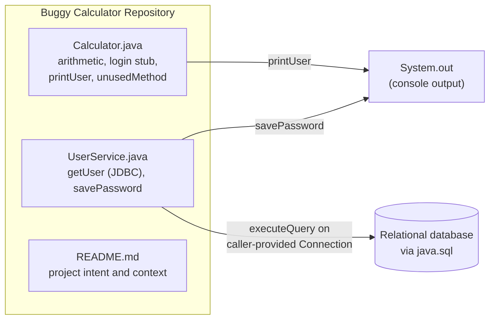
```mermaid
flowchart LR
    subgraph Repo["Buggy Calculator Repository"]
        Calc["Calculator.java<br/>arithmetic, login stub,<br/>printUser, unusedMethod"]
        Svc["UserService.java<br/>getUser (JDBC), savePassword"]
        Doc["README.md<br/>project intent and context"]
    end
    Console["System.out<br/>(console output)"]
    DB[("Relational database<br/>via java.sql")]
    Calc -->|"printUser"| Console
    Svc -->|"savePassword"| Console
    Svc -->|"executeQuery on<br/>caller-provided Connection"| DB
```

**Core technical approach.** The implementation is deliberately elementary. Both classes are written in plain Java with **no package declaration**, and the only external references are the JDBC types `java.sql.Connection` and `java.sql.Statement` from the Java SE standard library. There is no framework, dependency-injection container, build tool (no `pom.xml` or `build.gradle`), automated test, or dependency manifest, and no Java language/runtime version is pinned anywhere in the repository. Each intentional defect is co-located with an explanatory inline comment (e.g., `// Division by zero risk`, `// SQL Injection`), so the source itself doubles as the annotated answer key that gives the fixture its evaluative value.

### 1.2.3 Success Criteria

The repository does **not** define any numeric performance targets, service-level agreements (SLAs), or quantitative key performance indicators (KPIs). Its only stated objective, in `README.md`, is to serve as a fixture for *"testing AI bug detection"* that *"Contains intentional coding and security issues."* Success is therefore expressed qualitatively, in terms of whether the seeded, ground-truth defects are present and detectable.

**Measurable objective — ground-truth defect coverage.** The natural, evidence-derived measure of success for a consuming bug-detection tool is the extent to which it identifies the intentional defects present in the source. These seven self-annotated defects constitute the fixture's answer key:

| Intentional Defect | Category | Location |
|---|---|---|
| Hardcoded password / credential | Security | `Calculator.java:3` |
| SQL injection via string concatenation | Security | `UserService.java:12` |
| Sensitive information logged in plaintext | Security | `UserService.java:17` |
| Division-by-zero risk (unvalidated divisor) | Code quality / robustness | `Calculator.java:6` |
| Returning `null` (bad practice) | Code quality / robustness | `Calculator.java:15` |
| Null-pointer risk on unchecked parameter | Code quality / robustness | `Calculator.java:22` |
| Unused local variable | Code quality / robustness | `Calculator.java:28` |

**Critical success factors.** For the fixture to fulfill its purpose, the following must hold, all of which are satisfied by the current codebase: (1) the intentional defects remain present and unaltered in the source; (2) each defect is unambiguously identifiable, which the inline comments ensure; (3) the sample stays free of external dependencies (only Java SE `java.sql` types are referenced) so evaluation is portable and repeatable; and (4) coverage spans more than one defect class — here, both security and code-quality/robustness categories are represented.

**Key performance indicators.** No KPIs are declared in the repository. Any operational KPI (for example, the count of true-positive detections out of the seven seeded defects, or the false-positive/false-negative rate against this answer key) would necessarily be defined and measured by the external tool or evaluation harness that consumes the fixture, not by the repository itself.

## 1.3 Scope

This section defines what the repository does and does not contain. Because the project is a deliberately minimal test fixture, its scope is narrow and fully enumerable from the three files present.

### 1.3.1 In-Scope

**Core features and functionalities.** The in-scope functionality is exactly the behavior implemented by the two Java classes, together with the intentional defects that give the fixture its purpose.

| In-Scope Element | Detail | Evidence |
|---|---|---|
| `Calculator` class and its members | `divide`, `login`, `printUser`, `unusedMethod`, and the hardcoded `password` field | `Calculator.java` |
| `UserService` class and its members | `getUser` (JDBC lookup) and `savePassword` (console output) | `UserService.java` |
| Seeded intentional defects | The seven self-annotated coding/security issues that form the ground-truth answer key | Inline comments in both `.java` files |
| Console output integration | Output via `System.out.println` | `Calculator.java:20`, `UserService.java:17` |
| JDBC integration surface | Query execution against a caller-provided `Connection` | `UserService.java:6-13` |
| Project documentation | Declaration of identity and intent | `README.md` |

*Primary user workflows.* Two workflows are supported. The first, and the fixture's reason for existing, is **static evaluation**: an AI or static-analysis tool ingests `Calculator.java` and `UserService.java` and reports the defects it finds, which are then compared against the inline-annotated ground truth. The second is the **runtime behavior** of the methods themselves when invoked by a hypothetical caller — arithmetic via `divide`, the hardcoded-credential check via `login`, name printing via `printUser`, and a database lookup via `getUser` on a supplied connection.

*Essential integrations.* Only two integration touchpoints are in scope: (1) standard output (`System.out`), used by `printUser` and `savePassword`; and (2) the JDBC API (`java.sql.Connection`, `java.sql.Statement`), used by `getUser` on a connection that the caller must provide.

*Key technical requirements.* The code requires only a Java Standard Edition environment — it uses no third-party libraries, and the sole external references are JDK-provided `java.sql` types. Compilability of the two classes and the presence of the inline defect annotations are the implicit technical requirements that keep the fixture usable.

**Implementation boundaries.** The following table bounds the system along the dimensions relevant to a fixture of this kind.

| Boundary Dimension | In-Scope Definition |
|---|---|
| System boundary | The three files in the repository root (`Calculator.java`, `UserService.java`, `README.md`); the database and console are external to the system |
| User groups covered | Automated bug-detection/static-analysis tools and the engineers, researchers, and reviewers who operate them |
| Geographic / market coverage | Not applicable — the project is a code fixture with no locale, region, deployment, or market dimension |
| Data domains included | A nominal `users` domain referenced only as a SQL string literal (`SELECT * FROM users WHERE id='...'`) plus credential-like string literals (`"admin123"`, `"admin"`); no data is actually stored, read, or returned |

### 1.3.2 Out-of-Scope

Everything not embodied by the three files is out of scope. The exclusions below are stated explicitly to prevent misinterpreting the fixture as a functional application. Notably, *remediating* the seeded defects is out of scope by design, since their presence is the point of the project.

| Category | Out-of-Scope Items |
|---|---|
| Excluded features / capabilities | Real authentication (the `login` method is a hardcoded stub that ignores the `password` field); genuine persistence (`savePassword` only prints, and `getUser` never reads or returns the `ResultSet`); input validation; exception handling beyond a propagated `throws Exception`; resource management (the `Statement`/`ResultSet` are never closed); any user interface; configuration or logging frameworks; build, packaging, and automated tests |
| Future phase considerations | None are documented — the repository contains no roadmap, backlog, TODOs, changelog, or versioning; no subsequent phases or enhancements are defined |
| Integration points not covered | No configured database (no JDBC driver, datasource, connection string, or schema); no network, HTTP, or API layer; no authentication provider or secrets manager; no external services; no CI/CD or deployment pipeline |
| Unsupported use cases | Production or real-world deployment; storing or handling real credentials or secrets; secure database access; returning actual query results to a caller — all precluded by the intentional coding and security defects the project is built to contain |

## 1.4 References

The following repository artifacts were inspected directly and cited as evidence throughout this Introduction:

- `README.md` — Established the project's identity ("Buggy Calculator") and stated purpose: a small Java project for testing AI bug detection that intentionally contains coding and security issues. Basis for the Executive Summary and Project Context.
- `Calculator.java` — Established the `Calculator` component and its members (the hardcoded `password` field, `divide`, `login`, `printUser`, `unusedMethod`) and four of the seven intentional defects (hardcoded credential, division-by-zero risk, `null` return, null-pointer risk, unused variable). Cited in the High-Level Description, Success Criteria, and Scope.
- `UserService.java` — Established the `UserService` component and its members (`getUser`, `savePassword`), the `java.sql.Connection`/`java.sql.Statement` imports, and three intentional defects (SQL injection via string concatenation, sensitive-information logging). Cited in the integration analysis, Success Criteria, and Scope.
- `` (repository root folder) — Established the complete top-level structure: exactly three files with no subfolders, no build configuration, no test harness, no package hierarchy, and no dependency manifest. Basis for the "deliberately minimal fixture" characterization and the Scope boundaries.

No external web sources were required; the only external references in the codebase are the JDK-provided `java.sql` types, which are part of the Java Standard Edition library.

# 2. Product Requirements

## 2.1 Feature Catalog

This section decomposes the **Buggy Calculator** repository into discrete, testable features. Because the project is a deliberately minimal test fixture rather than a commercial application (see §1.1 Executive Summary and §1.2 System Overview), each "feature" corresponds to a single observable behavior implemented by the two Java classes, plus one fixture-level feature that captures the repository's defining purpose: the ground-truth corpus of seeded defects declared in `README.md`. Seven features are cataloged, all derived directly from the source files `Calculator.java` and `UserService.java` and the six-capability summary in §1.2.2.

**Assumptions, Conventions, and Constraints**

The following conventions govern this entire section and constitute its documented assumptions and constraints:

- **ID conventions.** Features are numbered `F-001`…`F-007`. Requirements are numbered `F-XXX-RQ-YYY` (see §2.2). These identifiers are introduced by this document; the repository itself contains no feature or requirement identifiers.
- **Priority is documentation-derived, not repository-declared.** The repository declares no priorities, service levels, or KPIs (confirmed in §1.2.3 and §1.3.2). The **Priority Level** below is an editorial indication of each feature's contribution to the fixture's stated purpose and the severity class of the seeded defect it carries, ranked **security > code-quality/robustness > cosmetic**. It is not a commitment recorded in the codebase.
- **Status semantics.** Every feature is marked **Completed** because it is present and fully implemented in the current source. The repository maintains no lifecycle tracking, roadmap, backlog, changelog, or version-control tags (confirmed in §1.3.2), so no other lifecycle state (Proposed/Approved/In Development) is applicable or evidenced.
- **Requirement versioning.** These requirements are recorded at document version **v1.0**, reflecting the current repository state. The repository provides no release tags or changelog against which to version requirements independently; any future change to the three files would supersede this baseline.
- **Defects are features, preserved by design.** Each functional feature co-locates an intentional, self-annotated defect. Per §1.3.2, remediating these defects is explicitly out of scope — their presence is the point of the fixture — so the catalog documents them as durable characteristics, not as issues to fix.

**Feature Summary — Identity and Classification**

| Feature ID | Feature Name | Category | Priority |
|---|---|---|---|
| F-001 | Integer Division Operation | Arithmetic / Computation | Medium |
| F-002 | Hardcoded-Credential Login Stub | Authentication (Stub) | Medium |
| F-003 | Console User Printing | Console Output / Presentation | Medium |
| F-004 | No-Op Utility Method | Utility / Dead Code | Low |
| F-005 | JDBC User Lookup | Data Access (JDBC) | High |
| F-006 | Password Console Output | Console Output / Secret Handling (Stub) | High |
| F-007 | Ground-Truth Seeded Defect Corpus | Test Fixture / Quality Benchmark | Critical |

**Feature Summary — Status and Location**

| Feature ID | Status | Complexity | Source Location |
|---|---|---|---|
| F-001 | Completed | Low | `Calculator.java:5-7` |
| F-002 | Completed | Low | `Calculator.java:9-16` |
| F-003 | Completed | Low | `Calculator.java:18-25` |
| F-004 | Completed | Low | `Calculator.java:27-29` |
| F-005 | Completed | Medium | `UserService.java:6-13` |
| F-006 | Completed | Low | `UserService.java:15-19` |
| F-007 | Completed | Low | `README.md`; inline annotations across both `.java` files (incl. `Calculator.java:3`) |

### 2.1.1 F-001 — Integer Division Operation

**Metadata:** Category Arithmetic / Computation · Priority Medium · Status Completed · Complexity Low · Source `Calculator.java:5-7`

**Description**

- *Overview:* The `Calculator.divide(int a, int b)` method returns the integer quotient `a / b` directly, performing no validation of the divisor.
- *Business Value:* Contributes a canonical robustness defect (an unvalidated divisor) to the fixture's answer key, giving detection tools a clear division-by-zero case in the code-quality/robustness class.
- *User Benefits:* Bug-detection tools and their evaluators obtain an unambiguous division-by-zero risk to detect; a developer reading the method sees standard truncating integer-division semantics.
- *Technical Context:* Pure computation with no state and no I/O, relying only on `java.lang`. Java integer division truncates toward zero and throws `ArithmeticException` at runtime when `b == 0`. The defect is annotated inline as `// Division by zero risk` at `Calculator.java:6`.

**Dependencies**

- *Prerequisite Features:* None.
- *System Dependencies:* A Java SE runtime (`java.lang`); no other component.
- *External Dependencies:* None.
- *Integration Requirements:* None — the method reads no input source and produces no external output.

### 2.1.2 F-002 — Hardcoded-Credential Login Stub

**Metadata:** Category Authentication (Stub) · Priority Medium · Status Completed · Complexity Low · Source `Calculator.java:9-16`

**Description**

- *Overview:* The `Calculator.login(String username, String password)` method returns the string `"Login Success"` only when both parameters equal the literal `"admin"`, and returns `null` in every other case.
- *Business Value:* Seeds a "bad practice" code-quality defect (returning `null`) and demonstrates a hardcoded-credential authentication anti-pattern, both valuable detection targets.
- *User Benefits:* Evaluators obtain a null-return defect and an insecure hardcoded-authentication pattern to flag; the method illustrates the absence of any real authentication flow.
- *Technical Context:* The method compares parameters against string literals using `String.equals` and returns `null` at `Calculator.java:15` (annotated `// Bad practice`). The `password` parameter shadows the class field `password` (`"admin123"`, `Calculator.java:3`), which the method never consults. If `username` is `null`, the `equals` call would raise a `NullPointerException` (an incidental, unannotated observation). This is a hardcoded stub, not a real login.

**Dependencies**

- *Prerequisite Features:* None.
- *System Dependencies:* A Java SE runtime (`java.lang`).
- *External Dependencies:* None.
- *Integration Requirements:* None. The hardcoded `password` field co-located in the same class is a seeded defect tracked under F-007.

### 2.1.3 F-003 — Console User Printing

**Metadata:** Category Console Output / Presentation · Priority Medium · Status Completed · Complexity Low · Source `Calculator.java:18-25`

**Description**

- *Overview:* The `Calculator.printUser(String name)` method prints the supplied `name` to standard output and additionally prints `"Welcome Admin"` when `name.equals("admin")`.
- *Business Value:* Seeds a null-pointer-risk robustness defect arising from dereferencing an unchecked parameter.
- *User Benefits:* Evaluators obtain a null-pointer risk to detect; the method demonstrates simple console output behavior.
- *Technical Context:* Uses `System.out.println` at `Calculator.java:20`. The guard `name.equals("admin")` at `Calculator.java:22` (annotated `// Null Pointer Risk`) would throw a `NullPointerException` if `name` is `null`. The method integrates only with the console.

**Dependencies**

- *Prerequisite Features:* None.
- *System Dependencies:* A Java SE runtime and a standard output stream (`System.out`).
- *External Dependencies:* None.
- *Integration Requirements:* Writes to `System.out`, the console touchpoint shared with F-006.

### 2.1.4 F-004 — No-Op Utility Method

**Metadata:** Category Utility / Dead Code · Priority Low · Status Completed · Complexity Low · Source `Calculator.java:27-29`

**Description**

- *Overview:* The `Calculator.unusedMethod()` method declares a local variable `int x = 10;` and returns without using it, performing no observable action.
- *Business Value:* Seeds an unused-variable (dead-code) code-quality defect — a cosmetic, static-analysis-oriented case that broadens the answer key.
- *User Benefits:* Evaluators obtain a clear unused-local-variable / dead-code finding to detect.
- *Technical Context:* A `void` method with no parameters, no return value, no output, and no state. The unused local is declared at `Calculator.java:28` (annotated `// Unused variable`).

**Dependencies**

- *Prerequisite Features:* None.
- *System Dependencies:* A Java SE runtime (`java.lang`).
- *External Dependencies:* None.
- *Integration Requirements:* None.

### 2.1.5 F-005 — JDBC User Lookup

**Metadata:** Category Data Access (JDBC) · Priority High · Status Completed · Complexity Medium · Source `UserService.java:6-13`

**Description**

- *Overview:* The `UserService.getUser(Connection con, String id)` method accepts a caller-supplied, already-open JDBC `Connection` and a `String id`, creates a `Statement`, builds a `SELECT * FROM users WHERE id='<id>'` query by direct string concatenation, and executes it via `executeQuery`.
- *Business Value:* Seeds the fixture's flagship security defect — SQL injection via string concatenation — the highest-value detection case in the corpus.
- *User Benefits:* Evaluators obtain a textbook SQL injection to detect; the method also illustrates missing parameterization and absent JDBC resource management.
- *Technical Context:* Imports `java.sql.Connection` and `java.sql.Statement` (`UserService.java:1-2`). The connection is provided by the caller — the class performs no connection management, and the repository contains no JDBC driver, datasource, connection string, or schema. The returned `ResultSet` is neither stored, processed, nor closed, and the `Statement` is not closed; the method declares `throws Exception`, propagating failures to the caller. The injection point is annotated `// SQL Injection` at `UserService.java:12`. It references a nominal `users` table with an `id` column, present only as a SQL string literal.

**Dependencies**

- *Prerequisite Features:* None.
- *System Dependencies:* A Java SE runtime and the JDBC API (`java.sql`).
- *External Dependencies:* An external relational database and an open JDBC `Connection` supplied by the caller — both unconfigured within this repository.
- *Integration Requirements:* Executes a query against the caller-provided `Connection`; the database is external to the system boundary (see §1.3.1).

### 2.1.6 F-006 — Password Console Output

**Metadata:** Category Console Output / Secret Handling (Stub) · Priority High · Status Completed · Complexity Low · Source `UserService.java:15-19`

**Description**

- *Overview:* The `UserService.savePassword(String password)` method prints the supplied password to standard output; despite its name, it performs no persistence and no masking.
- *Business Value:* Seeds a security defect — sensitive information (a secret) logged in plaintext.
- *User Benefits:* Evaluators obtain a plaintext-secret-exposure finding to detect; the method also demonstrates a name/behavior mismatch (no "save" actually occurs).
- *Technical Context:* Executes `System.out.println(password)` at `UserService.java:17` (annotated `// Sensitive Information Logging`). There is no storage, encryption, hashing, or masking. The method integrates only with the console.

**Dependencies**

- *Prerequisite Features:* None.
- *System Dependencies:* A Java SE runtime and a standard output stream (`System.out`).
- *External Dependencies:* None.
- *Integration Requirements:* Writes to `System.out`, the console touchpoint shared with F-003.

### 2.1.7 F-007 — Ground-Truth Seeded Defect Corpus

**Metadata:** Category Test Fixture / Quality Benchmark · Priority Critical · Status Completed · Complexity Low · Source `README.md`; inline annotations across `Calculator.java` and `UserService.java` (incl. the hardcoded field at `Calculator.java:3`)

**Description**

- *Overview:* This fixture-level feature captures the repository's defining purpose: a fixed, self-annotated set of **seven** intentional defects distributed across the two source files, declared in `README.md` as *"testing AI bug detection"* with *"intentional coding and security issues."* Collectively these constitute the ground-truth answer key formalized in §1.2.3. This feature is also the home for the hardcoded `password` field defect at `Calculator.java:3`, which is dead state not tied to any behavioral feature.
- *Business Value:* This is the reason the product exists — it provides a deterministic, low-dependency benchmark against which AI and static-analysis bug-detection tools can be exercised and compared (see §1.1).
- *User Benefits:* Tool developers, researchers, and QA reviewers obtain an enumerable, unambiguous answer key that spans two defect classes (security and code-quality/robustness) within a very small surface area.
- *Technical Context:* The corpus comprises three security defects — hardcoded credential (`Calculator.java:3`), SQL injection (`UserService.java:12`), and plaintext secret logging (`UserService.java:17`) — and four code-quality/robustness defects — division-by-zero risk (`Calculator.java:6`), returning `null` (`Calculator.java:15`), null-pointer risk (`Calculator.java:22`), and an unused variable (`Calculator.java:28`). Each is marked by an inline comment, and the sample compiles under Java SE with no third-party dependencies beyond the JDK `java.sql` types.

**Dependencies**

- *Prerequisite Features:* Overlays the seeded defects carried by F-001 through F-006, plus the standalone hardcoded `password` field.
- *System Dependencies:* A Java SE toolchain sufficient to compile and statically analyze the two classes.
- *External Dependencies:* An external AI or static-analysis tool / evaluation harness that consumes the fixture as input (the primary consumer identified in §1.1).
- *Integration Requirements:* The two source files are ingested as static input by the consuming tool; the inline annotations serve as the comparison key for detected findings.

## 2.2 Functional Requirements

Each feature is specified with a small set of testable requirements. Two requirement types recur, reflecting the fixture's dual nature described in §1.3.1:

- **`RQ-001` — Functional behavior:** the observable, as-implemented behavior of the method, verifiable by invoking it.
- **`RQ-002` — Defect preservation:** the intentional, self-annotated defect the feature carries, verifiable by static inspection. Because §1.3.2 places remediation out of scope, preserving each defect and its inline annotation is itself a requirement.

Two conventions apply to every table below. First, **Performance Criteria are "None specified"** throughout: the repository declares no performance targets, SLAs, or KPIs (§1.2.3); any detection-accuracy metric is defined by the external consuming tool, not this repository. Second, **Compliance Requirements are "None declared"** throughout: no regulatory, licensing, or standards obligations appear anywhere in the three files.

### 2.2.1 F-001 — Integer Division Operation Requirements

| Requirement ID | Description | Priority | Complexity |
|---|---|---|---|
| F-001-RQ-001 | `divide(int a, int b)` returns the integer quotient `a / b` with no divisor validation | Must-Have | Low |
| F-001-RQ-002 | The unvalidated division-by-zero risk and its inline annotation are preserved | Must-Have | Low |

**Acceptance Criteria**

- `divide(6, 3)` returns `2`; `divide(7, 2)` returns `3` (integer truncation toward zero).
- `divide(a, 0)` throws `java.lang.ArithmeticException`.
- The signature `public int divide(int a, int b)` is unchanged, and no guard precedes the `a / b` return.
- The inline comment `// Division by zero risk` remains present at `Calculator.java:6`.

| Aspect | Detail |
|---|---|
| Input Parameters | `int a` (dividend), `int b` (divisor) |
| Output / Response | `int` quotient; `ArithmeticException` when `b == 0` |
| Performance Criteria | None specified |
| Data Requirements | None — operates on primitive `int` values; no data read or stored |

| Rule Type | Detail |
|---|---|
| Business Rules | Standard Java truncating integer-division semantics; no domain rules beyond arithmetic |
| Data Validation | None performed — the divisor is intentionally unchecked |
| Security Requirements | Not applicable — no external input, secret, or side effect |
| Compliance Requirements | None declared |

### 2.2.2 F-002 — Hardcoded-Credential Login Stub Requirements

| Requirement ID | Description | Priority | Complexity |
|---|---|---|---|
| F-002-RQ-001 | `login(u, p)` returns `"Login Success"` iff both equal `"admin"`, else returns `null` | Must-Have | Low |
| F-002-RQ-002 | The `null`-return "bad practice" defect and its inline annotation are preserved | Must-Have | Low |

**Acceptance Criteria**

- `login("admin", "admin")` returns the string `"Login Success"`.
- `login("admin", "wrong")` and `login("user", "admin")` each return `null`.
- The method does not read the class field `password`; comparison is against the literal `"admin"` for both parameters.
- The signature `public String login(String username, String password)` is unchanged, and the inline comment `// Bad practice` remains present at `Calculator.java:15`.

| Aspect | Detail |
|---|---|
| Input Parameters | `String username`, `String password` |
| Output / Response | `String` `"Login Success"` on match; `null` otherwise |
| Performance Criteria | None specified |
| Data Requirements | Compares against the hardcoded literal `"admin"`; no external data source |

| Rule Type | Detail |
|---|---|
| Business Rules | Success requires **both** parameters to equal `"admin"` exactly |
| Data Validation | No null-checking of inputs; `username.equals(...)` would throw `NullPointerException` if `username` is `null` (incidental, unannotated) |
| Security Requirements | None enforced; the hardcoded-credential authentication anti-pattern is intentional and must be preserved |
| Compliance Requirements | None declared |

### 2.2.3 F-003 — Console User Printing Requirements

| Requirement ID | Description | Priority | Complexity |
|---|---|---|---|
| F-003-RQ-001 | `printUser(name)` prints `name`, then prints `"Welcome Admin"` when `name` equals `"admin"` | Must-Have | Low |
| F-003-RQ-002 | The null-pointer risk on the unchecked parameter and its inline annotation are preserved | Must-Have | Low |

**Acceptance Criteria**

- `printUser("Bob")` writes `Bob` to standard output and nothing further.
- `printUser("admin")` writes `admin` followed by `Welcome Admin`.
- `printUser(null)` throws `java.lang.NullPointerException` at the `name.equals("admin")` guard.
- The signature `public void printUser(String name)` is unchanged, and the inline comment `// Null Pointer Risk` remains present at `Calculator.java:22`.

| Aspect | Detail |
|---|---|
| Input Parameters | `String name` |
| Output / Response | `void`; writes one line, or two lines when `name` equals `"admin"`, to `System.out` |
| Performance Criteria | None specified |
| Data Requirements | None persisted; compares against the literal `"admin"` |

| Rule Type | Detail |
|---|---|
| Business Rules | The second line (`"Welcome Admin"`) prints only when `name` equals `"admin"` |
| Data Validation | None — the `name` parameter is dereferenced without a null-check (intentional) |
| Security Requirements | Not applicable — no secret or external input beyond the printed name |
| Compliance Requirements | None declared |

### 2.2.4 F-004 — No-Op Utility Method Requirements

| Requirement ID | Description | Priority | Complexity |
|---|---|---|---|
| F-004-RQ-001 | `unusedMethod()` executes without producing output, exceptions, or state change | Could-Have | Low |
| F-004-RQ-002 | The unused local variable and its inline annotation are preserved | Must-Have | Low |

**Acceptance Criteria**

- Invoking `unusedMethod()` produces no console output, throws no exception, and mutates no state.
- The local declaration `int x = 10;` exists at `Calculator.java:28` and is never read or used.
- The signature `public void unusedMethod()` is unchanged, and the inline comment `// Unused variable` remains present.

| Aspect | Detail |
|---|---|
| Input Parameters | None |
| Output / Response | `void`; no output |
| Performance Criteria | None specified |
| Data Requirements | None |

| Rule Type | Detail |
|---|---|
| Business Rules | None — the method is a deliberate no-op |
| Data Validation | None |
| Security Requirements | Not applicable |
| Compliance Requirements | None declared |

### 2.2.5 F-005 — JDBC User Lookup Requirements

| Requirement ID | Description | Priority | Complexity |
|---|---|---|---|
| F-005-RQ-001 | `getUser(con, id)` creates a `Statement` and executes a concatenated `SELECT` on the provided `Connection` | Must-Have | Medium |
| F-005-RQ-002 | The SQL-injection-via-concatenation defect and its inline annotation are preserved | Must-Have | Medium |

**Acceptance Criteria**

- Given an open `Connection`, `getUser(con, "1")` calls `con.createStatement()` and executes `SELECT * FROM users WHERE id='1'`.
- The `id` argument is concatenated directly into the query string with no parameter binding; e.g., `id = x' OR '1'='1` yields `SELECT * FROM users WHERE id='x' OR '1'='1'`.
- The method declares `throws Exception`, propagating connection/database errors to the caller; the `ResultSet` is not returned or processed.
- The signature `public void getUser(Connection con, String id) throws Exception` is unchanged, and the inline comment `// SQL Injection` remains present at `UserService.java:12`.

| Aspect | Detail |
|---|---|
| Input Parameters | `java.sql.Connection con` (already open), `String id` |
| Output / Response | `void`; the `ResultSet` from `executeQuery` is discarded; `Exception` propagated |
| Performance Criteria | None specified |
| Data Requirements | Targets a nominal `users` table with an `id` column; no schema, driver, datasource, or connection string exists in the repository (external and unconfigured) |

| Rule Type | Detail |
|---|---|
| Business Rules | Lookup is keyed by an exact SQL `id` match |
| Data Validation | None — `id` is neither sanitized, escaped, nor parameterized (intentional) |
| Security Requirements | None enforced; the SQL-injection anti-pattern is intentional and must be preserved; JDBC resources (`Statement`/`ResultSet`) are intentionally left unclosed |
| Compliance Requirements | None declared |

### 2.2.6 F-006 — Password Console Output Requirements

| Requirement ID | Description | Priority | Complexity |
|---|---|---|---|
| F-006-RQ-001 | `savePassword(password)` writes the supplied password verbatim to standard output | Must-Have | Low |
| F-006-RQ-002 | The plaintext-secret-logging defect and its inline annotation are preserved | Must-Have | Low |

**Acceptance Criteria**

- `savePassword("s3cret")` writes `s3cret` to `System.out`.
- No persistence, encryption, hashing, or masking is applied to the value despite the method name.
- The signature `public void savePassword(String password)` is unchanged, and the inline comment `// Sensitive Information Logging` remains present at `UserService.java:17`.

| Aspect | Detail |
|---|---|
| Input Parameters | `String password` |
| Output / Response | `void`; the password value is written unmodified to `System.out` |
| Performance Criteria | None specified |
| Data Requirements | Handles a secret string in memory only; nothing is stored |

| Rule Type | Detail |
|---|---|
| Business Rules | None — the method name implies persistence, but only console output occurs |
| Data Validation | None |
| Security Requirements | None enforced; the plaintext-secret-exposure defect is intentional and must be preserved |
| Compliance Requirements | None declared |

### 2.2.7 F-007 — Ground-Truth Seeded Defect Corpus Requirements

| Requirement ID | Description | Priority | Complexity |
|---|---|---|---|
| F-007-RQ-001 | All seven seeded defects are present at their stated locations, each carrying its inline annotation | Must-Have | Low |
| F-007-RQ-002 | The fixture remains dependency-light and compilable under Java SE | Must-Have | Low |

**Acceptance Criteria**

- Exactly the seven defects enumerated in §1.2.3 exist at their documented locations (`Calculator.java:3, 6, 15, 22, 28` and `UserService.java:12, 17`).
- Each defect is marked by its inline comment, and `README.md` states the intent — a project for *"testing AI bug detection"* that *"Contains intentional coding and security issues."*
- The only external references are the JDK types `java.sql.Connection` and `java.sql.Statement`; no build configuration, third-party library, or package declaration is introduced.
- Both `Calculator.java` and `UserService.java` compile under a Java SE compiler.

| Aspect | Detail |
|---|---|
| Input Parameters | Not applicable — the source files themselves are the ingested artifact |
| Output / Response | The set of findings a tool reports when analyzing the source; the inline annotations form the comparison key |
| Performance Criteria | None specified — detection accuracy/coverage is measured by the external consumer (§1.2.3) |
| Data Requirements | The two `.java` files plus `README.md`; no runtime data |

| Rule Type | Detail |
|---|---|
| Business Rules | The defect set is fixed, enumerable, and spans at least two defect classes (security and code-quality/robustness) |
| Data Validation | Not applicable |
| Security Requirements | The corpus intentionally contains security defects that must **not** be remediated (§1.3.2) |
| Compliance Requirements | None declared |

## 2.3 Feature Relationships

The relationships among the seven features are almost entirely **structural** (which class contains which behavior) rather than **functional** (one feature invoking another). No method in either class calls any other method, and the only piece of shared state — the `password` field in `Calculator` — is dead and read by nothing. Consequently the six behavioral features (F-001…F-006) are mutually independent and individually testable; the one genuine cross-cutting relationship is F-007, which overlays the seeded defects present in the other features. Only relationships evidenced directly in the source are documented here.

### 2.3.1 Feature Dependency Map

Features F-001 through F-004 are members of the `Calculator` class (which also holds the dead hardcoded `password` field), while F-005 and F-006 are members of the `UserService` class. The two classes do not import or reference each other. F-007 is not a runtime component; it is the answer-key overlay that annotates the intentional defects embedded across both files. The diagram below shows containment, the external touchpoints each feature reaches, and the F-007 overlay.

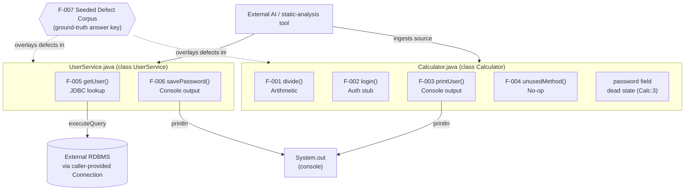
```mermaid
flowchart TB
    Tool["External AI / static-analysis tool"]
    subgraph CalcClass["Calculator.java (class Calculator)"]
        F001["F-001 divide()<br/>Arithmetic"]
        F002["F-002 login()<br/>Auth stub"]
        F003["F-003 printUser()<br/>Console output"]
        F004["F-004 unusedMethod()<br/>No-op"]
        PWD["password field<br/>dead state (Calc:3)"]
    end
    subgraph SvcClass["UserService.java (class UserService)"]
        F005["F-005 getUser()<br/>JDBC lookup"]
        F006["F-006 savePassword()<br/>Console output"]
    end
    Corpus{{"F-007 Seeded Defect Corpus<br/>(ground-truth answer key)"}}
    Console["System.out<br/>(console)"]
    DB[("External RDBMS<br/>via caller-provided Connection")]

    Tool -->|"ingests source"| CalcClass
    Tool -->|"ingests source"| SvcClass
    F003 -->|"println"| Console
    F006 -->|"println"| Console
    F005 -->|"executeQuery"| DB
    Corpus -.->|"overlays defects in"| CalcClass
    Corpus -.->|"overlays defects in"| SvcClass
```

**Prerequisite chains.** There are none. Every feature's Feature Catalog entry (§2.1) lists *Prerequisite Features: None*, and this is confirmed by the source: no method body invokes a sibling method, and no feature consumes another feature's output.

### 2.3.2 Integration Points

Three integration touchpoints exist, all crossing the system boundary defined in §1.3.1 (the database and console are external to the three-file system). None of the features integrate with each other; they integrate only with the runtime environment or with the external consuming tool.

| Integration Point | Feature(s) | Type / Direction | Notes |
|---|---|---|---|
| Standard output (`System.out`) | F-003, F-006 | Outbound console write | `printUser` writes the name (and conditionally `"Welcome Admin"`); `savePassword` writes the password verbatim |
| JDBC / external RDBMS (`java.sql`) | F-005 | Outbound query on a caller-provided `Connection` | Builds and executes a `SELECT`; no driver, datasource, or schema is configured in the repository |
| Static source ingestion | F-007 (both `.java` files) | Inbound — external tool reads the source | The consuming bug-detection tool ingests the files; the inline annotations serve as the comparison key |

### 2.3.3 Shared Components and Common Services

The repository contains no internal shared services — there is no dependency-injection container, no utility/helper class, and no configuration or logging framework (consistent with the "deliberately minimal fixture" characterization in §1.1 and §1.2.2). The only element used by more than one feature is the console output stream. The following table enumerates the shared and common elements that are actually evidenced.

| Shared / Common Element | Used By | Nature |
|---|---|---|
| `System.out` console stream | F-003, F-006 | The single shared external output sink used by more than one feature |
| JDBC API (`java.sql`) | F-005 only | External service interface; touched by exactly one feature (not shared) |
| `Calculator` class container | F-001–F-004 (+ dead `password` field) | Structural grouping only; contains no code shared between its own methods |
| `UserService` class container | F-005, F-006 | Structural grouping only; the two methods share no state or helper code |
| Internal services / DI / configuration / logging framework | None | Absent by design |

**No shared data model.** The data referenced by different features is unrelated: F-005 names a nominal `users` table (as a SQL string literal), while F-002 compares against the credential literal `"admin"`. No feature reads or depends on another feature's data. The single defining relationship in this repository is therefore F-007's overlay of the intentional defects onto the otherwise-independent behavioral features.

## 2.4 Implementation Considerations

This section records the technical constraints, performance and scalability posture, security implications, and maintenance requirements that govern the features. Because the system is a static test fixture (see §1.2 and §1.3), several considerations are uniform across all features and are stated once in §2.4.1 rather than repeated per feature; the considerations that genuinely differ by feature are tabulated in §2.4.2.

### 2.4.1 Cross-Cutting Constraints, Performance, and Scalability

**Cross-cutting technical constraints (apply to every feature).**

- **Java SE only, no tooling.** The code compiles against the Java Standard Edition library; the only external references anywhere are the JDK types `java.sql.Connection` and `java.sql.Statement`. There is no build configuration (`pom.xml`/`build.gradle`), no package declaration, no automated test harness, and no dependency manifest, so features must remain buildable by a plain `javac` invocation.
- **Defects are preserved, not remediated.** Per §1.3.2, fixing any seeded defect is out of scope by design; every implementation must retain both the defective construct and its inline annotation. This is the overriding maintenance constraint for the fixture.
- **Caller-supplied environment.** Runtime behaviors assume the caller provides what the repository does not: an open JDBC `Connection` for F-005 and a console for F-003/F-006. The repository configures none of these.

**Performance requirements.** None are specified. The repository declares no performance targets, SLAs, or KPIs (§1.2.3). Each behavioral method is constant-time and trivial (a single arithmetic operation, one or two string comparisons, or one to two `println` calls); F-005's cost is dominated by the externally provided database, which is outside the system boundary. No performance requirement is therefore attributable to any feature within this repository.

**Scalability considerations.** Not applicable. The fixture has no deployment, concurrency, throughput, or load dimension, and §1.3.1 explicitly records that it has no geographic, market, or region dimension. Scaling behavior would be a property of a hypothetical host application, not of these three files. The only "scaling" axis meaningful to the fixture — enlarging the seeded-defect corpus (F-007) — is a content decision, not a runtime scalability concern.

### 2.4.2 Per-Feature Technical Constraints, Security, and Maintenance

The table below captures the considerations that differ by feature. Performance and scalability are omitted as columns because they are uniform (§2.4.1).

| Feature | Technical Constraints | Security Implications | Maintenance Requirements |
|---|---|---|---|
| F-001 Integer Division | Primitive `int` arithmetic; truncation/overflow semantics; no divisor guard by design | None — no external input, secret, or side effect; only an `ArithmeticException` robustness risk | Preserve the unvalidated `a / b` and the `// Division by zero risk` comment (`Calculator.java:6`) |
| F-002 Login Stub | String-literal comparison; `password` parameter shadows the dead field; `NullPointerException` if `username` is `null` | Hardcoded-credential authentication anti-pattern; must remain an insecure stub, never hardened into real auth | Preserve the `null` return and the `// Bad practice` comment (`Calculator.java:15`) |
| F-003 Console User Printing | Depends on `System.out`; dereferences the unchecked `name` parameter | Minimal — prints a caller-provided name; no secret handled | Preserve the null-pointer risk and the `// Null Pointer Risk` comment (`Calculator.java:22`) |
| F-004 No-Op Utility Method | No-op body; declares an unused local that will trigger compiler/linter warnings by design | None | Preserve `int x = 10;` unused and the `// Unused variable` comment (`Calculator.java:28`); do not delete the dead code |
| F-005 JDBC User Lookup | Requires the JDBC API and a caller-provided open `Connection`; no driver/datasource/schema in repo; `Statement`/`ResultSet` left unclosed; result never processed; `throws Exception` | SQL injection via string concatenation — the highest-severity seeded defect; also an unclosed-resource leak risk | Preserve the concatenated query and the `// SQL Injection` comment (`UserService.java:12`); do not parameterize or add resource cleanup |
| F-006 Password Console Output | Depends on `System.out`; performs no persistence despite the method name | Plaintext exposure of a secret via console output | Preserve `System.out.println(password)` and the `// Sensitive Information Logging` comment (`UserService.java:17`); do not mask, hash, or remove |
| F-007 Defect Corpus | Must compile under Java SE with only `java.sql` external references; no build config/packages introduced; exactly seven annotated defects at their stated locations | Deliberately aggregates three security defects; the fixture is unsafe by design and must never be deployed or run against real data or credentials (§1.3.2) | Any change that adds, removes, or relocates a defect or annotation — or introduces dependencies/build tooling — invalidates the answer key and supersedes the v1.0 baseline; re-version accordingly |

## 2.5 Traceability Matrix

This section links features and requirements back to their source locations, to the seven ground-truth defects, and to the related sections of this specification. Every row is traceable to a specific file and line range in the repository.

### 2.5.1 Feature-to-Requirement Traceability

Each feature maps to its two requirements (§2.2), its source location, and the corresponding capability enumerated in §1.2.2.

| Feature ID | Requirement IDs | Source Location | Related Capability (§1.2.2 / §1.2.3) |
|---|---|---|---|
| F-001 | F-001-RQ-001, F-001-RQ-002 | `Calculator.java:5-7` | Integer division |
| F-002 | F-002-RQ-001, F-002-RQ-002 | `Calculator.java:9-16` | Login (stub) |
| F-003 | F-003-RQ-001, F-003-RQ-002 | `Calculator.java:18-25` | Print user |
| F-004 | F-004-RQ-001, F-004-RQ-002 | `Calculator.java:27-29` | No-op method |
| F-005 | F-005-RQ-001, F-005-RQ-002 | `UserService.java:6-13` | User lookup (JDBC) |
| F-006 | F-006-RQ-001, F-006-RQ-002 | `UserService.java:15-19` | Save password (stub) |
| F-007 | F-007-RQ-001, F-007-RQ-002 | `README.md`; both `.java` files | Ground-truth answer key (§1.2.3) |

### 2.5.2 Defect-to-Feature Traceability (Answer Key)

This matrix maps each of the seven ground-truth defects from §1.2.3 to the feature and defect-preservation requirement that owns it. It is the authoritative cross-reference between the intentional defects and the feature catalog.

| Seeded Defect | Category | Feature (Requirement) | Source Location |
|---|---|---|---|
| Hardcoded password / credential | Security | F-007 (F-007-RQ-001) | `Calculator.java:3` |
| SQL injection via string concatenation | Security | F-005 (F-005-RQ-002) | `UserService.java:12` |
| Sensitive information logged in plaintext | Security | F-006 (F-006-RQ-002) | `UserService.java:17` |
| Division-by-zero risk | Code quality / robustness | F-001 (F-001-RQ-002) | `Calculator.java:6` |
| Returning `null` (bad practice) | Code quality / robustness | F-002 (F-002-RQ-002) | `Calculator.java:15` |
| Null-pointer risk (unchecked parameter) | Code quality / robustness | F-003 (F-003-RQ-002) | `Calculator.java:22` |
| Unused local variable | Code quality / robustness | F-004 (F-004-RQ-002) | `Calculator.java:28` |

### 2.5.3 Cross-References and Process Flow

**Related specification sections.** The features and requirements above trace to the following sections of this document:

| Related Section | Relationship |
|---|---|
| §1.1 Executive Summary | Business context, stakeholders, and value proposition underpinning these features |
| §1.2.2 High-Level Description | Source of the six-capability list and the component-relationship flowchart from which F-001–F-006 are derived |
| §1.2.3 Success Criteria | Formalizes the seven-defect answer key documented here as F-007 |
| §1.3 Scope | Establishes in-scope feature boundaries and out-of-scope exclusions (including defect remediation) |

**Related process flowcharts.** The component-relationship flowchart in §1.2.2 depicts how `Calculator`, `UserService`, and `README.md` relate to the console and database touchpoints; the feature dependency map in §2.3.1 refines that view to feature granularity. The diagram below expresses the fixture's primary workflow — the **static-evaluation flow** identified in §1.3.1 — as the process against which the requirements in §2.2 are validated.

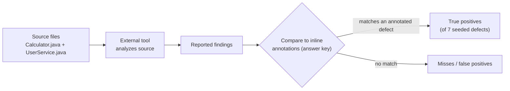
```mermaid
flowchart LR
    Start["Source files<br/>Calculator.java + UserService.java"]
    Analyze["External tool<br/>analyzes source"]
    Findings["Reported findings"]
    Compare{"Compare to inline<br/>annotations (answer key)"}
    TP["True positives<br/>(of 7 seeded defects)"]
    Miss["Misses / false positives"]

    Start --> Analyze
    Analyze --> Findings
    Findings --> Compare
    Compare -->|"matches an annotated defect"| TP
    Compare -->|"no match"| Miss
```

**Traceability completeness.** All seven features (F-001–F-007) and all fourteen requirements (`F-XXX-RQ-001`/`-RQ-002`) resolve to a concrete source location, and all seven ground-truth defects from §1.2.3 are accounted for exactly once in §2.5.2 — six owned by the behavioral features via their `RQ-002` requirements and one (the hardcoded credential field) owned by F-007.

## 2.6 References

The following repository artifacts were inspected directly and cited as evidence throughout this Product Requirements section.

**Repository files and folders**

- `Calculator.java` — Established features F-001 (`divide`), F-002 (`login`), F-003 (`printUser`), and F-004 (`unusedMethod`), their exact signatures, line ranges, and behavior, and five of the seven seeded defects (hardcoded `password` field, division-by-zero risk, `null` return, null-pointer risk, unused variable) with their inline annotations.
- `UserService.java` — Established features F-005 (`getUser`) and F-006 (`savePassword`), the `java.sql.Connection`/`java.sql.Statement` imports, the caller-provided-connection integration, and two seeded defects (SQL injection via string concatenation, plaintext secret logging) with their inline annotations.
- `README.md` — Established the project identity ("Buggy Calculator") and stated purpose (a Java project for testing AI bug detection that intentionally contains coding and security issues); the basis for feature F-007 and its priority.
- `` (repository root folder) — Established the complete top-level structure (exactly three files, no subfolders, no build configuration, no test harness, no package hierarchy, no dependency manifest), which grounds the uniform "Completed" status, the requirement-versioning note, and the "no internal shared services" findings.

**Cross-referenced specification sections**

- §1.1 Executive Summary — Business context, stakeholders, and value proposition referenced in the Feature Catalog descriptions.
- §1.2 System Overview (§1.2.2 High-Level Description, §1.2.3 Success Criteria) — Source of the six-capability list, the component-relationship flowchart, and the seven-defect answer key that underpins F-007.
- §1.3 Scope (§1.3.1 In-Scope, §1.3.2 Out-of-Scope) — Source of the in-scope feature boundaries, the static-evaluation and runtime-behavior workflows, and the defect-preservation (remediation out-of-scope) constraint.

**External sources**

- None. No external web sources were required; the only external references in the codebase are the JDK-provided `java.sql` types, which are part of the Java Standard Edition library.

# 3. Technology Stack

## 3.1 Programming Languages

The Buggy Calculator system is implemented in a **single programming language — Java**, in its Standard Edition (Java SE) form. Every executable artifact in the repository is a plain Java class: `Calculator.java` and `UserService.java`. The only non-code artifact, `README.md`, confirms the project identity, describing it as a *"Small Java project created for testing AI bug detection."* No secondary language, script, stylesheet, markup dialect, or configuration DSL exists anywhere in the repository — the technology footprint is deliberately reduced to Java and the Java platform alone, consistent with the fixture role established in §1.2 and §1.3.

The following diagram shows how the two source components relate to the language's standard library and to the runtime/toolchain they require.

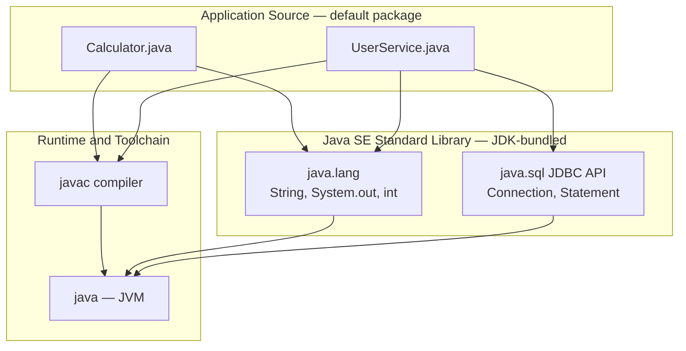
```mermaid
flowchart TB
    subgraph App["Application Source — default package"]
        Calc["Calculator.java"]
        Svc["UserService.java"]
    end
    subgraph StdLib["Java SE Standard Library — JDK-bundled"]
        Lang["java.lang<br/>String, System.out, int"]
        Sql["java.sql JDBC API<br/>Connection, Statement"]
    end
    subgraph Toolchain["Runtime and Toolchain"]
        Javac["javac compiler"]
        JVM["java — JVM"]
    end
    Calc --> Lang
    Svc --> Lang
    Svc --> Sql
    Calc --> Javac
    Svc --> Javac
    Javac --> JVM
    Lang --> JVM
    Sql --> JVM
```

### 3.1.1 Language Inventory by Component

| Language | Where Used | Version Declared in Repository |
|---|---|---|
| Java (Java SE) | `Calculator.java`, `UserService.java` — 100% of executable source | None — no language or runtime version is pinned |

Both classes are declared **without a `package` statement**, so they occupy the default (unnamed) package at the repository root. `Calculator.java` uses only implicit `java.lang` types — `String`, `System.out`, and the primitive `int` — with no `import` statements at all. `UserService.java` adds exactly two imports, `java.sql.Connection` and `java.sql.Statement`, which are part of the Java SE platform rather than any external library. No other language surface (generics, lambdas, records, annotations, reflection, concurrency, I/O beyond `System.out`) is exercised, which keeps the language footprint minimal and portable.

### 3.1.2 Selection Criteria and Rationale

The repository does not document an explicit rationale for choosing Java; the following criteria are inferred from the fixture's stated purpose and the constructs actually present in the source:

- **Fidelity to common real-world defect patterns.** The seeded issues — SQL injection built with `java.sql.Statement` and string concatenation (`UserService.java:12`), a hardcoded credential held in a `String` field (`Calculator.java:3`), a secret written to `System.out` (`UserService.java:17`), an unguarded integer division (`Calculator.java:6`), and an unclosed JDBC resource — are classic, instantly recognizable Java/JDBC anti-patterns. Java is therefore a natural carrier language for a bug-detection benchmark of this kind.
- **Static analyzability.** Java is a statically typed, compiled, object-oriented language, which makes it a well-supported target for the AI and static-analysis tools the fixture is meant to exercise (§1.3.1).
- **Zero-dependency portability.** Because the code touches only standard-library types, the sample compiles and is analyzable anywhere a Java SE toolchain is present, with no package resolution or network access required.

### 3.1.3 Version Posture, Constraints, and Runtime Dependencies

**No version is pinned.** Consistent with §1.2.2, the repository pins no Java language level or runtime version anywhere: there is no build descriptor, no toolchain file, no `module-info.java`, and no `.java-version`/CI matrix that would declare a target release.

**Runtime dependency.** The only hard requirement is a **Java SE JDK** providing the `javac` compiler and the `java` launcher (JVM). The single external API family the code depends on, `java.sql` (JDBC), is a standard part of the Java SE platform (delivered as the `java.sql` module in modern, modularized JDKs), so no additional runtime component must be installed to satisfy the imports.

**Compatibility.** Because the source uses only long-stable language features and standard-library APIs (the `Connection`/`Statement` interfaces have been part of JDBC since its earliest releases), the two classes compile and run on any modern JDK. As external context (the repository itself specifies none), the currently maintained Java SE long-term-support (LTS) line includes Java 8, 11, 17, 21, and 25; any of these — or any interim release — satisfies the code's requirements. A binding constraint carried over from §2.4.1 is that the sources must remain **buildable by a plain `javac` invocation**, which precludes introducing a language level that would require a build tool or preview features.

### 3.1.4 Language-Level Security Considerations

The language and API selections directly enable several of the fixture's intentional security defects, and these are preserved by design (see §1.2.3 and §2.4.2):

- Using `java.sql.Statement` with a query assembled by string concatenation — rather than a parameterized `PreparedStatement` — is what makes the SQL-injection defect possible (`UserService.java:12`).
- A plain `String` field is used to embed a hardcoded credential (`Calculator.java:3`), and `System.out.println` is used to emit a secret in plaintext (`UserService.java:17`).
- Java's unchecked runtime behaviors surface as robustness risks: integer division without a divisor guard can raise `ArithmeticException` (`Calculator.java:6`), and `String.equals` on an unchecked parameter can raise `NullPointerException` (`Calculator.java:22`).

These are catalogued in full in §2.4.2; they are listed here only to show that the security posture is a consequence of deliberate language/API usage, not of any third-party technology (of which there is none).

## 3.2 Frameworks & Libraries

**No application framework and no third-party library are used by this system.** There is no web framework, dependency-injection container, ORM, logging framework, testing framework, or utility library anywhere in the repository. This is confirmed both by direct inspection of the two source files and by the absence of any dependency manifest (no `pom.xml`, `build.gradle`, `build.gradle.kts`, or `settings.gradle`), and it is consistent with the "Java SE only, no tooling" constraint recorded in §2.4.1.

The only "libraries" the code relies on are packages of the **Java SE standard library**, which ship inside the JDK rather than being resolved as external artifacts.

### 3.2.1 Standard-Library APIs in Use

| Standard-Library API | Used By | Purpose |
|---|---|---|
| `java.lang` (implicit) | `Calculator`, `UserService` | `String` handling, `System.out` console output, primitive `int` arithmetic |
| `java.sql` (JDBC) | `UserService` | `Connection` and `Statement` types for executing a SQL query against a caller-provided connection (`UserService.java:1-2,6-13`) |

`java.lang` is imported implicitly by the Java compiler and requires no `import` statement, so `Calculator.java` declares none. `UserService.java` explicitly imports `java.sql.Connection` and `java.sql.Statement` — the sole non-implicit API references in the entire codebase.

### 3.2.2 Versions and Compatibility Requirements

Because these APIs are part of the platform, they are **not independently versioned** and no version is declared in the repository. Their capability level tracks the JDK in use: the JDBC surface exposed by `java.sql` corresponds to the JDBC version bundled with that JDK (modern JDKs implement JDBC 4.3). The compatibility requirement is therefore identical to the language requirement in §3.1.3 — any modern Java SE JDK provides these packages, and the specific `Connection`/`Statement` members used (`createStatement`, `executeQuery`) are long-stable and available across all current LTS releases.

### 3.2.3 Justification

The absence of frameworks and libraries is intentional and appropriate for the system's purpose. As a bug-detection fixture (§1.2, §1.3), the sample must stay **portable, deterministic, and dependency-free** so that analysis tools can ingest it without package resolution, network access, or build orchestration. Introducing a framework would add surface area unrelated to the seeded defects and would violate the requirement that the code remain compilable by a bare `javac` invocation (§2.4.1). Relying only on `java.lang` and `java.sql` keeps every construct — including each intentional defect — visible in plain source with no framework behavior obscuring it.

## 3.3 Open Source Dependencies

**The system declares no open-source or third-party package dependencies.** The repository contains no dependency manifest, no lockfile, and no vendored libraries, and neither source file imports any non-JDK package. There is consequently **no package manager and no package registry** in play.

### 3.3.1 Dependency and Registry Inventory

| Dependency Aspect | Status in Repository |
|---|---|
| Package manager | None — no Maven, Gradle, Ivy, or other build/dependency tool is present |
| Package registry | None — no Maven Central, JCenter, or other remote registry is referenced |
| Dependency manifest / lockfile | None — no `pom.xml`, `build.gradle*`, `ivy.xml`, or equivalent exists |
| Vendored / bundled libraries | None — no `lib/` directory, `.jar` files, or checked-in third-party sources |
| External imports in code | None — the only imports are the JDK-provided `java.sql.Connection` and `java.sql.Statement` (`UserService.java:1-2`) |

The `java.sql` and `java.lang` APIs the code uses (see §3.2) are part of the Java SE platform. While a JDK distribution such as OpenJDK is itself open-source software, these packages are supplied by the runtime rather than resolved as project dependencies, so they do not constitute third-party package dependencies of this repository.

### 3.3.2 Implications

The zero-dependency posture is a deliberate property of the fixture and carries concrete benefits aligned with its purpose (§1.3.1): the sample has **no third-party supply-chain attack surface**, requires **no dependency resolution or network access** to build or analyze, and is **fully reproducible** from the three files alone. It also means there is no dependency-version management, transitive-dependency graph, or license-compliance obligation to document for this project.

## 3.4 Third-Party Services

**The system integrates with no third-party services.** There are no external API clients, SDKs, endpoint URLs, credentials for remote systems, or configuration for any hosted platform anywhere in the repository. This matches the out-of-scope declaration in §1.3.2, which records "no authentication provider or secrets manager … no external services."

### 3.4.1 Service Category Assessment

| Category | Status | Evidence / Notes |
|---|---|---|
| External APIs & integrations | None | No HTTP client, REST/GraphQL/gRPC code, or network layer exists in either source file |
| Authentication services | None | `Calculator.login` is a hardcoded-credential stub comparing against the literals `"admin"`/`"admin"` (`Calculator.java:9-16`); no identity provider, OAuth/OIDC, or auth SDK is used |
| Monitoring / observability tools | None | No logging framework, metrics, tracing, or telemetry — the only "observability" is `System.out.println` output |
| Cloud services | None | No cloud SDK, IaC, or provider configuration; §1.3.1 records no deployment, region, or market dimension |

### 3.4.2 The JDBC Integration Point

The one integration *surface* present is the JDBC usage in `UserService.getUser`, which executes a query against a `java.sql.Connection` **supplied by the caller** (`UserService.java:6-13`). This is not an integration with a configured third-party service: the repository provides no JDBC driver, datasource, endpoint, or credentials, so no database service is contacted by anything in this codebase. The integration requirement is simply that a hypothetical host application must inject an already-open `Connection`; see §3.5 for the database/storage view of the same code path.

## 3.5 Databases & Storage

**No database or storage service is provisioned or configured in this repository.** The code references the relational-database *API* (JDBC) but ships no driver, datasource, connection string, schema, migration, or seed data, and it performs no durable persistence. This is consistent with §1.2.1 ("the repository contains no JDBC driver, datasource configuration, connection string, or schema") and the out-of-scope statement in §1.3.2.

### 3.5.1 Database and Storage Assessment

| Aspect | Status in Repository |
|---|---|
| Primary / secondary database | None provisioned; a relational target is *implied* only by the JDBC call in `UserService.getUser` |
| Database driver / datasource | None — no JDBC driver dependency, connection pool, `DataSource`, or connection string exists |
| Schema definition | None — the `users` table appears only inside a SQL string literal (`SELECT * FROM users WHERE id='...'`), never as a defined schema |
| ORM / data-access framework | None — raw `java.sql.Statement` is used directly (`UserService.java:8-12`) |
| Caching solution | None — no in-memory or distributed cache is present |
| Object / file / blob storage | None — no filesystem, object-store, or blob APIs are used |

### 3.5.2 Persistence Strategy

There is effectively **no persistence strategy implemented**. `UserService.getUser` builds a `SELECT` query and calls `stmt.executeQuery(query)` on a caller-provided `Connection`, but it never stores, reads, iterates, or returns the resulting `ResultSet`, and it closes neither the `Statement` nor the `ResultSet` (`UserService.java:6-13`) — so no data is actually retrieved or handled by the system. `UserService.savePassword`, despite its name, performs no storage at all: it only writes the supplied value to the console via `System.out.println` (`UserService.java:15-19`). No component in `Calculator.java` touches storage.

### 3.5.3 Integration Requirements and Security Notes

For the JDBC code path to run, a host application must supply an **already-open `java.sql.Connection`** targeting some external relational database; the repository configures none of this. From a security standpoint, the query is assembled by direct string concatenation of the `id` argument, which is the seeded SQL-injection defect (`UserService.java:12`), and the unclosed `Statement`/`ResultSet` constitute a resource-leak risk. Both are intentional and preserved by design per §2.4.2; they are noted here because they are properties of how the data-access technology is used.

## 3.6 Development & Deployment

The development and deployment toolchain is as minimal as the codebase itself. The **only development tool present in the repository is Git** (a `.git/` directory is the sole infrastructure artifact alongside the three tracked files). There is **no build system, no containerization, no CI/CD pipeline, and no deployment mechanism** — a finding that aligns with §1.3.2 ("no CI/CD or deployment pipeline") and the "no tooling" constraint in §2.4.1.

### 3.6.1 Tooling Assessment

| Concern | Status | Evidence / Notes |
|---|---|---|
| Version control | Git | A `.git/` directory is present in the repository root |
| Build system | None | No `pom.xml`, `build.gradle*`, `settings.gradle`, `Makefile`, or `Ant` script; compilation is a manual `javac` step (§2.4.1) |
| Dependency/package management | None | No manifest or lockfile (see §3.3) |
| Automated testing | None | No test sources, test framework, or test runner exists |
| Containerization | None | No `Dockerfile`, Compose file, or container/orchestration manifest |
| Infrastructure as Code | None | No Terraform, CloudFormation, or equivalent |
| CI/CD | None | No `.github/workflows/`, `.gitlab-ci.yml`, `Jenkinsfile`, or other pipeline definition |
| Deployment target | None | The project is consumed as source by analysis tools, not deployed as a running application |

### 3.6.2 Build and Run Flow

Because no build tooling is configured, the sources are compiled and executed directly with the JDK's own commands: `javac` produces bytecode and `java` runs it on the JVM. There is no artifact packaging (no JAR/WAR), no release process, and no environment configuration. The consuming workflow is primarily *static* — an analysis tool reads the `.java` sources directly (§1.3.1) — while any runtime execution requires a caller to supply the JDBC `Connection` and console the code depends on.

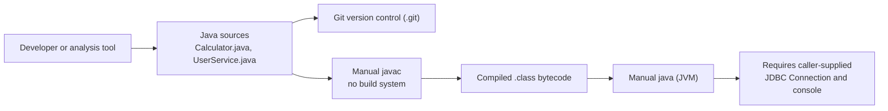
```mermaid
flowchart LR
    Dev["Developer or analysis tool"] --> Src["Java sources<br/>Calculator.java, UserService.java"]
    Src --> Git["Git version control (.git)"]
    Src --> Compile["Manual javac<br/>no build system"]
    Compile --> Bytecode["Compiled .class bytecode"]
    Bytecode --> Run["Manual java (JVM)"]
    Run --> Ext["Requires caller-supplied<br/>JDBC Connection and console"]
```

### 3.6.3 Component Integration Requirements

Integration *between* the system's own components is negligible: `Calculator` and `UserService` are independent classes in the default package, neither imports nor instantiates the other, and no method in one calls the other. Their only shared touchpoint is the console (`System.out`), used by `Calculator.printUser` and `UserService.savePassword`. The sole *external* integration requirement at runtime is the caller-supplied `java.sql.Connection` needed by `UserService.getUser` (§3.4.2, §3.5.3). Consequently, there is no inter-service contract, message format, network protocol, or deployment coupling to define for this system.

## 3.7 References

**Repository files examined**

- `Calculator.java` - Established Java as the implementation language, the default-package/no-import structure, sole reliance on `java.lang` types (`String`, `System.out`, `int`), and the language-level behaviors referenced in §3.1.4.
- `UserService.java` - Established the only non-implicit imports (`java.sql.Connection`, `java.sql.Statement`), the raw-JDBC data-access usage (§3.5), the caller-supplied `Connection` integration point (§3.4.2), and the absence of any driver/datasource/persistence.
- `README.md` - Established the project identity ("Buggy Calculator") and its purpose as a Java fixture for testing AI bug detection, supporting the technology-selection rationale in §3.1.2.

**Repository structure and tooling artifacts**

- `` (repository root) - Confirmed the complete file inventory (three files plus a `.git/` directory) and the absence of any subfolders, build config, dependency manifest, test harness, containerization, IaC, or CI/CD definitions.
- `.git/` - Confirmed Git as the sole version-control/development tool present (§3.6.1).

**Cross-referenced Technical Specification sections**

- `1.2 System Overview` - Corroborated "plain Java, no package declaration," the `java.sql`-only external references, and that no Java language/runtime version is pinned.
- `1.3 Scope` - Corroborated the "Java Standard Edition environment, no third-party libraries" requirement and the out-of-scope list (no configured database, no external services, no CI/CD, no build/packaging/tests).
- `2.4 Implementation Considerations` - Corroborated the "Java SE only, no tooling" constraint, the "buildable by a plain `javac` invocation" requirement, and the per-feature security/technical notes referenced in §3.1.4 and §3.5.3.

**External sources**

- [web] Java SE LTS release line (Java 8, 11, 17, 21, 25) - Cited only as general external context for §3.1.3/§3.2.2; a targeted web search returned no results in this environment, so no version claim is attributed to the repository, which pins none.

# 4. Process Flowchart

## 4.1 System Workflows

This section documents the process flows of the **Buggy Calculator** repository. The repository is a deliberately minimal Java Standard Edition (Java SE) fixture consisting of exactly three files — `Calculator.java`, `UserService.java`, and `README.md` — created, per the `README.md`, as a "Small Java project created for testing AI bug detection" that "Contains intentional coding and security issues." Its workflows are therefore correspondingly small, self-contained, and free of orchestration.

Two facts observed directly from the source shape every flowchart in this section:

- **No application entry point exists.** Neither `Calculator.java` nor `UserService.java` declares a `main` method, a constructor with behavior, a scheduler, or any bootstrapping code. All work is initiated by an unspecified external *caller* that invokes one of the public methods directly. There is no request router, dispatcher, or lifecycle manager.
- **The methods are mutually independent.** As established in §2.3 (Feature Relationships), no method in the repository calls any other method, and the only instance field — `Calculator.password` at `Calculator.java:3` — is never read or written by any method (dead state). Each public method is thus an isolated, synchronously-invoked unit of work.

**Actors and system boundary.** The system boundary encloses only the two classes. Everything else — the code that calls the methods, the console, and any relational database — is external. The following actors and systems participate in the workflows:

| Actor / System | Boundary | Role in Workflows | Evidence |
| --- | --- | --- | --- |
| Runtime caller / invoker | External | Invokes the six public methods; supplies all inputs (operands, credentials, name, `Connection`, `id`, password) | No `main`/entry point in either class; all methods are `public` |
| AI / static-analysis tool | External | Ingests the two source files and compares detected issues against the inline-annotated ground-truth defects (F-007) | `README.md`; §1.3.1 static-evaluation workflow |
| `Calculator` class | Internal | Provides `divide`, `login`, `printUser`, `unusedMethod` (F-001–F-004) | `Calculator.java:1-30` |
| `UserService` class | Internal | Provides `getUser` (F-005) and `savePassword` (F-006) | `UserService.java:4-20` |
| `System.out` console | External | Receives text written by `printUser` and `savePassword` | `Calculator.java:20,23`; `UserService.java:17` |
| External RDBMS | External | Executes the SQL statement issued through a caller-supplied JDBC `Connection` in `getUser` | `UserService.java:6-13` (`java.sql` API) |

**Top-level workflows.** Consistent with the two primary workflows identified in §1.3.1 (In-Scope), the repository supports exactly two top-level process flows:

1. **Static Evaluation Workflow (F-007).** An external AI or static-analysis tool reads the two `.java` files as text, reports the coding and security issues it detects, and compares those findings against the seven ground-truth defects that are self-annotated with inline comments (for example `// Hardcoded password`, `// SQL Injection`, `// Sensitive Information Logging`). This workflow is the fixture's reason to exist and involves no code execution.
2. **Runtime Invocation Workflow.** A caller invokes one of the six public method behaviors (F-001–F-006). Control flows through the invoked method and terminates in one of four ways: a returned value, one or more console writes, a SQL query issued to an external database, or an uncaught exception that propagates back to the caller.

No numeric service-level agreements (SLAs), throughput targets, or timing constraints are defined anywhere in the repository (confirmed in §1.2.3 and throughout §2.2, where "Performance Criteria" is recorded as "None specified"). Every runtime operation is synchronous, single-threaded, and in-memory; the only operation whose latency depends on an external system is F-005 (`getUser`), which waits on the caller-supplied database connection.

### 4.1.1 High-Level System Workflow

The high-level workflow below unifies both top-level flows. The diagram uses swim-lane subgraphs to separate the three domains — external actors, the system boundary, and external systems — and shows how a consumed fixture branches into either static evaluation or runtime invocation. Entry and exit points are rendered as stadium nodes and the mode selection as a decision diamond.

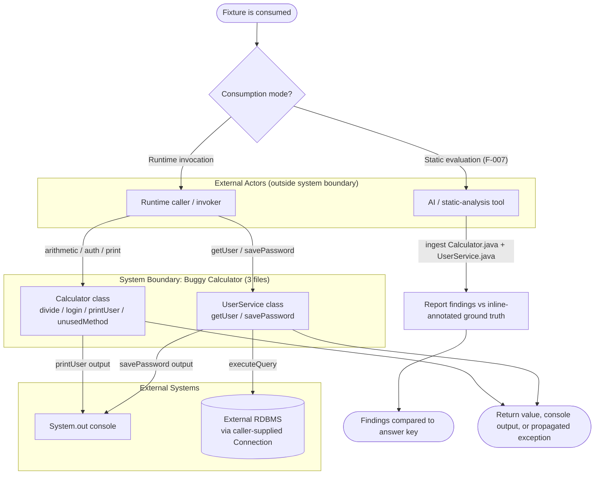
```mermaid
flowchart TB
    Start(["Fixture is consumed"]) --> Mode{"Consumption mode?"}

    subgraph Consumers["External Actors (outside system boundary)"]
        Tool["AI / static-analysis tool"]
        Caller["Runtime caller / invoker"]
    end

    subgraph SystemBoundary["System Boundary: Buggy Calculator (3 files)"]
        Calc["Calculator class<br/>divide / login / printUser / unusedMethod"]
        Svc["UserService class<br/>getUser / savePassword"]
    end

    subgraph ExternalSys["External Systems"]
        Console["System.out console"]
        DB[("External RDBMS<br/>via caller-supplied Connection")]
    end

    Mode -->|"Static evaluation (F-007)"| Tool
    Tool -->|"ingest Calculator.java + UserService.java"| Analyze["Report findings vs inline-annotated ground truth"]
    Analyze --> End1(["Findings compared to answer key"])

    Mode -->|"Runtime invocation"| Caller
    Caller -->|"arithmetic / auth / print"| Calc
    Caller -->|"getUser / savePassword"| Svc
    Calc -->|"printUser output"| Console
    Svc -->|"savePassword output"| Console
    Svc -->|"executeQuery"| DB
    Calc --> End2(["Return value, console output, or propagated exception"])
    Svc --> End2
```

**Boundaries and touchpoints.** The only outbound touchpoints from the system boundary are (a) writes to the `System.out` console from `printUser` (F-003) and `savePassword` (F-006), and (b) a single SQL query issued to an external RDBMS from `getUser` (F-005) through a JDBC `Connection` that the caller passes in. There is no inbound network interface, no message consumer, and no scheduler — the caller drives every runtime interaction.

### 4.1.2 Core Business Processes

This subsection details the runtime journey of each core `Calculator` behavior. Each flow is triggered by a direct method invocation from the caller (there is no shared session, request context, or preceding authentication step), and each terminates independently. Genuine decision points are rendered as diamonds; error states that propagate uncaught to the caller are called out explicitly, because no method contains a `try`/`catch` block.

#### 4.1.2.1 F-001 — Integer Division (`divide`)

`divide(int a, int b)` at `Calculator.java:5-7` evaluates and returns `a / b`. There is no explicit divisor guard in the code; the "decision" modeled below is the Java Virtual Machine's runtime behavior for integer division. When `b` is `0`, the JVM raises an unchecked `ArithmeticException` ("/ by zero") that propagates to the caller; otherwise the method returns the integer quotient, which is truncated toward zero (for example, `divide(6, 3)` returns `2`). There is no user touchpoint — the result is returned in-process.

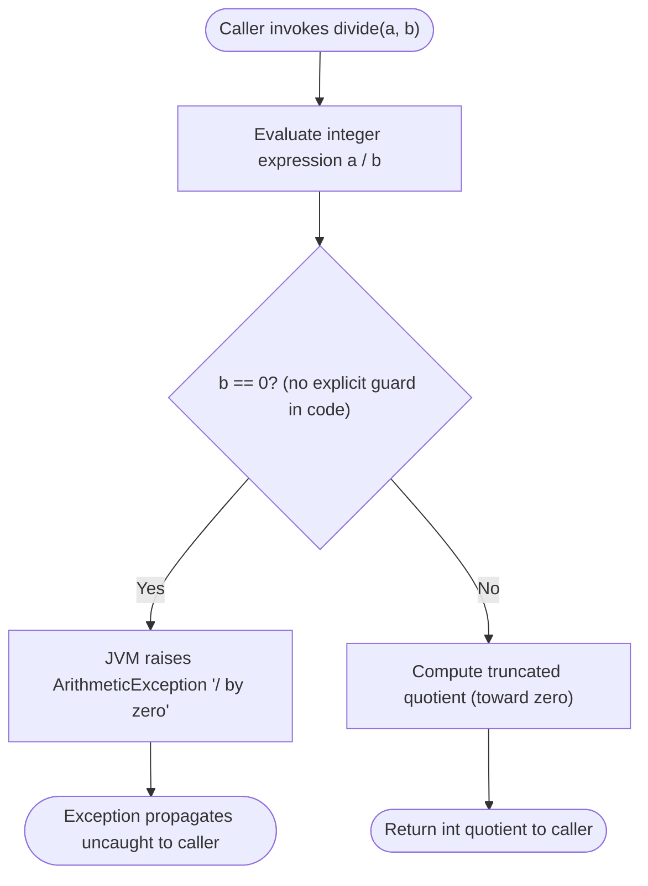
```mermaid
flowchart TD
    S(["Caller invokes divide(a, b)"]) --> Compute["Evaluate integer expression a / b"]
    Compute --> D{"b == 0? (no explicit guard in code)"}
    D -->|"Yes"| Err["JVM raises ArithmeticException '/ by zero'"]
    Err --> Prop(["Exception propagates uncaught to caller"])
    D -->|"No"| Ret["Compute truncated quotient (toward zero)"]
    Ret --> E(["Return int quotient to caller"])
```

#### 4.1.2.2 F-002 — Credential Login Stub (`login`)

`login(String username, String password)` at `Calculator.java:9-16` is a hardcoded authentication stub. Its single decision (the boolean `AND` at `Calculator.java:11`) returns the literal `"Login Success"` only when *both* the `username` argument equals `"admin"` and the `password` argument equals `"admin"`; on any other combination it returns `null` (annotated `// Bad practice` at `Calculator.java:15`). The method does **not** consult the instance field `Calculator.password` ("admin123"), so that field is irrelevant to the decision. A `NullPointerException` is raised at `Calculator.java:11` if `username` is `null` (its `equals` is evaluated first); it is likewise raised if `username` equals `"admin"` but `password` is `null`. Returning `null` rather than `false`/a status object is the seeded code-quality defect, and returning a value only on hardcoded credentials is the seeded security concern. The result is returned in-process; there is no user touchpoint or console output.

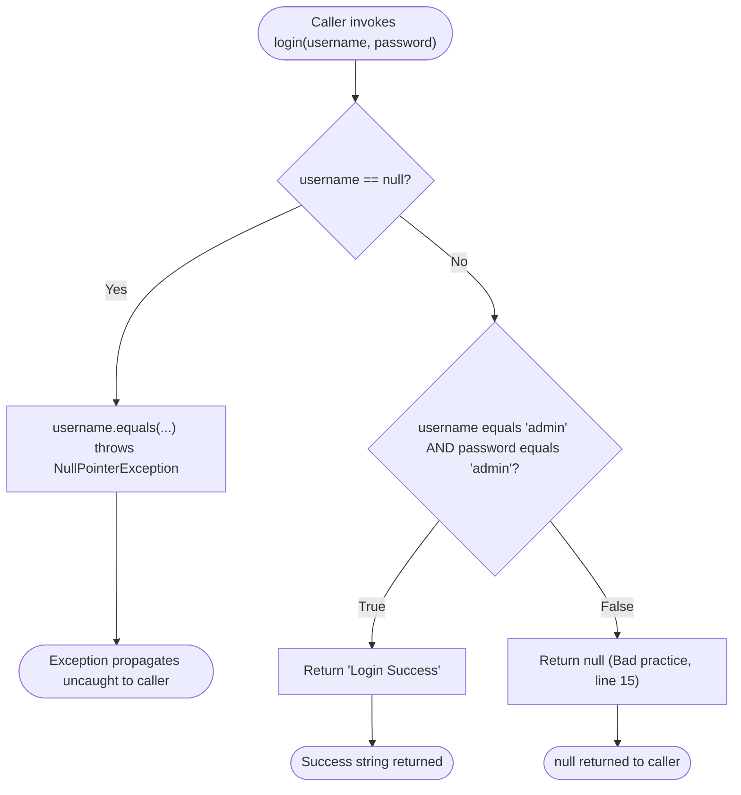
```mermaid
flowchart TD
    S(["Caller invokes login(username, password)"]) --> N{"username == null?"}
    N -->|"Yes"| NPE["username.equals(...) throws NullPointerException"]
    NPE --> Prop(["Exception propagates uncaught to caller"])
    N -->|"No"| C{"username equals 'admin' AND password equals 'admin'?"}
    C -->|"True"| OK["Return 'Login Success'"]
    OK --> E1(["Success string returned"])
    C -->|"False"| Nul["Return null (Bad practice, line 15)"]
    Nul --> E2(["null returned to caller"])
```

#### 4.1.2.3 F-003 — Console User Printing (`printUser`)

`printUser(String name)` at `Calculator.java:18-25` first writes `name` to the `System.out` console (`Calculator.java:20`) and then, if `name` equals `"admin"` (`Calculator.java:22`), writes the additional line `"Welcome Admin"`. This is the first user-visible touchpoint: text is emitted to the console. The seeded null-pointer risk is subtle — `System.out.println(name)` prints the literal `null` without failing when `name` is `null`, but the subsequent guard `name.equals("admin")` at `Calculator.java:22` then throws a `NullPointerException` that propagates to the caller. The method returns `void` in the non-null cases regardless of which branch is taken.

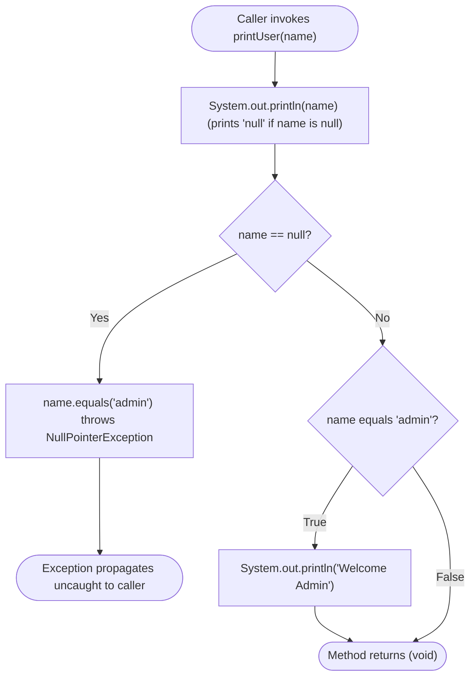
```mermaid
flowchart TD
    S(["Caller invokes printUser(name)"]) --> P["System.out.println(name) (prints 'null' if name is null)"]
    P --> N{"name == null?"}
    N -->|"Yes"| NPE["name.equals('admin') throws NullPointerException"]
    NPE --> Prop(["Exception propagates uncaught to caller"])
    N -->|"No"| C{"name equals 'admin'?"}
    C -->|"True"| W["System.out.println('Welcome Admin')"]
    W --> E(["Method returns (void)"])
    C -->|"False"| E
```

#### 4.1.2.4 F-004 — No-Op Utility (`unusedMethod`)

`unusedMethod()` at `Calculator.java:27-29` declares a single local variable `int x = 10` (annotated `// Unused variable` at `Calculator.java:28`) and returns. It has no decision points, produces no output, performs no I/O, mutates no state, and throws no exception. It exists solely to carry the seeded "unused variable" dead-code defect (F-004), and its process flow is therefore linear from entry to exit.

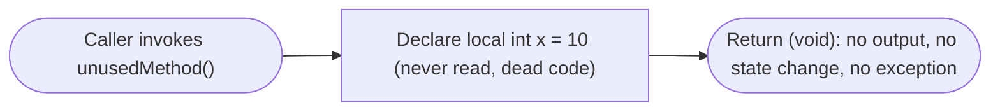
```mermaid
flowchart LR
    S(["Caller invokes unusedMethod()"]) --> X["Declare local int x = 10 (never read, dead code)"]
    X --> E(["Return (void): no output, no state change, no exception"])
```

### 4.1.3 Integration Workflows

The repository has a single genuine integration surface — a relational database reached through the `java.sql` (JDBC) API in `getUser` — plus a console output surface shared with F-003. These are documented below, followed by an explicit, evidence-based enumeration of the integration patterns that are **absent** from the repository.

#### 4.1.3.1 F-005 — JDBC User Lookup (`getUser`)

`getUser(Connection con, String id)` at `UserService.java:6-13` is the repository's only cross-system data flow. The method is declared `throws Exception`, receives an already-open JDBC `Connection` from the caller, obtains a `Statement` via `con.createStatement()` (`UserService.java:8`), constructs a query by directly concatenating the `id` argument into the SQL text — `"SELECT * FROM users WHERE id='" + id + "'"` (`UserService.java:10`) — and issues it with `stmt.executeQuery(query)` (annotated `// SQL Injection` at `UserService.java:12`).

The data flow is one-directional in practice: the `id` flows **into** the database as part of the SQL string (unsanitized, which is why a value such as `x' OR '1'='1` alters the query's meaning), but the `ResultSet` returned by `executeQuery` is **discarded** — it is never assigned, iterated, or returned, so no row data flows back to the caller. Neither the `Statement` nor the `ResultSet` is closed (a resource leak, noted out-of-scope in §1.3.2), and any `SQLException` (or other failure) propagates to the caller because there is no local exception handling. The repository provides no JDBC driver, datasource, connection string, or schema — connection management is entirely the external caller's responsibility.

The following sequence diagram uses participants as swim lanes to show the JDBC interaction, including both the success path and the propagated-error path.

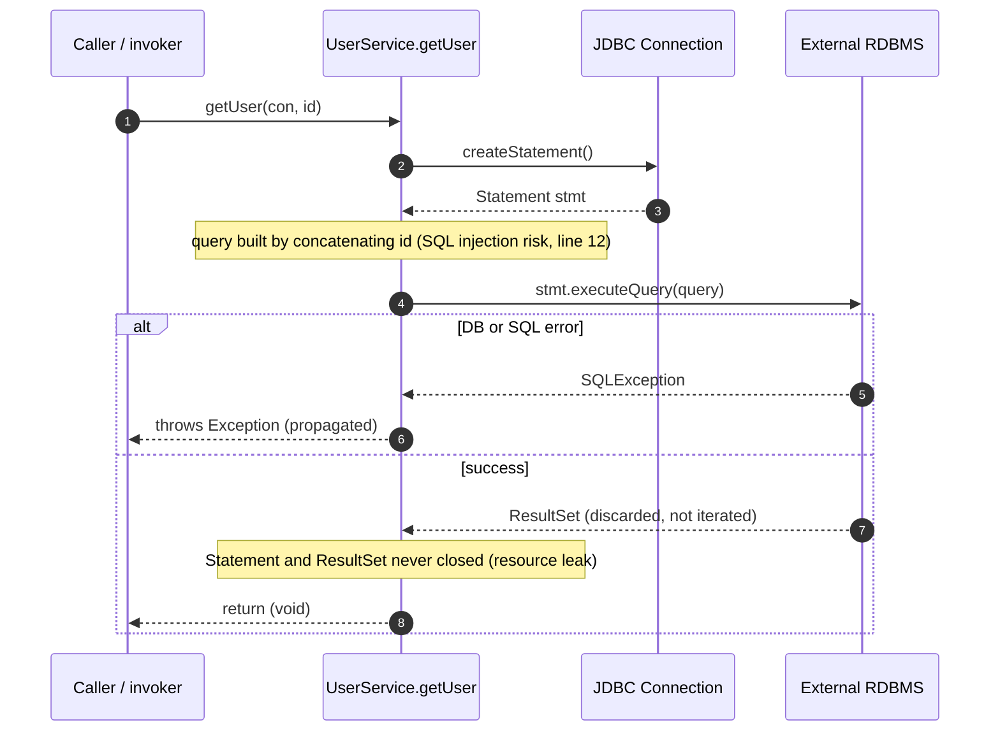
```mermaid
sequenceDiagram
    autonumber
    participant Caller as Caller / invoker
    participant Svc as UserService.getUser
    participant Con as JDBC Connection
    participant DB as External RDBMS
    Caller->>Svc: getUser(con, id)
    Svc->>Con: createStatement()
    Con-->>Svc: Statement stmt
    Note over Svc: query built by concatenating id (SQL injection risk, line 12)
    Svc->>DB: stmt.executeQuery(query)
    alt DB or SQL error
        DB-->>Svc: SQLException
        Svc-->>Caller: throws Exception (propagated)
    else success
        DB-->>Svc: ResultSet (discarded, not iterated)
        Note over Svc: Statement and ResultSet never closed (resource leak)
        Svc-->>Caller: return (void)
    end
```

#### 4.1.3.2 F-006 — Password Console Output (`savePassword`)

`savePassword(String password)` at `UserService.java:15-19` is a stub whose name implies persistence but whose only action is `System.out.println(password)` (annotated `// Sensitive Information Logging` at `UserService.java:17`). It writes the supplied secret to the `System.out` console in plaintext and returns `void`. There is no database write, no file write, no masking, hashing, or encryption, and no persistence of any kind — the mismatch between the method's name and its behavior is itself part of the seeded defect corpus (F-006).

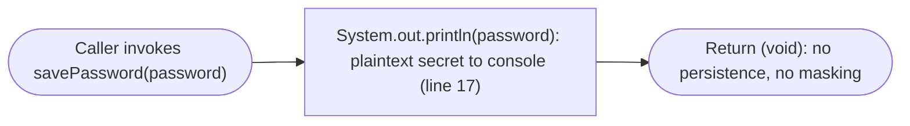
```mermaid
flowchart LR
    S(["Caller invokes savePassword(password)"]) --> W["System.out.println(password): plaintext secret to console (line 17)"]
    W --> E(["Return (void): no persistence, no masking"])
```

#### 4.1.3.3 Absent Integration Patterns

To document the integration surface accurately, the following patterns from the section prompt were investigated and confirmed **absent** from the repository (consistent with the out-of-scope boundary in §1.3.2 and the integration-points analysis in §2.3):

| Integration Pattern | Status | Evidence |
| --- | --- | --- |
| HTTP / REST / network API | Absent | No web framework, controller, socket, or network import in either file |
| Event processing / message queues | Absent | No broker client, listener, publisher, or event loop anywhere |
| Batch processing / scheduling | Absent | No scheduler, cron trigger, or batch/loop-over-records construct |
| Inter-service / inter-method calls | Absent | No method calls another; classes do not reference each other (§2.3) |
| Relational database (JDBC) | Present (F-005 only) | `UserService.java:6-13` uses `java.sql.Connection`/`Statement` |
| Console output | Present (F-003, F-006) | `Calculator.java:20,23`; `UserService.java:17` (`System.out`) |

The only external application programming interface exercised by the code is the JDBC (`java.sql`) API used within `getUser`; the only other external interaction is unstructured text written to the console.


## 4.2 Flowchart Requirements and Validation Rules

This section consolidates the required flowchart elements for every workflow documented in §4.1 — start and end points, process steps, decision diamonds, system boundaries, user touchpoints, error states and recovery paths, and timing/SLA considerations — and then enumerates the validation rules, authorization checkpoints, and regulatory compliance checks that apply at each step. Because the repository is a deliberately minimal fixture, several of these categories are legitimately empty; those absences are documented explicitly rather than omitted.

### 4.2.1 Workflow Element Reference

The three tables below decompose each runtime workflow (F-001–F-006) into the standard flowchart elements. The seventh feature, F-007 (Ground-Truth Seeded Defect Corpus), is the static-evaluation meta-workflow and is described in prose after the tables because it involves no code execution and therefore has no runtime steps.

**Entry, exit, and timing.** Every runtime workflow is triggered by a direct, synchronous method call from an external caller; none is scheduled, queued, or event-driven.

| Workflow | Start / Trigger | Terminal State(s) | Timing / SLA |
| --- | --- | --- | --- |
| F-001 `divide` | Caller invokes `divide(a, b)` | Return `int` quotient, or propagate `ArithmeticException` | None specified; synchronous, in-memory |
| F-002 `login` | Caller invokes `login(username, password)` | Return `"Login Success"`, return `null`, or propagate `NullPointerException` | None specified; synchronous, in-memory |
| F-003 `printUser` | Caller invokes `printUser(name)` | `void` return after console write, or propagate `NullPointerException` | None specified; synchronous, in-memory |
| F-004 `unusedMethod` | Caller invokes `unusedMethod()` | `void` return (no effect) | None specified; synchronous, in-memory |
| F-005 `getUser` | Caller invokes `getUser(con, id)` | `void` return after query, or propagate `Exception`/`SQLException` | None specified; latency bound by external RDBMS |
| F-006 `savePassword` | Caller invokes `savePassword(password)` | `void` return after console write | None specified; synchronous, in-memory |

**Process steps and decision diamonds.** Only three genuine decision points exist across the entire codebase; workflows without a diamond execute a straight-line sequence.

| Workflow | Key Process Steps | Decision Diamonds |
| --- | --- | --- |
| F-001 `divide` | Evaluate `a / b` (`Calculator.java:6`) | Implicit `b == 0?` JVM runtime branch (`Calculator.java:6`; no explicit `if`) |
| F-002 `login` | Compare `username`/`password` against literal `"admin"` (`Calculator.java:11`) | `username.equals("admin") && password.equals("admin")?` (`Calculator.java:11`) |
| F-003 `printUser` | `println(name)` (`Calculator.java:20`); conditional `println("Welcome Admin")` (`Calculator.java:23`) | `name.equals("admin")?` (`Calculator.java:22`) |
| F-004 `unusedMethod` | Declare unused `int x = 10` (`Calculator.java:28`) | None |
| F-005 `getUser` | `createStatement()` (`:8`); build query by concatenation (`:10`); `executeQuery(query)` (`:12`); discard `ResultSet` | None in code (success/failure determined by the external RDBMS) |
| F-006 `savePassword` | `println(password)` (`UserService.java:17`) | None |

**System boundaries, user touchpoints, error states, and recovery.** No workflow contains a `try`/`catch`/`finally` block, so there is no in-code recovery path anywhere — every error state propagates uncaught to the caller, which bears sole responsibility for handling it.

| Workflow | System Boundary Crossed | User Touchpoint | Error State & Recovery Path |
| --- | --- | --- | --- |
| F-001 `divide` | None (in-process) | None (value returned) | `ArithmeticException` on `b == 0`; no recovery (propagates) |
| F-002 `login` | None (in-process) | None (value returned) | `NullPointerException` on `null` argument; `null` return on failed match; no recovery |
| F-003 `printUser` | `System.out` console | Console text (`name`, optional `"Welcome Admin"`) | `NullPointerException` on `null` name at the guard; no recovery |
| F-004 `unusedMethod` | None | None | None |
| F-005 `getUser` | JDBC `Connection` → external RDBMS | None (`ResultSet` discarded) | `SQLException`/`Exception` propagates; unclosed `Statement`/`ResultSet` leak; no recovery |
| F-006 `savePassword` | `System.out` console | Console text (plaintext secret) | None thrown (plaintext exposure is a security concern, not an exception) |

**F-007 — Static Evaluation Workflow.** This meta-workflow is not a code-execution path. Its start point is an external AI/static-analysis tool ingesting `Calculator.java` and `UserService.java` as text; its process steps are analysis of the source and comparison of detected issues against the inline annotations (`// Hardcoded password`, `// Division by zero risk`, `// Bad practice`, `// Null Pointer Risk`, `// Unused variable`, `// SQL Injection`, `// Sensitive Information Logging`); its decision is the tool-internal judgment of whether each finding matches a ground-truth annotation; and its end point is the comparison of findings against the answer key (§1.2.3). It crosses no runtime system boundary and has no timing/SLA. This workflow is depicted as the left-hand branch of the high-level diagram in §4.1.1.

### 4.2.2 Validation Rules, Authorization Checkpoints, and Regulatory Compliance

The table below records the business rule enforced at each workflow's decision/computation step, the data-validation performed on inputs, and any authorization checkpoint. The consistent finding — corroborated by the "Validation Rules" rows of §2.2 — is that the code performs **no** input validation and enforces **no** authorization.

| Workflow | Business Rule | Data Validation | Authorization Checkpoint |
| --- | --- | --- | --- |
| F-001 `divide` | Truncating integer division of `a` by `b` | None (divisor not checked for zero) | None |
| F-002 `login` | Success only if both arguments equal the literal `"admin"`; field `password` ignored; failure yields `null` | None (arguments not null-checked) | None (the stub is never used as a gate — see below) |
| F-003 `printUser` | `"Welcome Admin"` emitted only when `name` equals `"admin"` | None (name not null-checked before the guard) | None |
| F-004 `unusedMethod` | None (no-op) | None | None |
| F-005 `getUser` | Select rows whose `id` column matches the supplied value | None (`id` concatenated raw into SQL — no sanitization or parameterization) | None |
| F-006 `savePassword` | Emit the supplied password verbatim | None (value neither validated nor masked) | None |

**Authorization checkpoints.** No workflow enforces an authorization or access-control check. Although `login` (F-002) computes a credential-style verdict, §2.3 establishes that no method calls any other method, so the login result is never consulted as a gate before `getUser`, `printUser`, `savePassword`, or any other operation. There are no roles, sessions, tokens, or permission checks anywhere in the repository, and there is no authentication provider or secrets manager (confirmed out-of-scope in §1.3.2).

**Regulatory compliance checks.** No regulatory compliance controls exist. The "Compliance Requirements" row is recorded as "None declared" for every feature in §2.2, and there is no data-classification, audit-logging, retention, consent, encryption, or masking mechanism in the code. Notably, two workflows actively contradict common data-protection expectations by design: `savePassword` (F-006) writes a secret to the console in plaintext (`UserService.java:17`) and `getUser` (F-005) is vulnerable to SQL injection (`UserService.java:12`). These are intentional seeded defects (F-007) preserved as part of the fixture's ground truth, not compliance features to be satisfied.


## 4.3 Technical Implementation Flows

This section documents the implementation-level flows behind the workflows in §4.1 — how (little) state is managed and how errors are handled. Both areas are intentionally sparse: the repository holds no mutable state and contains no exception-handling code. The state-transition and error-handling diagrams below therefore emphasize the boundaries and the absent mechanisms as much as the present ones.

### 4.3.1 State Management

The system is effectively stateless. The only instance field in the entire repository is `Calculator.password = "admin123"` at `Calculator.java:3`; it is assigned once at object construction and is never read or mutated by any method (it is dead state, as noted in §2.3). `UserService` declares no fields at all. Consequently there are no meaningful in-object state transitions — an instance simply remains in its constructed state for its lifetime, and each method call leaves that state unchanged.

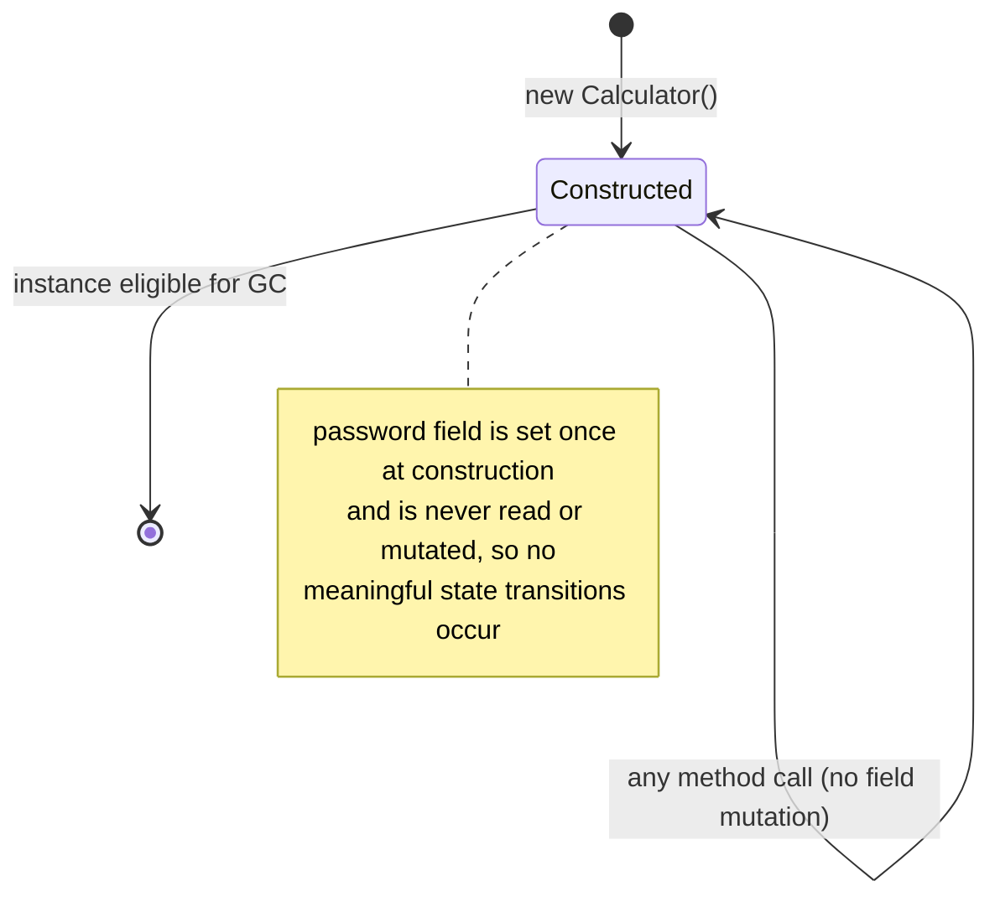
```mermaid
stateDiagram-v2
    [*] --> Constructed: new Calculator()
    Constructed --> Constructed: any method call (no field mutation)
    Constructed --> [*]: instance eligible for GC
    note right of Constructed
        password field is set once at construction
        and is never read or mutated, so no
        meaningful state transitions occur
    end note
```

**Transaction and resource boundaries.** The nearest thing to stateful behavior is the transient JDBC resource lifecycle inside `getUser` (`UserService.java:6-13`). The method obtains a `Statement` from the caller-supplied `Connection`, executes exactly one query, and returns — but it never advances to a "closed" state for either the `Statement` or the discarded `ResultSet`, and it performs no explicit transaction demarcation. There is no `begin`, `commit`, or `rollback` in the code; whether the single `SELECT` runs under auto-commit is governed entirely by the external `Connection`, which the repository never configures. The state diagram below models this resource lifecycle and highlights the missing `close` transition that constitutes the seeded resource-leak concern (also noted out-of-scope in §1.3.2).

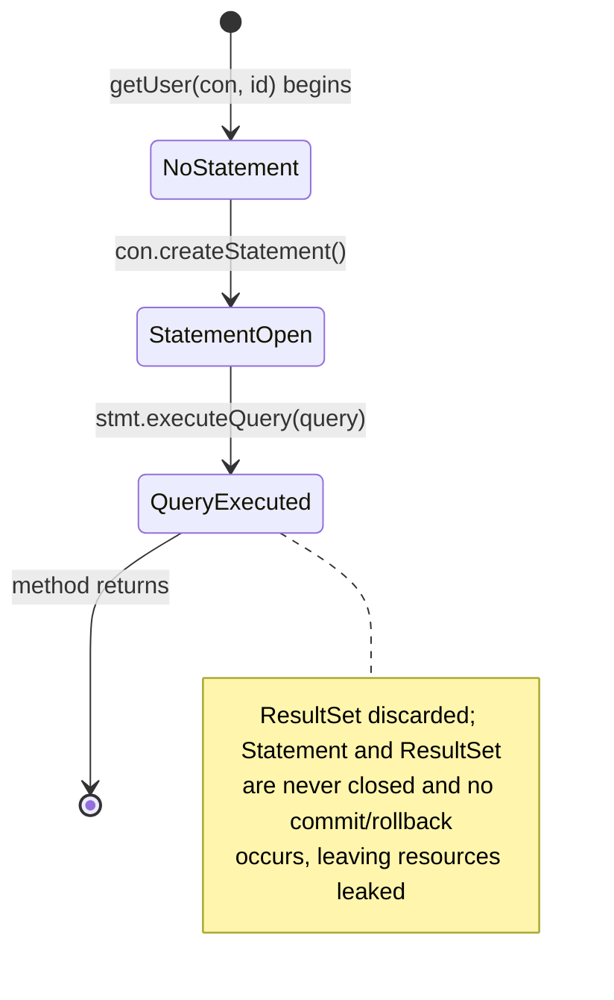
```mermaid
stateDiagram-v2
    [*] --> NoStatement: getUser(con, id) begins
    NoStatement --> StatementOpen: con.createStatement()
    StatementOpen --> QueryExecuted: stmt.executeQuery(query)
    QueryExecuted --> [*]: method returns
    note right of QueryExecuted
        ResultSet discarded; Statement and ResultSet
        are never closed and no commit/rollback
        occurs, leaving resources leaked
    end note
```

**Data persistence points.** There are none. Despite its name, `savePassword` (F-006) only writes to the console and persists nothing (`UserService.java:17`). `getUser` (F-005) issues a read-only `SELECT` and discards the `ResultSet`, so it neither writes data nor returns retrieved data to the caller. No method writes to a database, file, or any durable store.

**Caching requirements.** There is no caching of any kind — no in-memory cache, memoization, connection pool, or cache library. Every invocation recomputes from its arguments, and `getUser` opens a fresh `Statement` on each call.

### 4.3.2 Error Handling

The error-handling model is uniform across the codebase: **detect nothing, handle nothing, propagate everything.** No method contains a `try`, `catch`, or `finally` block, so any exception raised during execution travels up the call stack to the external caller unchanged. This is consistent with §1.3.2, which places "exception handling beyond a propagated `throws Exception`" out of scope. The flowchart below models the unified path and, via the dotted branch, records the recovery mechanisms that are deliberately absent.

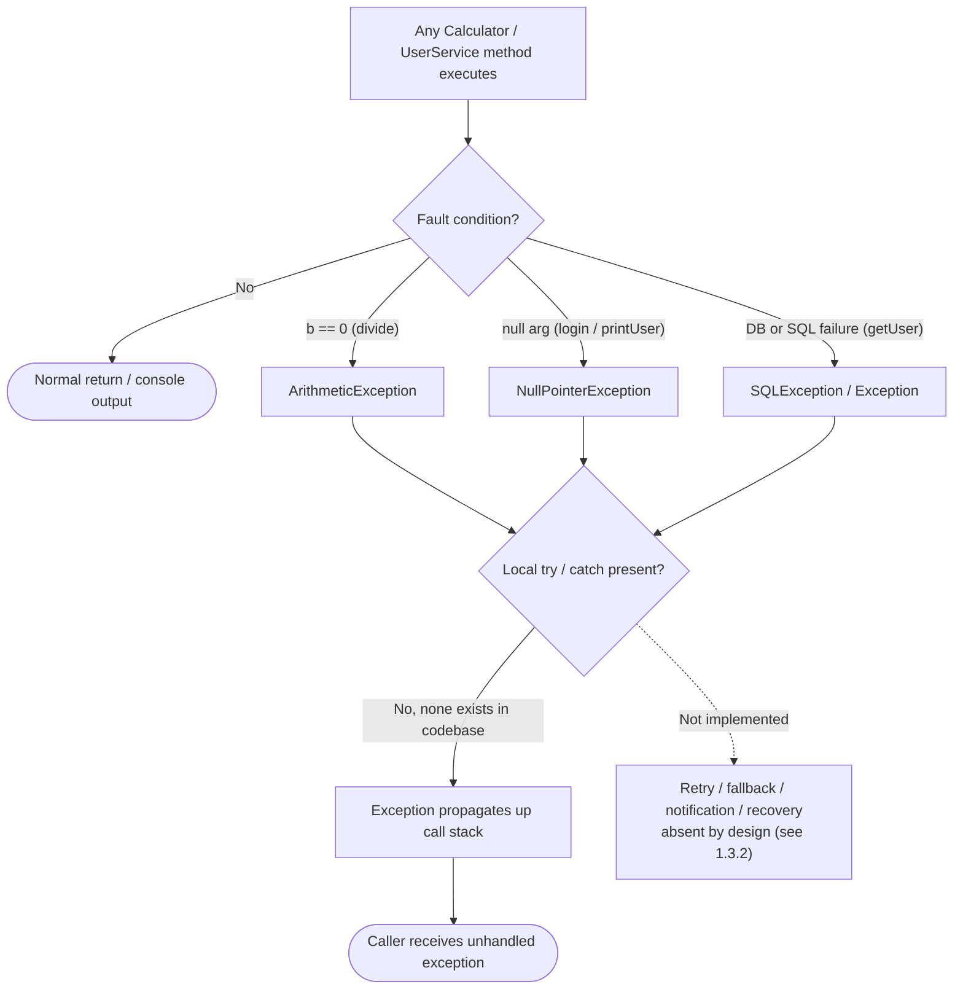
```mermaid
flowchart TD
    Op["Any Calculator / UserService method executes"] --> Fault{"Fault condition?"}
    Fault -->|"No"| Normal(["Normal return / console output"])
    Fault -->|"b == 0 (divide)"| Arith["ArithmeticException"]
    Fault -->|"null arg (login / printUser)"| NPEx["NullPointerException"]
    Fault -->|"DB or SQL failure (getUser)"| SqlErr["SQLException / Exception"]
    Arith --> H{"Local try / catch present?"}
    NPEx --> H
    SqlErr --> H
    H -->|"No, none exists in codebase"| Propg["Exception propagates up call stack"]
    Propg --> CallerNode(["Caller receives unhandled exception"])
    H -.->|"Not implemented"| NA["Retry / fallback / notification / recovery<br/>absent by design (see 1.3.2)"]
```

**Exception taxonomy.** Three exception types can arise from the runtime workflows; all are unhandled and propagate to the caller.

| Exception Type | Trigger Condition | Workflow(s) | In-Code Handling |
| --- | --- | --- | --- |
| `ArithmeticException` | `b == 0` during `a / b` | F-001 `divide` | None — propagates uncaught |
| `NullPointerException` | `null` `username`/`password` (`Calculator.java:11`); `null` `name` at the guard (`Calculator.java:22`) | F-002 `login`, F-003 `printUser` | None — propagates uncaught |
| `SQLException` / `Exception` | Database or SQL failure during `executeQuery` | F-005 `getUser` | None — method is declared `throws Exception`; propagates |

**Retry mechanisms.** None. No loop, backoff, retry counter, or retry library surrounds any operation — notably, the single JDBC query in `getUser` is attempted exactly once with no retry on failure.

**Fallback processes.** None. There is no default value, alternate code path, or degraded mode when an operation fails; `divide`, `printUser`, and `getUser` simply throw, and `login` returns `null` on a failed match rather than falling back to any alternative.

**Error notification flows.** None. There is no logging framework, error channel, alerting, or monitoring integration. The only console writes in the repository (`printUser` at `Calculator.java:20,23` and `savePassword` at `UserService.java:17`) are ordinary output, not error notifications, and no stack traces are captured or reported by the code itself.

**Recovery procedures.** None. With no `try`/`catch`/`finally` and no `close()` calls, there is no cleanup, compensation, or state-restoration logic. Recovery — including closing the leaked `Statement`/`ResultSet` from `getUser` and deciding how to respond to a propagated exception — is entirely the responsibility of the external caller.


## 4.4 References

The workflows, decision points, error states, and integration flows documented in this section were derived directly from the following repository artifacts and cross-referenced Technical Specification sections. No external web sources were used.

**Repository files and folders examined:**

- `Calculator.java` — Established the F-001–F-004 behaviors and their process flows: the `divide` integer-division computation and divide-by-zero error state (`:5-7`), the hardcoded-credential `login` decision and `null`/`NullPointerException` outcomes (`:9-16`), the `printUser` console output and null-name guard (`:18-25`), the no-op `unusedMethod` dead-code flow (`:27-29`), and the dead `password` instance field used in the state-management analysis (`:3`).
- `UserService.java` — Established the integration and console workflows: the `getUser` JDBC data flow, SQL-injection concatenation, discarded `ResultSet`, unclosed `Statement`, and propagated `Exception` (`:6-13`, with `java.sql` imports at `:1-2`), and the `savePassword` plaintext console-output flow (`:15-19`).
- `README.md` — Established the fixture's purpose and the F-007 static-evaluation workflow (a Java project "created for testing AI bug detection" that "Contains intentional coding and security issues").
- Repository root (`/`) — Confirmed the system boundary: exactly the three files above, with no build system, no test harness, no package hierarchy, no framework, and no configuration or deployment artifacts, establishing the absence of API/event/batch/scheduling entry points.

**Cross-referenced Technical Specification sections:**

- §1.2.2 High-Level Description — System capabilities table and component diagram used to frame the high-level workflow and the console/JDBC touchpoints.
- §1.2.3 Success Criteria — Confirmed the absence of numeric KPIs/SLAs, informing the timing/SLA columns.
- §1.3.1 In-Scope — Source of the system boundary and the two top-level workflows (static evaluation and runtime invocation).
- §1.3.2 Out-of-Scope — Confirmed the deliberate absence of exception handling beyond `throws Exception`, persistence, resource management (unclosed `Statement`/`ResultSet`), API/network, authentication, and compliance.
- §2.1 Feature Catalog — Source of the feature identifiers (F-001–F-007), names, categories, and exact source locations referenced throughout the diagrams.
- §2.2 Functional Requirements — Source of the per-feature validation rules and the "Performance Criteria: None specified" / "Compliance Requirements: None declared" findings used in §4.2.
- §2.3 Feature Relationships — Established feature independence (no method calls another, `password` field is dead) and the integration-points analysis underpinning §4.1.3.


# 5. System Architecture

## 5.1 High-Level Architecture

The Buggy Calculator system is a deliberately minimal Java SE codebase whose architecture is defined as much by what it omits as by what it contains. The repository holds exactly three artifacts at its root — `Calculator.java`, `UserService.java`, and `README.md` — with no build descriptor, dependency manifest, package declaration, application entry point, or configuration file. This subsection describes the overall architectural style and rationale, the components that make up the system, the data that flows between them, and the external systems they touch. Every statement below is grounded directly in those three source artifacts.

### 5.1.1 System Overview

**Architectural style and rationale**

The system does not implement a layered, service-oriented, event-driven, hexagonal, or microservice architecture. Because the repository contains only two Java classes and a README — with no `main()` method, no constructor logic, no scheduler, and no framework — it is most accurately characterized as a **flat collection of independent, standalone utility classes residing in the default (unnamed) Java package**. Neither class references the other, and no method invokes any other method; each public method is a self-contained unit of behavior. Both classes are behaviorally stateless: the only field in the codebase, `Calculator.password` (`Calculator.java`, line 3), is never read or mutated and therefore constitutes dead state.

The rationale for this minimalism is stated by the project itself. `README.md` declares the project was "created for testing AI bug detection" and "Contains intentional coding and security issues." A flat, dependency-free structure keeps each seeded defect isolated and directly observable to a static-analysis or AI review tool, and makes the sample trivially portable — it compiles against a stock JDK with no external libraries.

**Key architectural principles and patterns**

- **Caller-driven invocation** — With no entry point, scheduler, or bootstrap logic, all behavior is triggered by an external caller that constructs a class and invokes one of its public methods.
- **Zero third-party dependencies** — The only non-implicit imports are JDK-standard (`java.sql.Connection` and `java.sql.Statement` in `UserService.java`, lines 1–2); `java.lang` is implicit. No dependency-injection container, ORM, logging, or test framework is present.
- **Synchronous, in-process execution** — Every method runs to completion on the calling thread and returns synchronously or throws; there is no concurrency, asynchrony, or I/O beyond console output and a single JDBC call.
- **Seeded-defect ("answer key") pattern** — The code intentionally embeds known anti-patterns (catalogued elsewhere in this specification as features F-001 through F-007) that serve as ground truth for the consuming analysis tool.

**System boundaries and major interfaces**

The system boundary encloses only the two Java classes. Four interfaces cross that boundary:

1. **Public method API** — the six public methods invoked in-process by a runtime caller.
2. **Standard output** — console writes via `System.out.println` in `Calculator.printUser` and `UserService.savePassword`.
3. **JDBC database interface** — reached only inside `UserService.getUser`, and only through a `java.sql.Connection` that the caller supplies as a method parameter (no driver, URL, or datasource exists in the repository).
4. **Source-file ingestion** — the `.java` files themselves consumed read-only by an AI or static-analysis tool, the primary intended consumer.

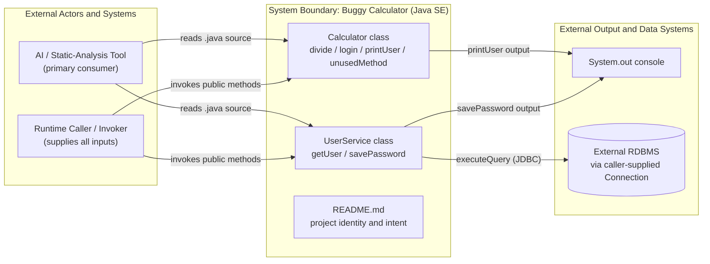
```mermaid
flowchart LR
    subgraph External["External Actors and Systems"]
        Tool["AI / Static-Analysis Tool<br/>(primary consumer)"]
        Caller["Runtime Caller / Invoker<br/>(supplies all inputs)"]
    end
    subgraph Boundary["System Boundary: Buggy Calculator (Java SE)"]
        Calc["Calculator class<br/>divide / login / printUser / unusedMethod"]
        Svc["UserService class<br/>getUser / savePassword"]
        Doc["README.md<br/>project identity and intent"]
    end
    subgraph Downstream["External Output and Data Systems"]
        Console["System.out console"]
        DB[("External RDBMS<br/>via caller-supplied Connection")]
    end
    Tool -->|"reads .java source"| Calc
    Tool -->|"reads .java source"| Svc
    Caller -->|"invokes public methods"| Calc
    Caller -->|"invokes public methods"| Svc
    Calc -->|"printUser output"| Console
    Svc -->|"savePassword output"| Console
    Svc -->|"executeQuery (JDBC)"| DB
```

### 5.1.2 Core Components

The system is composed of three artifacts: two functional Java classes and one descriptive document. The table below summarizes their roles within the four-column limit adopted throughout this specification; component-specific critical considerations follow as a companion list.

| Component Name | Primary Responsibility | Key Dependencies | Integration Points |
| --- | --- | --- | --- |
| Calculator (`Calculator.java`) | Provides four unrelated public operations — integer division, a hardcoded-credential login stub, console user printing, and a no-op method — plus one unused password field | JDK `java.lang` (implicit); `System.out` | Invoked in-process by an external caller; writes to the `System.out` console via `printUser` |
| UserService (`UserService.java`) | Provides JDBC-based user lookup (`getUser`) and a password-printing stub (`savePassword`) | JDK `java.sql` (`Connection`, `Statement`); `System.out` | Invoked in-process by an external caller; issues SQL to an external RDBMS through a caller-supplied `Connection`; writes to `System.out` via `savePassword` |
| Project README (`README.md`) | Declares project identity, purpose (AI bug-detection testing), and that the contained defects are intentional | None | Read as documentation by human and tool consumers; serves as the answer-key preamble |

**Critical considerations per component:**

- **Calculator** — `divide` carries a division-by-zero risk (F-001, `Calculator.java` lines 5–7); `login` returns `null` on failure and compares against hardcoded credentials (F-002, lines 9–16); `printUser` has a null-pointer risk when passed `null` (F-003, line 22); `unusedMethod` declares an unused local variable (F-004, lines 27–29); the `password` field is a hardcoded secret and dead state (line 3).
- **UserService** — `getUser` builds its SQL by string concatenation, creating a SQL-injection vector (F-005, `UserService.java` line 10), declares `throws Exception`, and never closes the `Statement` or the discarded `ResultSet` (a resource leak); `savePassword` prints a plaintext secret to the console (F-006, line 17) and persists nothing despite its name.
- **Project README** — purely descriptive; it establishes the ground-truth intent (F-007) and has no operational role at runtime.

### 5.1.3 Data Flow Description

**Primary data flows**

All data flow follows a single shape: a caller passes inputs into a public method, and the method returns a value, writes to the console, issues a SQL query, or throws. There is no flow *between* the two classes and none between methods.

- `divide(int, int)` — two integers in; an integer quotient out, or an `ArithmeticException` when the divisor is zero.
- `login(String, String)` — two strings in; the literal `"Login Success"` or `null` out.
- `printUser(String)` — one string in; one or two console lines out (a `NullPointerException` if the argument is `null`).
- `unusedMethod()` — no input and no output.
- `getUser(Connection, String)` — a caller-supplied `Connection` and an `id` string in; a SQL string is constructed and submitted via `executeQuery`; the driver-returned `ResultSet` is discarded and nothing is returned to the caller.
- `savePassword(String)` — one string in; the value is written to the console and not persisted.

**Integration patterns and protocols**

The only intra-system integration pattern is the direct, in-process Java method call — there is no RPC, HTTP, or messaging layer. Two protocols cross the boundary: **JDBC** (`java.sql`), used exclusively inside `getUser` over the caller-supplied `Connection`; and **plain-text standard output** via `System.out.println` in `printUser` and `savePassword`.

**Data transformation points**

The single notable transformation occurs in `getUser`, where the raw `id` argument is concatenated directly into a SQL string literal — `"SELECT * FROM users WHERE id='" + id + "'"` (`UserService.java`, line 10) — with no escaping or parameterization. This concatenation *is* the SQL-injection defect (F-005). Elsewhere, `login` performs equality comparisons of its arguments against the literal `"admin"`, and `printUser` compares its argument against `"admin"`. No serialization, encoding, or object-relational mapping layers exist.

**Key data stores and caches**

There are none. No database is provisioned in the repository — there is no driver, datasource, connection string, schema, or migration; the `users` table exists only as text inside a SQL string literal. `getUser` depends entirely on the caller to inject a live `Connection`, and it neither iterates nor closes the returned `ResultSet`. No caching layer, in-memory store, or session state is present: `savePassword` persists nothing, and the `Calculator.password` field is an unused in-memory constant.

### 5.1.4 External Integration Points

The following external systems interact with the codebase. The four-column table respects the column limit adopted in this specification; service-level expectations are addressed in prose beneath it.

| System Name | Integration Type | Data Exchange Pattern | Protocol / Format |
| --- | --- | --- | --- |
| External RDBMS | Outbound database query through a caller-supplied `java.sql.Connection` | Synchronous request; driver returns a `ResultSet` that the code discards | JDBC (`java.sql`); SQL text submitted over the `Connection` |
| System.out console | Outbound standard-output write | One-way, fire-and-forget line writes | Plain text via `System.out.println` (stdout) |
| AI / Static-Analysis Tool | Inbound source ingestion (primary consumer) | Read-only, offline analysis of the source files | Java source text (`.java` files) |
| Runtime Caller / Invoker | Inbound in-process API invocation | Synchronous method call and return, or a thrown exception | Java method signatures (in-process on the JVM) |

**SLA requirements.** The repository defines no service-level agreements, latency or throughput targets, availability guarantees, or KPIs for any of these integration points. None of the three files contains timeout configuration, retry policy, connection pooling, transaction-boundary management, or monitoring hooks. The RDBMS integration is the clearest example: because `getUser` operates solely on the `Connection` injected by the caller at runtime, all reliability and performance characteristics of that integration are determined outside the system boundary and are not specified anywhere in the codebase.

## 5.2 Component Details

This subsection details each of the system's three components. Because the codebase contains no frameworks, services, or shared infrastructure, the "components" are simply the two Java classes and the README; each is documented in terms of purpose, technologies, interfaces, persistence, and scaling. Behavioral and interaction diagrams follow in 5.2.4.

### 5.2.1 Calculator Component

**Purpose and responsibilities.** `Calculator.java` is a single class that exposes four functionally unrelated public operations — integer division, a login stub, console user printing, and a no-op method — together with one unused instance field. It behaves as a grab-bag utility class rather than a cohesive domain object; each method illustrates a distinct seeded defect.

**Technologies and frameworks.** Pure Java SE with no `import` statements; it relies only on the implicitly imported `java.lang` package and writes to the JVM's `System.out` stream. No third-party framework, dependency-injection container, or logging library is involved.

**Key interfaces and APIs.**

- `int divide(int a, int b)` — returns `a / b` with no divisor guard (feature F-001, lines 5–7).
- `String login(String username, String password)` — returns `"Login Success"` when both arguments equal `"admin"`, otherwise `null` (feature F-002, lines 9–16).
- `void printUser(String name)` — prints `name`, then prints `"Welcome Admin"` when `name` equals `"admin"` (feature F-003, lines 18–25).
- `void unusedMethod()` — declares an unused local variable and does nothing else (feature F-004, lines 27–29).
- `String password = "admin123"` — a package-private field (line 3) that is never referenced by any method.
- There is no explicit constructor (an implicit default constructor applies) and no `main` method.

**Data persistence requirements.** None. The class reads and writes no file, database, or cache. The `password` field exists only in object memory and is never persisted or even read.

**Scaling considerations.** The class holds no mutable shared state that any method uses, so instances are independent and every method is constant-time, synchronous, and single-threaded. The only side effect is `printUser`'s write to the shared `System.out` stream. Because the class is a library-style unit with no server, socket, or event loop, it presents no horizontal or vertical scaling dimension of its own.

### 5.2.2 UserService Component

**Purpose and responsibilities.** `UserService.java` exposes two public operations: a JDBC-based user lookup (`getUser`) and a password-printing stub (`savePassword`). It demonstrates database-access and sensitive-data-handling anti-patterns.

**Technologies and frameworks.** Java SE plus the standard JDBC API — it imports `java.sql.Connection` and `java.sql.Statement` (lines 1–2) — and writes to `System.out`. There is no connection-pooling library, ORM, or datasource abstraction.

**Key interfaces and APIs.**

- `void getUser(Connection con, String id) throws Exception` — creates a `Statement` from the caller-supplied `Connection`, builds a SQL string by concatenating `id`, and calls `executeQuery`; the returned `ResultSet` is discarded and the method declares `throws Exception` (feature F-005, lines 6–13).
- `void savePassword(String password)` — writes the supplied value to the console and persists nothing (feature F-006, lines 15–19).
- The class declares no fields and no explicit constructor.

**Data persistence requirements.** None is provisioned in the repository. `getUser` depends on a `Connection` injected by the caller toward some external RDBMS; there is no JDBC driver, connection URL, datasource, schema, or transaction management anywhere in the code. The `Statement` and the discarded `ResultSet` are never closed, producing a resource leak. `savePassword` does not persist despite its name.

**Scaling considerations.** The class is stateless, so concurrency, pooling, and transaction behavior are delegated entirely to the externally supplied `Connection` and are unspecified within the system. The unclosed `Statement`/`ResultSet` is itself a scaling and robustness concern: repeated invocation against a live database would leak cursors and connections over time. This behavior is preserved intentionally as a seeded defect rather than corrected.

### 5.2.3 Project README Component

**Purpose and responsibilities.** `README.md` is documentation only. It declares the project name, states that the project was created for testing AI bug detection, and notes that the coding and security issues it contains are intentional. It has no runtime behavior, employs no technology beyond Markdown text, requires no persistence, and has no scaling relevance; its architectural role is to serve as the ground-truth preamble (feature F-007) for the analysis tools that consume the source.

### 5.2.4 Component Interaction, State, and Sequence Diagrams

**Component interaction.** The following diagram shows how an external caller fans out to each public method and where each method's output is directed. There are no edges between the two class subgraphs, which confirms the components are mutually independent, and the `password` field appears as an isolated node, reflecting its dead-state status.

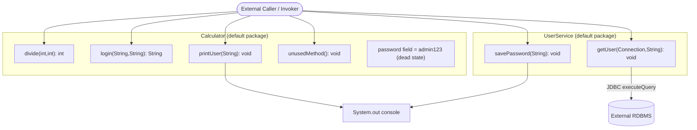
```mermaid
flowchart TB
    Caller(["External Caller / Invoker"])
    subgraph CalcC["Calculator (default package)"]
        divide["divide(int,int): int"]
        login["login(String,String): String"]
        printUser["printUser(String): void"]
        unused["unusedMethod(): void"]
        pwd["password field = admin123 (dead state)"]
    end
    subgraph SvcC["UserService (default package)"]
        getUser["getUser(Connection,String): void"]
        savePwd["savePassword(String): void"]
    end
    Console["System.out console"]
    DB[("External RDBMS")]
    Caller --> divide
    Caller --> login
    Caller --> printUser
    Caller --> unused
    Caller --> getUser
    Caller --> savePwd
    printUser --> Console
    savePwd --> Console
    getUser -->|"JDBC executeQuery"| DB
```

**State transition.** The only stateful sequence in the codebase is the JDBC resource lifecycle inside `getUser`. The diagram below traces that lifecycle: a `Statement` is opened and a query executed, but the resources are never closed and no transaction is committed or rolled back before the method returns.

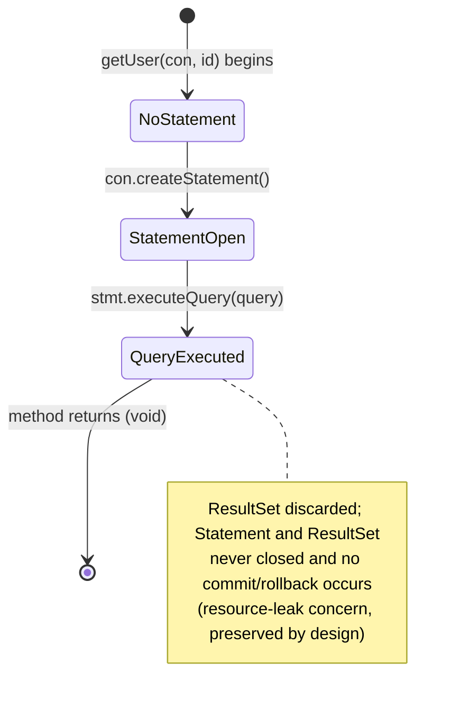
```mermaid
stateDiagram-v2
    [*] --> NoStatement: getUser(con, id) begins
    NoStatement --> StatementOpen: con.createStatement()
    StatementOpen --> QueryExecuted: stmt.executeQuery(query)
    QueryExecuted --> [*]: method returns (void)
    note right of QueryExecuted
        ResultSet discarded; Statement and ResultSet
        never closed and no commit/rollback occurs
        (resource-leak concern, preserved by design)
    end note
```

**Sequence for a key flow.** The `getUser` invocation is the single interaction that crosses the system boundary to an external system, making it the most significant flow to trace. The sequence diagram highlights both the string-concatenation transformation (the SQL-injection point) and the propagation of any error back to the caller.

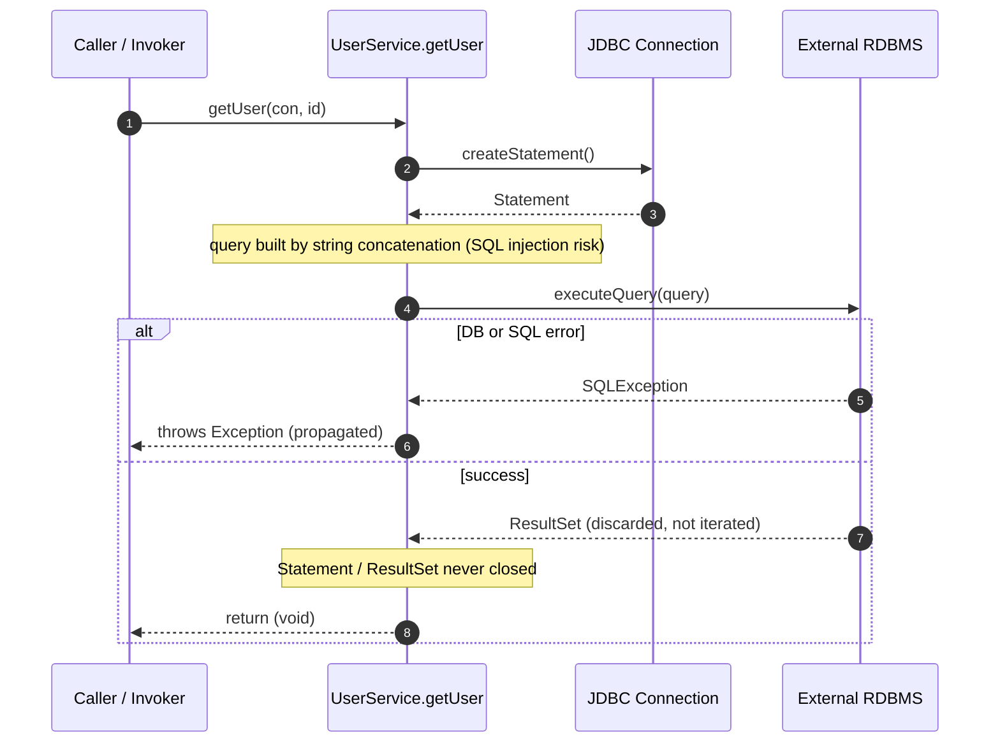
```mermaid
sequenceDiagram
    autonumber
    participant Caller as Caller / Invoker
    participant Svc as UserService.getUser
    participant Con as JDBC Connection
    participant DB as External RDBMS
    Caller->>Svc: getUser(con, id)
    Svc->>Con: createStatement()
    Con-->>Svc: Statement
    Note over Svc: query built by string concatenation (SQL injection risk)
    Svc->>DB: executeQuery(query)
    alt DB or SQL error
        DB-->>Svc: SQLException
        Svc-->>Caller: throws Exception (propagated)
    else success
        DB-->>Svc: ResultSet (discarded, not iterated)
        Note over Svc: Statement / ResultSet never closed
        Svc-->>Caller: return (void)
    end
```

## 5.3 Technical Decisions

The repository contains no written architecture-decision records, design documents, or configuration that would state design intent directly. The decisions documented here are therefore **inferred** from the code itself and from the project's stated purpose in `README.md` — a fixture "created for testing AI bug detection" that "Contains intentional coding and security issues." Read through that lens, several of the choices that would be defects in a production system are, for this artifact, deliberate and appropriate.

### 5.3.1 Decision Summary and Tradeoffs

The table below summarizes the principal technical decisions observed across the codebase, the rationale each supports given the fixture's purpose, and the tradeoff or consequence it carries.

| Decision Area | Choice Observed | Rationale | Tradeoff / Consequence |
| --- | --- | --- | --- |
| Architecture style | Flat set of standalone Java SE classes in the default package, no framework | Maximizes portability and keeps each seeded defect isolated and visible to analysis tools | No modularity, namespacing, or production structure |
| Communication pattern | Synchronous, in-process public method calls; no RPC, HTTP, or messaging | Matches a library-style fixture with no networked or distributed components | Requires an external caller to drive; no remote interoperability |
| Data storage | No provisioned store; raw JDBC `Statement` over a caller-supplied `Connection` | Provides a realistic database-access surface to host the injection defect without real infrastructure | No actual persistence; unclosed resources leak; behavior depends on the injected `Connection` |
| Caching | None | Operations are constant-time and stateless, leaving nothing to cache | Not applicable to this scope |
| Security mechanism | Hardcoded-credential login stub; no authentication or authorization framework | Seeds hardcoded-credential and plaintext-secret anti-patterns for detection | Provides no actual access control |

**Architecture style and tradeoffs.** The flat, default-package structure trades away everything associated with production modularity — packages, interfaces, layering, and a build system — in exchange for the smallest possible surface that still compiles and still exhibits the intended defects. For a bug-detection fixture this is a favorable trade; for any real application it would not be.

**Communication pattern.** All interaction is synchronous method invocation on the calling thread. There is no asynchronous processing, no inter-class messaging, and no network protocol other than the single JDBC call in `getUser`. This keeps behavior deterministic and easy to reason about statically.

**Data storage and caching.** No datasource, driver, or schema is committed; the `users` table exists only inside a SQL string literal. The decision to use a raw `Statement` with string concatenation (rather than a `PreparedStatement`) is precisely what creates the SQL-injection defect, and the absence of a cache reflects that there is no repeated or expensive computation to memoize.

**Security mechanism.** Rather than integrate an authentication framework, `login` performs a literal equality check and the class carries a hardcoded `password` field. These choices exist to embed recognizable security anti-patterns, not to provide protection.

### 5.3.2 Design Decision Tree

The following decision tree reconstructs how the fixture's purpose leads to each structural choice. Every branch is driven by the artifact being a test fixture rather than a production system.

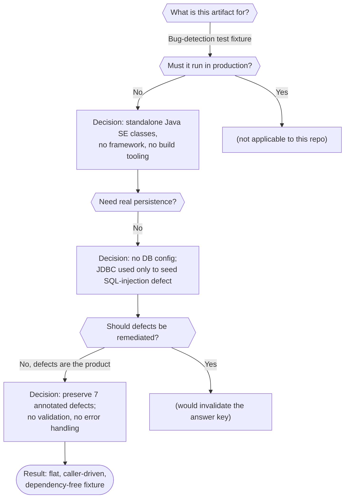
```mermaid
flowchart TD
    Start{{"What is this artifact for?"}}
    Start -->|"Bug-detection test fixture"| Q1{{"Must it run in production?"}}
    Q1 -->|"No"| DA["Decision: standalone Java SE classes,<br/>no framework, no build tooling"]
    Q1 -->|"Yes"| XA["(not applicable to this repo)"]
    DA --> Q2{{"Need real persistence?"}}
    Q2 -->|"No"| DB2["Decision: no DB config;<br/>JDBC used only to seed SQL-injection defect"]
    DB2 --> Q3{{"Should defects be remediated?"}}
    Q3 -->|"No, defects are the product"| DC["Decision: preserve 7 annotated defects;<br/>no validation, no error handling"]
    Q3 -->|"Yes"| XB["(would invalidate the answer key)"]
    DC --> Done(["Result: flat, caller-driven,<br/>dependency-free fixture"])
```

### 5.3.3 Architecture Decision Records

Because no ADRs are stored in the repository, the following records are reconstructed from the observable code. Each is marked *Accepted (inferred)* to signal that it reflects the implemented state rather than a documented deliberation.

| ADR (Status) | Context | Decision | Consequences |
| --- | --- | --- | --- |
| ADR-01: Standalone classes, no build tooling — *Accepted (inferred)* | The fixture must be maximally portable and easy for a tool to ingest | Ship two independent classes in the default package with no build descriptor, dependency manifest, or package hierarchy | Compiles with a stock JDK and stays simple; but has no namespacing, modularity, or reproducible build |
| ADR-02: Synchronous in-process API, no entry point — *Accepted (inferred)* | No orchestration is required; an external caller or analysis tool drives usage | Expose behavior only through public methods; provide no `main`, server, or scheduler | Deterministic and simple; cannot run standalone and requires an external driver |
| ADR-03: No persistence layer; raw JDBC by design — *Accepted (inferred)* | A realistic database-access path is needed to host a SQL-injection defect | Use `java.sql.Statement` with a concatenated query over a caller-supplied `Connection`, and provision no datasource | Demonstrates the injection anti-pattern (F-005) and a resource leak; unacceptable in production, intentional here |
| ADR-04: No caching layer — *Accepted (inferred)* | Operations are constant-time and stateless | Omit any cache | No caching complexity; none is needed at this scope |
| ADR-05: Console-only output, no logging framework — *Accepted (inferred)* | A simple output channel is needed, and one is required to host the sensitive-logging defect | Call `System.out.println` directly in `printUser` and `savePassword` | Zero dependencies; but no log levels, structure, or redaction, and `savePassword` leaks a secret (F-006) |
| ADR-06: No exception handling; propagate everything — *Accepted (inferred)* | The fixture must exhibit robustness gaps for detection | Use no `try`/`catch`/`finally`; `getUser` declares `throws Exception`; leave runtime exceptions unguarded | `ArithmeticException`, `NullPointerException`, and `SQLException` propagate uncaught (F-001, F-003, F-005); simple but fragile |
| ADR-07: Hardcoded-credential login stub, no auth framework — *Accepted (inferred)* | A security anti-pattern seed is required; no real authentication is in scope | Implement `login` as a literal equality check and keep a hardcoded `password` field | Demonstrates hardcoded-credential defects (F-002 and the dead field); provides no usable access control |

## 5.4 Cross-Cutting Concerns

Cross-cutting concerns are the operational qualities — observability, logging, error handling, security, performance, and recoverability — that typically span an entire system. In this repository almost all of them are **absent by construction**, which is consistent with a three-file test fixture that has no runtime host, no persistence, and no deployment target. The concerns are documented honestly below: where a mechanism exists it is described from the code; where none exists, that is stated plainly.

The table gives a status overview; the subsections that follow provide detail.

| Concern | Status in Repository | Observed Evidence |
| --- | --- | --- |
| Monitoring and observability | Absent | No metrics, health checks, or tracing instrumentation appears in any file |
| Logging and tracing | Ad hoc console output only; no framework | `System.out.println` in `printUser` and `savePassword`; no logging library, levels, or correlation IDs |
| Error handling | No handling; exceptions propagate | No `try`/`catch`/`finally` anywhere; `getUser` declares `throws Exception` |
| Authentication and authorization | Stub only; no framework | `login` performs a literal equality check; a hardcoded `password` field exists but is unused |
| Performance and SLAs | None defined | No targets, timeouts, or benchmarks; all operations are synchronous and constant-time |
| Disaster recovery | None | No persistence, backups, redundancy, or failover; Git is the only continuity mechanism |

### 5.4.1 Monitoring and Observability

There is no monitoring or observability capability in the codebase. None of the three files exposes metrics, health or readiness endpoints, counters, or distributed-tracing spans, and no telemetry or instrumentation library is imported. Because the system is a set of library-style classes with no running process, there is nothing to scrape or probe; any observability would have to be provided by the external caller that hosts the classes.

### 5.4.2 Logging and Tracing

No logging framework or tracing system is present. The only output the code emits is direct console writing via `System.out.println`, which occurs in exactly two places: `Calculator.printUser` (printing the supplied name and, conditionally, `"Welcome Admin"`) and `UserService.savePassword` (printing the supplied password). These are program output rather than structured logging — there are no log levels, timestamps, categories, correlation IDs, or redaction. The `savePassword` write is notable because it emits a plaintext secret to standard output, which is the sensitive-information-exposure defect catalogued as feature F-006.

### 5.4.3 Error Handling

The error-handling strategy across the codebase can be summarized as "detect nothing, handle nothing, propagate everything." There is no `try`, `catch`, or `finally` block anywhere; no method validates its inputs; and `UserService.getUser` explicitly declares `throws Exception`, deferring all failure handling to the caller. The following table enumerates the exception conditions latent in the code.

| Trigger | Method (Feature) | Exception Type | Disposition |
| --- | --- | --- | --- |
| Divisor equals zero | `Calculator.divide` (F-001) | `ArithmeticException` | Propagates uncaught to the caller |
| `null` argument compared with `.equals` | `Calculator.login` (F-002) | `NullPointerException` | Propagates uncaught to the caller |
| `null` argument compared with `.equals` | `Calculator.printUser` (F-003) | `NullPointerException` | Propagates uncaught to the caller |
| Database, SQL, or driver failure | `UserService.getUser` (F-005) | `SQLException` / `Exception` | Declared via `throws Exception`; propagates to the caller |

No retry, fallback, circuit-breaking, compensating action, or user notification exists for any of these conditions. The diagram below shows the uniform flow: a fault of any category reaches no local handler and therefore propagates out of the system to whatever caller invoked the method.

```mermaid
flowchart TD
    Invoke["Caller invokes a public method"] --> Fault{"Fault condition arises?"}
    Fault -->|"No"| Normal(["Normal return / console output / SQL issued"])
    Fault -->|"b == 0 in divide"| Arith["ArithmeticException"]
    Fault -->|"null arg in login / printUser"| NPEx["NullPointerException"]
    Fault -->|"DB or SQL failure in getUser"| SqlErr["SQLException / Exception"]
    Arith --> Handler{"Local try / catch / finally present?"}
    NPEx --> Handler
    SqlErr --> Handler
    Handler -->|"No handler exists anywhere in codebase"| Propagate["Exception propagates up the call stack"]
    Propagate --> CallerRcv(["External caller receives unhandled exception"])
    Handler -.->|"Not implemented by design"| Absent["Retry / fallback / notification / recovery: ABSENT"]
```

### 5.4.4 Authentication and Authorization

No authentication or authorization framework is present, and no method acts as an access-control gate. `Calculator.login` is a stub that returns `"Login Success"` only when both arguments equal the literal `"admin"` and returns `null` otherwise; its result is never consumed to guard any other operation. The class also declares a hardcoded `password` field initialized to `"admin123"`, but that field is never read, so it functions purely as a seeded credential-exposure defect (feature F-002 and the hardcoded-secret concern) rather than as part of any security control. In short, the codebase demonstrates authentication *anti-patterns* but implements no security mechanism.

### 5.4.5 Performance Requirements and SLAs

The repository defines no performance requirements, service-level agreements, latency or throughput targets, or capacity benchmarks, and it contains no timeout or resource-limit configuration. All operations are synchronous, single-threaded, and in-memory, and execute in constant time relative to their inputs; the sole exception is the one JDBC call in `getUser`, whose performance is governed entirely by the external database and the caller-supplied `Connection` rather than by anything in this code. Consequently there are no scalability dimensions to tune within the system boundary.

### 5.4.6 Disaster Recovery

There are no disaster-recovery procedures, and none are applicable in the conventional sense: the system persists no data, provisions no infrastructure, and runs no service, so there is nothing to back up, replicate, fail over, or restore at runtime. `savePassword` writes to a transient console stream and stores nothing, and `getUser` owns no database — it borrows a `Connection` from the caller. The only continuity mechanism observable in the repository is version control: the three source files are tracked in Git, which preserves and allows recovery of the source itself.

## 5.5 References

The following repository artifacts and previously authored specification sections were examined as evidence for this System Architecture section.

**Repository files inspected**

- `Calculator.java` — Established the Calculator component: the `password` field (dead state), and the `divide`, `login`, `printUser`, and `unusedMethod` public methods, along with their seeded defects (features F-001 through F-004) and the absence of a constructor or `main` method.
- `UserService.java` — Established the UserService component: the `java.sql` imports, the `getUser` JDBC method (caller-supplied `Connection`, string-concatenated query, discarded/unclosed `ResultSet`, `throws Exception`) and the `savePassword` console stub (features F-005 and F-006).
- `README.md` — Established the project's identity and purpose as a test fixture for AI bug detection and confirmed that its coding and security issues are intentional (feature F-007).

**Repository folder inspected**

- `/` (repository root) — Confirmed the repository consists of exactly the three files above, with no build descriptor, dependency manifest, package hierarchy, configuration, test harness, CI/CD, or deployment artifacts.

**Specification sections cross-referenced for terminology and consistency**

- `1.2 System Overview` — Confirmed the system framing, boundary, and the absence of performance targets.
- `2.1 Feature Catalog` — Confirmed the F-001 through F-007 feature identifiers and their code locations.
- `2.4 Implementation Considerations` — Confirmed the synchronous, constant-time, single-threaded operational profile and the fixture rationale.
- `3.2 Frameworks & Libraries` — Confirmed the Java SE / `java.lang` / `java.sql` (JDBC) dependency picture and the absence of third-party frameworks.
- `3.5 Databases & Storage` — Confirmed that no database, driver, schema, or cache is provisioned and that the `users` table exists only as a string literal.
- `3.6 Development & Deployment` — Confirmed that Git is the only tooling and that no build system, tests, containerization, or deployment target exists.
- `4.1 System Workflows` — Confirmed the external-actor model (caller, analysis tool, console, external RDBMS) and the static-evaluation and runtime-invocation workflows.
- `4.3 Technical Implementation Flows` — Confirmed the JDBC resource lifecycle and the "propagate everything" error-handling model.

**Web sources**

- None. All findings in this section are grounded solely in the repository artifacts and the cross-referenced specification sections listed above.

# 6. SYSTEM COMPONENTS DESIGN

## 6.1 Core Services Architecture

### 6.1.1 Applicability Assessment

The system documented in this repository is **not** a distributed, service-oriented, or microservices architecture, and it exposes no independently deployable service components. In accordance with the guidance for this section:

> **Core Services Architecture is not applicable for this system.**

The remainder of Section 6.1 substantiates this determination by walking through every service-architecture concern enumerated for this section — service components, scalability design, and resilience patterns — and recording the concrete repository evidence behind each conclusion. This keeps the section honest and traceable rather than fabricating services, communication protocols, or service-level guarantees that the codebase does not contain.

#### Why the concept does not apply

The repository consists of exactly three artifacts — `Calculator.java`, `UserService.java`, and `README.md` — plus a `.git/` metadata directory. `README.md` declares the project a "Small Java project created for testing AI bug detection" that "Contains intentional coding and security issues." It compiles to two independent, standalone Java SE classes in the default (unnamed) package and provides no runnable service of any kind:

- **No deployable services and no entry point.** Neither `Calculator` nor `UserService` declares a `main()` method, a server bootstrap, a scheduler, or any framework annotation, so there is nothing to launch, register, or route traffic to. All behavior is triggered by an external caller invoking a public method in-process — consistent with Architecture Decision Record ADR-02 in §5.3 Technical Decisions ("Synchronous in-process API, no entry point").
- **No inter-service boundary.** The two classes never reference or invoke each other, and the only field in the codebase (`Calculator.password`) is dead state that is never read. There is a single process boundary — the JVM — and a single intra-system integration mechanism: the direct Java method call (see §5.1 High-Level Architecture, Data Flow Description).
- **No service infrastructure.** The repository contains no build descriptor, dependency manifest, container image, orchestration manifest, message broker, service-registry client, load-balancer configuration, thread pool, or resilience library. The only imports anywhere in the codebase are the JDK types `java.sql.Connection` and `java.sql.Statement`.

The one external touchpoint that superficially resembles an integration — `UserService.getUser` — is a single synchronous JDBC call issued over a `Connection` that the **caller supplies as a method parameter**; the repository provisions no datasource, driver, URL, connection pool, or schema. This is a library-style database-access path, not a networked service interaction (see §5.1 External Integration Points).

#### Distributed-System Indicator Checklist

The table below evaluates the concrete markers that would signal a core-services (distributed) architecture. None are present.

| Distributed-System Indicator | Present in Repository? | Evidence |
| --- | --- | --- |
| Multiple deployable services / processes | No | Two classes in one default package; no `main()`, server, or process separation |
| Inter-service communication (REST / gRPC / messaging) | No | Only in-process Java method calls; sole imports are `java.sql.Connection` / `Statement` |
| Service discovery / registry | No | No registry client, endpoint configuration, or discovery dependency |
| Load balancer / reverse proxy | No | No load-balancer or proxy configuration of any kind |
| Message broker / queue | No | No Kafka, RabbitMQ, JMS, or any messaging dependency |
| Container / orchestration manifests | No | No Dockerfile, Compose file, or Kubernetes manifests |
| Circuit breaker / retry libraries | No | No resilience4j, Hystrix, or custom retry/backoff logic |
| Auto-scaling / replica configuration | No | No scaling policy, thread pool, or replica definition |

#### Actual Interaction Topology (Service Interaction Diagram)

Because there are no services, the "service interaction" diagram required for this section instead depicts the system's *actual* interaction topology, which is what demonstrates the absence of a service tier. A single external caller invokes methods on two mutually-independent classes inside one JVM; the classes reach only the console and, in one method, a caller-supplied database connection. There is deliberately no edge between `Calculator` and `UserService` because neither calls the other.

```mermaid
flowchart LR
    Caller["External Caller / Test Harness<br/>(no entry point exists in the repository)"]
    subgraph JVM["Single JVM Process — no service tier, no network layer"]
        Calc["Calculator class<br/>divide / login / printUser / unusedMethod"]
        Svc["UserService class<br/>getUser / savePassword"]
    end
    Console["System.out console"]
    DB[("External RDBMS<br/>via caller-supplied java.sql.Connection")]
    Caller -->|"synchronous in-process call"| Calc
    Caller -->|"synchronous in-process call"| Svc
    Calc -->|"printUser writes"| Console
    Svc -->|"savePassword writes"| Console
    Svc -->|"executeQuery — JDBC"| DB
```

*Diagram 6.1.1 — Actual interaction topology of the Buggy Calculator fixture. The two classes are independent (no connecting edge), and the only cross-boundary interactions are console writes and a single caller-driven JDBC query. No service registry, gateway, or load balancer participates.*

This assessment is fully consistent with §5.1 High-Level Architecture, which states the system "does not implement a layered, service-oriented, event-driven, hexagonal, or microservice architecture," and with §5.4 Cross-Cutting Concerns, which records that performance/SLAs and disaster recovery are undefined precisely because the fixture "runs no service." The subsections that follow (6.1.2–6.1.4) address each mandated service-architecture concern individually and confirm the same conclusion with specific evidence.

### 6.1.2 Service Components

This subsection addresses each of the six mandated service-component concerns. Because the system is a pair of standalone Java SE classes with no independently deployable services (see §6.1.1), none of these concerns has a concrete implementation. The table records the status and repository evidence for each, and the prose that follows identifies the closest code-level analog where one exists, so the mapping to the requested topics is explicit.

| Service Component Concern | Applicability | Evidence in Repository |
| --- | --- | --- |
| Service boundaries & responsibilities | Not applicable (class-level only) | Two classes in one JVM; the only decomposition is `Calculator` vs `UserService`, not a service boundary |
| Inter-service communication patterns | Not applicable | Classes never call each other; only cross-boundary I/O is `System.out` and one JDBC query |
| Service discovery mechanisms | Not applicable | No registry, endpoint config, or discovery client; the caller holds direct object references |
| Load balancing strategy | Not applicable | Single JVM, single calling thread; no proxy, LB, or replica set |
| Circuit breaker patterns | Not applicable | No resilience library; faults propagate uncaught (see §5.4) |
| Retry & fallback mechanisms | Not applicable | `getUser` declares `throws Exception`; no retry, backoff, or fallback path anywhere |

#### Service boundaries and responsibilities

There are no service boundaries. The only decomposition present is at the class level within a single JVM: `Calculator` bundles four unrelated operations (integer division, a hardcoded-credential login stub, console user printing, and a no-op method), while `UserService` bundles a JDBC user lookup and a password-printing stub. These are code-level responsibilities co-located in one process — documented as components in §5.1 High-Level Architecture and §5.2 Component Details — not deployable services with owned data stores or independent lifecycles. Notably, the two classes are mutually independent: neither imports, instantiates, or invokes the other.

#### Inter-service communication patterns

No inter-service communication exists because there is only one process and the two classes do not interact. The sole intra-system integration pattern is the direct, synchronous, in-process Java method call, as recorded in §5.3 Technical Decisions ("Synchronous, in-process public method calls; no RPC, HTTP, or messaging"). Only two interactions cross the system boundary at all: fire-and-forget console writes via `System.out.println` (in `Calculator.printUser` and `UserService.savePassword`), and a single synchronous JDBC `executeQuery` in `UserService.getUser` over a caller-supplied `Connection`. There is no REST, gRPC, GraphQL, WebSocket, or message-based communication of any kind.

#### Service discovery mechanisms

None. The codebase contains no service registry, discovery client, DNS-based lookup, or endpoint configuration, and no library capable of providing them. A caller obtains behavior by directly constructing a `Calculator` or `UserService` object and calling its methods; the database `Connection` used by `getUser` is likewise handed in directly by the caller rather than resolved through any discovery layer.

#### Load balancing strategy

None. All execution occurs on the single thread of the invoking caller inside one JVM, and every method runs to completion synchronously (§5.4 Cross-Cutting Concerns confirms all operations are "synchronous, single-threaded, and in-memory"). There is no reverse proxy, no load balancer, no worker pool, and no notion of multiple instances across which requests could be distributed.

#### Circuit breaker patterns

None. No circuit-breaker library (for example, resilience4j or Hystrix) is present, and no custom state machine guards any call. As documented in §5.4 Cross-Cutting Concerns, the error-handling posture is "detect nothing, handle nothing, propagate everything": there is no `try`/`catch`/`finally` anywhere, so a fault such as an `ArithmeticException`, `NullPointerException`, or `SQLException` propagates directly to the caller with no interruption, tripping, or half-open recovery behavior.

#### Retry and fallback mechanisms

None. `UserService.getUser` simply declares `throws Exception` and forwards any database or SQL failure to the caller; there is no retry loop, exponential backoff, idempotency handling, or fallback value. Similarly, `Calculator.login` returns `null` on a failed credential check rather than invoking any fallback path, and `Calculator.divide` performs no guarded re-computation. §5.4 Cross-Cutting Concerns states explicitly that "no retry, fallback, circuit-breaking, compensating action, or user notification exists" for any of the latent failure conditions.

### 6.1.3 Scalability Design

This subsection addresses each of the five mandated scalability-design concerns. Because the codebase runs no service and hosts no process of its own — every operation is a synchronous, single-threaded, in-memory method call inside one JVM — there are no scalability dimensions to design or tune within the system boundary. §5.4 Cross-Cutting Concerns states this directly: "Consequently there are no scalability dimensions to tune within the system boundary." The table summarizes each concern, and the prose and diagram that follow explain the basis.

| Scalability Concern | Applicability | Basis in Repository |
| --- | --- | --- |
| Horizontal scaling approach | Not applicable | No deployable service or process to replicate; behavior runs in the caller's JVM |
| Vertical scaling approach | Not applicable | No runtime host or resource envelope owned by the code |
| Auto-scaling triggers & rules | Not applicable | No metrics, thresholds, or autoscaler; no configuration files exist |
| Resource allocation strategy | Not applicable | No memory/CPU limits, thread pool, or connection pool defined |
| Performance optimization techniques | Not applicable | Constant-time, stateless operations; no caching, batching, or async (see §5.3) |
| Capacity planning guidelines | Not applicable | No SLAs, throughput targets, or benchmarks defined (see §1.2, §5.4) |

#### Horizontal and vertical scaling approach

Neither horizontal (adding instances) nor vertical (enlarging an instance) scaling applies, because the repository defines no service, process, or deployment unit that could be scaled. The classes are library-style code intended to be compiled and invoked by an external caller; any decision to run more copies, or on a larger machine, belongs entirely to that host and lies outside the system boundary. The operations themselves are stateless and constant-time relative to their inputs — the only field, `Calculator.password`, is dead state and is never read — so nothing in the code constrains how many instances a caller could construct, but the repository neither provides nor requires any scaling mechanism.

#### Auto-scaling triggers and rules

None. There are no metrics emitted, no health or readiness signals, no thresholds, and no auto-scaling controller. §5.4 Cross-Cutting Concerns confirms the absence of any monitoring or observability capability, so there is nothing to drive a scaling decision even in principle, and no configuration file in which scaling rules could be declared exists in the repository.

#### Resource allocation strategy

None is defined. The codebase specifies no memory or CPU limits, no thread pool, and no database connection pool — `UserService.getUser` operates on a `Connection` supplied by the caller and never creates, sizes, or manages one. It also never closes the `Statement` or the discarded `ResultSet`, which is a resource leak catalogued as a defect rather than a resource-management strategy. All resource governance is therefore deferred to the external caller and the JVM defaults.

#### Performance optimization techniques

None are present, and none are required at this scope. Every operation is a synchronous, in-memory computation that completes in constant time relative to its inputs; there is no caching (§5.3 Technical Decisions records "Caching: None"), no batching, no lazy loading, no asynchronous or parallel execution, and no algorithmic hot path to optimize. The only latency-bearing operation is the single JDBC `executeQuery` in `getUser`, and its performance is governed entirely by the external database and the caller-supplied `Connection`, not by anything in this repository.

#### Capacity planning guidelines

None exist. The repository declares no service-level agreements, latency or throughput targets, or capacity benchmarks, and contains no load model or sizing guidance — a point recorded in both §1.2 System Overview (no numeric performance targets, SLAs, or KPIs) and §5.4 Cross-Cutting Concerns (performance and SLAs "None defined"). Any capacity planning would necessarily be performed by the external system that embeds these classes.

#### Scalability Architecture Diagram

The diagram contrasts the horizontal-scaling infrastructure that a core-services architecture would provide (all absent here) with the fixture's actual runtime: a single caller drives a single class instance on a single thread, with no load balancer, autoscaler, or replica set participating.

```mermaid
flowchart TB
    Caller["Caller / Test Harness"]
    subgraph NA["Horizontal-Scaling Infrastructure — NOT APPLICABLE (none present)"]
        LB["Load Balancer"]
        Auto["Auto-Scaling Controller"]
        Rep["Service Replicas / Node Pool"]
    end
    subgraph Real["Actual Runtime — Single JVM, Single Calling Thread"]
        Inst["Class instance constructed by the caller"]
        Exec["Method runs to completion<br/>synchronously, then returns or throws"]
    end
    Caller --> Inst
    Inst --> Exec
    LB -.-> Rep
    Auto -.-> Rep
```

*Diagram 6.1.3 — Scalability architecture. The upper cluster (load balancer, auto-scaling controller, replicas) represents the scaling tier of a distributed service and is entirely absent from this repository; it is intentionally disconnected from the actual runtime flow (lower cluster) to signal that no such infrastructure exists. The real execution model is a single synchronous invocation per caller.*

### 6.1.4 Resilience Patterns

This subsection addresses each of the five mandated resilience concerns. Because the system runs no service, persists no data, and provisions no infrastructure, no resilience patterns are implemented — a posture examined in depth in §5.4 Cross-Cutting Concerns, which this subsection cross-references rather than duplicates. The table summarizes each concern, and the prose and diagram explain the basis.

| Resilience Concern | Applicability | Basis / Cross-Reference |
| --- | --- | --- |
| Fault tolerance mechanisms | Not applicable | No `try`/`catch`/`finally`; faults propagate uncaught (§5.4 Error Handling) |
| Disaster recovery procedures | Not applicable | No persistence or infrastructure; Git is the only continuity mechanism (§5.4 Disaster Recovery) |
| Data redundancy approach | Not applicable | System owns no datastore; `users` table exists only as a SQL string literal |
| Failover configurations | Not applicable | Single JVM instance; no standby, replica, or health check |
| Service degradation policies | Not applicable | No service to degrade; faults cause a hard throw, not graceful degradation |

#### Fault tolerance mechanisms

None. There is no `try`, `catch`, or `finally` block anywhere in the codebase, no timeout, no bulkhead, and no circuit breaker. As detailed in §5.4 Cross-Cutting Concerns, the strategy is to "detect nothing, handle nothing, propagate everything," so the three latent fault conditions each propagate uncaught to the caller:

- `ArithmeticException` when `Calculator.divide` is called with a zero divisor;
- `NullPointerException` when `Calculator.login` or `Calculator.printUser` is passed a `null` argument;
- `SQLException` / `Exception` from `UserService.getUser`, which explicitly declares `throws Exception`.

No compensating action, degraded response, or self-healing behavior mitigates any of these.

#### Disaster recovery procedures

None, and none are applicable in the conventional sense. §5.4 Cross-Cutting Concerns states that "there are no disaster-recovery procedures, and none are applicable ... the system persists no data, provisions no infrastructure, and runs no service, so there is nothing to back up, replicate, fail over, or restore at runtime." `UserService.savePassword` writes to a transient console stream and stores nothing, and `getUser` owns no database — it borrows a `Connection` from the caller. The only continuity mechanism observable in the repository is version control: the three source files are tracked in Git, which preserves and allows recovery of the source itself.

#### Data redundancy approach

None. The system owns no datastore, so there is nothing to replicate or duplicate for redundancy. The `users` table referenced by `getUser` exists only as text inside a SQL string literal; the repository provisions no database, driver, schema, replica, or backup. `getUser` neither stores nor returns the `ResultSet` it retrieves, and `savePassword` persists nothing despite its name, so no data is ever written that could require a redundancy strategy.

#### Failover configurations

None. Execution is confined to the single JVM of the invoking caller, with one instance and one calling thread (§5.4 Cross-Cutting Concerns). There is no standby instance, no replica set, no clustering, no health or readiness probe, and no leader election — hence nothing to detect a failure and no target to fail over to. Any redundancy or failover would have to be arranged by the external host that embeds these classes.

#### Service degradation policies

None. There is no service to degrade, and the code implements no graceful-degradation, feature-flag, rate-limiting, or load-shedding behavior. When a fault arises, the affected method fails hard by throwing (or, for `login`, returns `null`) rather than returning a reduced-fidelity result; there is no fallback tier, cached last-known-good value, or partial response. This is consistent with the uniform "propagate everything" error posture documented in §5.4 Cross-Cutting Concerns.

#### Resilience Pattern Implementations Diagram

The diagram traces how any fault flows through the system. Every fault type reaches the same decision — whether a circuit breaker, retry, fallback, or failover exists — and, because none do, propagates uncaught to the external caller.

```mermaid
flowchart TD
    Call["Caller invokes a public method"] --> Fault{"Fault arises during execution?"}
    Fault -->|"No"| OK(["Normal return / console write / SQL issued"])
    Fault -->|"divide by zero (b == 0)"| E1["ArithmeticException"]
    Fault -->|"null argument in login / printUser"| E2["NullPointerException"]
    Fault -->|"DB or SQL failure in getUser"| E3["SQLException / Exception"]
    E1 --> Guard{"Circuit breaker, retry, fallback,<br/>or failover present?"}
    E2 --> Guard
    E3 --> Guard
    Guard -->|"None exist anywhere in the codebase"| Prop["Fault propagates uncaught up the call stack"]
    Prop --> Rcv(["External caller receives the unhandled fault"])
    Guard -. "Not implemented by design" .-> Absent["Resilience patterns: ABSENT"]
```

*Diagram 6.1.4 — Resilience pattern implementations. All three latent fault types converge on a single decision point; since no circuit breaker, retry, fallback, or failover exists, every fault propagates uncaught to the caller. The dotted branch makes explicit that resilience patterns are absent by design, consistent with §5.4 Cross-Cutting Concerns.*

### 6.1.5 References

The following repository artifacts and Technical Specification sections were examined and cited as evidence for the determinations in Section 6.1.

**Repository files examined**

- `Calculator.java` — Confirmed a single standalone class with four unrelated public methods (`divide`, `login`, `printUser`, `unusedMethod`) and one dead `password` field; no `main()` method, no imports, no framework, no inter-class calls. Established the absence of any service, communication protocol, or resilience/scaling construct.
- `UserService.java` — Confirmed a single standalone class importing only `java.sql.Connection` and `java.sql.Statement`; `getUser` issues one synchronous JDBC query over a caller-supplied `Connection`, and `savePassword` writes to the console. Established that the only external touchpoint is a library-style JDBC call, not a networked service interaction, and that no retry/fallback exists (`throws Exception`).
- `README.md` — Established the project's identity and purpose: a "Small Java project created for testing AI bug detection" that "Contains intentional coding and security issues," confirming a test fixture rather than a runnable service.

**Repository folders examined**

- Repository root (`/`) — Confirmed to contain exactly the three source/documentation files plus a `.git/` directory, with no build descriptor, dependency manifest, configuration file, container image, orchestration manifest, subdirectory of source, or service infrastructure of any kind.
- `.git/` — Version-control metadata only (three commits, one per file); noted as the sole continuity mechanism in the repository. No source or service configuration.

**Technical Specification sections cross-referenced**

- §1.2 System Overview — Confirmed the project is a "standalone, greenfield fixture" with no framework, build tool, or pinned runtime, and defines no SLAs/KPIs.
- §5.1 High-Level Architecture — Established that the system "does not implement a layered, service-oriented, event-driven, hexagonal, or microservice architecture" and uses only in-process Java method calls; provided the component and external-integration framing.
- §5.2 Component Details — Provided the class-level responsibilities cited under service boundaries.
- §5.3 Technical Decisions — Provided ADR-02 ("Synchronous in-process API, no entry point"), the "no RPC, HTTP, or messaging" communication statement, and "Caching: None."
- §5.4 Cross-Cutting Concerns — Provided the authoritative treatment of error handling ("propagate everything"), the statement that "there are no scalability dimensions to tune within the system boundary," and the disaster-recovery analysis cited throughout 6.1.3 and 6.1.4.

No external (web) sources were required or used for this section; all conclusions are grounded in the repository and the cross-referenced specification sections above.

## 6.2 Database Design

### 6.2.1 Applicability Assessment

The system documented in this repository provisions **no database and no persistent storage of any kind**, and it defines no schema, data model, ORM mapping, migration, connection pool, replication topology, backup process, or cache. In accordance with the guidance for this section:

> **Database Design is not applicable to this system.**

The remainder of Section 6.2 substantiates this determination against every concern the section enumerates — schema design, data management, compliance, and performance optimization — recording the concrete repository evidence behind each conclusion rather than fabricating tables, indexes, replicas, or retention policies the codebase does not contain. Where a database-adjacent artifact *does* exist — the single JDBC query in `UserService.getUser` — it is documented precisely in §6.2.2, including everything that is absent around it. This assessment is fully consistent with §3.5 Databases & Storage ("No database or storage service is provisioned or configured in this repository"), §1.3.2 (a configured database is explicitly out of scope), and §5.3 Technical Decisions (ADR-03, "No persistence layer; raw JDBC by design").

#### Why the concept does not apply

The repository consists of exactly three artifacts — `Calculator.java`, `UserService.java`, and `README.md` — which `README.md` declares to be a "Small Java project created for testing AI bug detection" that "Contains intentional coding and security issues." Nothing in these files defines or manages a database:

- **No schema is defined anywhere.** The only table name in the codebase, `users`, appears solely as text inside a SQL string literal (`"SELECT * FROM users WHERE id='" + id + "'"`, `UserService.java:10`). There is no `CREATE TABLE`, DDL script, entity class, or ORM annotation that defines the table, its columns, their types, or any key.
- **No database is provisioned or configured.** The repository ships no JDBC driver, `DataSource`, connection URL, credentials, connection pool, or `persistence.xml`/`application.properties`. `UserService.getUser` operates on a `java.sql.Connection` that the **caller supplies as a method parameter** (`getUser(Connection con, String id)`, `UserService.java:6`); the class opens, configures, and owns no connection itself.
- **No data is actually persisted or retrieved.** `getUser` executes a query but never captures, iterates, returns, or closes the `ResultSet`, so no data flows back into the system (`UserService.java:12`). `savePassword`, despite its name, writes its argument to the console via `System.out.println` and stores nothing (`UserService.java:15-19`).
- **No supporting persistence machinery exists.** There is no migration tool (Flyway/Liquibase), no ORM (JPA/Hibernate), no cache, and no build descriptor to declare any of these as dependencies; the only imports anywhere in the codebase are the JDK types `java.sql.Connection` and `java.sql.Statement`.

Consequently, the traditional Database Design concerns — entity-relationship modeling, indexing, partitioning, replication, backup, migration, retention, and query optimization — have no artifact to describe. The subsections that follow (§6.2.2–§6.2.4) walk through each mandated concern and confirm the same conclusion with specific evidence.

#### Database-Design Indicator Checklist

The table evaluates the concrete markers that would signal a designed persistence layer. None are present.

| Database-Design Indicator | Present in Repository? | Evidence |
| --- | --- | --- |
| Provisioned database (primary/secondary) | No | No datasource, driver, URL, or instance; a relational target is only *implied* by one SQL string literal |
| Schema definition (DDL / entities) | No | `users` appears only inside a SQL string (`UserService.java:10`); no `CREATE TABLE`, entity, or mapping |
| ORM / data-access framework | No | Raw `java.sql.Statement` used directly (`UserService.java:8-12`); no JPA/Hibernate |
| Migration / versioning tooling | No | No Flyway/Liquibase, no migration scripts, no schema-version table |
| Connection pool / datasource config | No | `Connection` is a caller-supplied method parameter (`UserService.java:6`); no pool or `DataSource` |
| Indexes, constraints, partitions | No | None declared; no schema exists in which to declare them |
| Replication / backup configuration | No | No replica, standby, or backup process; Git is the only continuity mechanism (§5.4.6) |
| Caching layer | No | No in-memory or distributed cache; ADR-04 records "No caching layer" (§5.3.3) |

#### Actual Persistence Topology (Data Flow)

Because there is no database design, the required data-flow diagram instead depicts the system's *actual* persistence-adjacent data flow, which is what demonstrates the absence of a managed data store. The `id` argument flows unsanitized into a concatenated query issued over a caller-supplied connection; the resulting `ResultSet` is discarded, and the only other data-bearing path (`savePassword`) terminates at the console rather than a store.

```mermaid
flowchart LR
    Caller["External Caller / Test Harness<br/>(no entry point in the repository)"]
    subgraph SVC["UserService — single JVM, no persistence layer"]
        GU["getUser(con, id)<br/>builds SQL by string concatenation"]
        SP["savePassword(password)<br/>no persistence"]
    end
    Console["System.out console<br/>(transient, not a store)"]
    DB[("External RDBMS<br/>caller-supplied java.sql.Connection<br/>schema undefined in repo")]
    Caller -->|"id (unsanitized)"| GU
    Caller -->|"password"| SP
    GU -->|"executeQuery — ResultSet discarded, never closed"| DB
    SP -->|"println — plaintext"| Console
    DB -. "no rows returned into the system" .-> GU
```

*Diagram 6.2.1 — Actual persistence-adjacent data flow. The repository owns no database; `getUser` issues one query over a connection the caller provides and discards the result, while `savePassword` writes to the console and stores nothing. No datasource, connection pool, schema, replica, or cache participates.*

### 6.2.2 Observed Data-Access Surface and Implied Data Model

Although no database is designed or provisioned (§6.2.1), one code path does touch a relational database: `UserService.getUser`. This subsection documents that path exactly, together with the *implied* data model that can be inferred from it — and, importantly, the boundary between what the repository actually defines and what it merely references in passing.

#### The single data-access operation

`UserService.getUser` is the sole database operation in the codebase. It receives an already-open connection and a user identifier, creates a `Statement`, assembles a `SELECT` by concatenating the identifier directly into the SQL text, and executes it:

```java
Statement stmt = con.createStatement();
String query = "SELECT * FROM users WHERE id='" + id + "'";
stmt.executeQuery(query); // SQL Injection
```

The table captures the observable characteristics of this operation (`UserService.java:6-13`).

| Aspect | Observed Behavior |
| --- | --- |
| Operation type | Single read (`SELECT`); no `INSERT`/`UPDATE`/`DELETE` or DDL exists anywhere |
| Target relation | `users`, referenced only as text within the SQL string literal (`UserService.java:10`) |
| Query construction | Raw `java.sql.Statement` with string concatenation of `id`; no `PreparedStatement` or bind parameters |
| Result handling | `ResultSet` is neither stored, iterated, returned, nor closed; the `Statement` is never closed |

The second method on the class, `savePassword(String password)`, is named as though it persists data but does not: it only executes `System.out.println(password)` (`UserService.java:15-19`). It issues no `INSERT`, opens no connection, and writes to no store — the console is a transient stream, so no persistence occurs (consistent with §3.5.2, "no persistence strategy implemented"). `Calculator.java` contains no database interaction of any kind.

#### Implied data model and entity relationships

The repository defines **no data model**. The most that can be inferred from the single query is the existence of a relation named `users` with a column named `id` used in the `WHERE` predicate; the `SELECT *` projection implies the table has one or more additional columns, but none is named, typed, or otherwise defined anywhere in the codebase. There are **no entity relationships** to describe: only one relation is referenced, no foreign keys or joins appear, and no second entity exists with which `users` could relate. Because `id` is compared against a single-quoted literal in the SQL, a text-typed key is plausible, but this is an inference from quoting style, not a declared type.

The ERD below therefore shows the *only* entity that can be inferred, with an explicit marker that its full structure is undefined in the repository. It is a documentation reconstruction, not a schema the code owns.

```mermaid
erDiagram
    users {
        string id "Only column evidenced, via the WHERE id predicate"
        unknown other_columns "SELECT-star implies more columns, none defined in repo"
    }
```

*Diagram 6.2.2 — Implied entity for the `users` relation. Only the `id` column is evidenced (by the `WHERE id='...'` predicate at `UserService.java:10`); the `SELECT *` projection implies further columns whose names and types are undefined anywhere in the repository. No second entity and no relationship exist, so this ERD is a reconstruction inferred from one SQL string literal, not a defined schema artifact.*

#### Indexes and constraints

Because no schema is defined, **no indexes and no constraints are declared in the repository**. The output-format requirement to document all indexes and constraints is therefore satisfied by recording their complete absence, together with the only implicit expectation the query's shape suggests.

| Object | Declared in Repository? | Notes |
| --- | --- | --- |
| Primary key / unique constraint | No | `id` is used as a lookup key, but no `PRIMARY KEY`/`UNIQUE` is declared anywhere |
| Foreign keys | No | Only one relation is referenced; no joins or references exist |
| Indexes | No | No index DDL; any index on `users(id)` would live in the external database, not this repo |
| Check / NOT NULL / default constraints | No | No column definitions exist in which to declare them |

Any index or constraint that happens to exist on the real `users` table would be a property of the external database instance the caller connects to — outside this repository's boundary and undocumented by it.

#### Data storage and retrieval mechanism

The access mechanism is **direct, driver-agnostic JDBC over a caller-supplied connection**, with no abstraction layer. Retrieval is initiated by `stmt.executeQuery(query)` but is functionally incomplete: the returned `ResultSet` is discarded rather than read, so the operation retrieves nothing usable by the system (`UserService.java:12`). There is no storage mechanism at all — no method issues a write, and `savePassword` only prints. Connection lifecycle, transaction boundaries (commit/rollback), and resource cleanup are all deferred to, or omitted by, the external caller: the `Connection` arrives already open, and neither the `Statement` nor the `ResultSet` is closed, which §2.4.2 catalogues as an intentional unclosed-resource leak accompanying the SQL-injection defect (F-005). In short, this is a database-*access* surface, not a database *design*.

### 6.2.3 Schema Design and Data Management Assessment

This subsection addresses each concern the section enumerates under Schema Design and Data Management. Because the repository provisions no database and defines no schema (§6.2.1), none has a concrete implementation; the tables below record the status and the specific repository evidence for each, so the mapping to every requested topic is explicit.

#### Schema Design concerns

| Schema Design Concern | Status in Repository | Evidence |
| --- | --- | --- |
| Entity relationships | Not applicable | Only the `users` relation is referenced; no second entity, foreign key, or join exists (§6.2.2) |
| Data models and structures | Not defined | No entity class, DDL, or ORM mapping; `users` exists only as a SQL string literal (`UserService.java:10`) |
| Indexing strategy | Not applicable | No index is declared; any index would belong to the external database, not this repo |
| Partitioning approach | Not applicable | No table definition exists; no partitioning, sharding, or table-split declaration anywhere |
| Replication configuration | Not applicable | No datasource, replica, or standby is configured; the repository runs no database (§5.4.6) |
| Backup architecture | Not applicable | No backup process; Git version control is the only continuity mechanism (§5.4.6) |

The schema-design concerns collapse to the same root cause: there is no schema. The `users` relation is named exactly once, inside the concatenated query string (`UserService.java:10`), and nowhere is its structure, key, index, partition, or storage engine described. Replication and backup in particular presuppose a running database instance and a data store to protect; this repository owns neither — it borrows a connection from the caller and persists nothing (§3.5.2, §6.2.2).

#### Replication Architecture

The section requires a replication-architecture diagram. Because no replication is configured, the diagram makes that explicit: the components a replicated topology would contain (primary, replicas, backup target) are shown as an absent tier, disconnected from the fixture's actual runtime, in which a single caller-supplied connection reaches one external database that the repository neither replicates nor backs up.

```mermaid
flowchart TB
    subgraph NA["Replication & Backup Tier — NOT PRESENT (no configuration exists)"]
        Primary["Primary / Writer node"]
        Replica["Read Replica(s)"]
        Backup["Backup / Snapshot target"]
    end
    subgraph Real["Actual Runtime — no database owned by the repository"]
        App["UserService.getUser<br/>one Statement, one query"]
        Conn["Caller-supplied java.sql.Connection<br/>(single connection, no pool)"]
    end
    ExtDB[("External RDBMS<br/>schema, replication, and backups<br/>all external and undocumented")]
    App --> Conn
    Conn --> ExtDB
    Primary -. "no primary configured" .-> Replica
    Primary -. "no backup configured" .-> Backup
```

*Diagram 6.2.3 — Replication architecture. The upper cluster (primary, read replicas, backup target) represents the replication/backup tier of a designed persistence layer and is entirely absent from this repository; it is intentionally disconnected from the actual runtime (lower cluster) to signal that no such configuration exists. The fixture reaches at most one external database through a single caller-supplied connection, and any replication or backup that database may have is external and undocumented here.*

#### Data Management concerns

| Data Management Concern | Status in Repository | Evidence |
| --- | --- | --- |
| Migration procedures | Not applicable | No Flyway/Liquibase, migration scripts, or schema-version table; nothing to migrate |
| Versioning strategy | Not applicable | No schema and no schema versioning; source is tracked in Git, but no data/schema version exists |
| Archival policies | Not applicable | No stored data to archive; `getUser` returns nothing and `savePassword` persists nothing |
| Data storage and retrieval | Access-only, incomplete | One `SELECT` via raw JDBC; `ResultSet` discarded and unclosed (`UserService.java:12`); no writes |
| Caching policies | None | No cache present; ADR-04 records "No caching layer" (§5.3.3) |

Data management likewise has no substrate to act upon. Migration, versioning, and archival all presuppose a schema and stored data whose lifecycle is managed over time; here there is neither a schema nor any persisted row. Storage and retrieval reduce to the single incomplete read documented in §6.2.2, and caching is explicitly absent by design because all operations are constant-time and stateless (§5.3, ADR-04). The only versioning present in the repository is source-control history in Git, which governs the three source files — not any database schema or data (§5.4.6).

### 6.2.4 Compliance and Performance Assessment

This subsection addresses the Compliance Considerations and Performance Optimization concerns the section enumerates. As with the preceding subsections, the driving fact is that the repository owns no data store: with no persisted data, no configured database, and no running service, these concerns have no implementation to describe. Each is recorded below with its repository evidence, including the points at which the fixture's *intentional* security defects intersect a compliance concern.

#### Compliance considerations

| Compliance Concern | Status in Repository | Evidence |
| --- | --- | --- |
| Data retention rules | Not applicable | No data is stored; `getUser` discards its `ResultSet` and `savePassword` persists nothing |
| Backup & fault tolerance | None | No backup or failover; no `try`/`catch`, and `getUser` declares `throws Exception` (§5.4.3, §6.1.4) |
| Privacy controls | None (anti-pattern present) | `savePassword` prints a plaintext secret to the console (F-006, `UserService.java:17`); no masking or encryption |
| Audit mechanisms | None | No audit log, metrics, or tracing; only ad hoc `System.out.println` output (§5.4.1–§5.4.2) |
| Access controls | None (external only) | No DB credentials, roles, or grants in repo; `login` is an unused stub and the `password` field is dead state (§5.4.4) |

No data-retention or archival rule can apply because nothing is retained: the one read discards its result and the one "save" method only writes to the console (§6.2.2). Backup and fault tolerance are absent — there is no persisted state to protect and no error handling around the JDBC call, so a `SQLException` simply propagates to the caller (§5.4.3). The compliance concerns that the code *does* touch, it touches as **anti-patterns rather than controls**: `savePassword` exposes a secret in plaintext instead of applying a privacy control (F-006), the `id` argument is concatenated into SQL without sanitization instead of being access-checked or parameterized (F-005, `UserService.java:10`), and authentication is a hardcoded-credential stub rather than an access-control gate (F-002, §5.4.4). Any genuine data-retention, privacy, audit, or database access-control mechanism would live in the external database and host application, which this repository neither provides nor configures.

#### Performance optimization

| Performance Concern | Status in Repository | Evidence |
| --- | --- | --- |
| Query optimization patterns | None | One `SELECT *` with an equality predicate; no `PreparedStatement`, projection pruning, or plan tuning |
| Caching strategy | None | No cache; ADR-04 "No caching layer"; §5.3 records "Caching: None" |
| Connection pooling | None | `Connection` is a caller-supplied parameter; the class creates, sizes, and manages no pool (§6.1.3) |
| Read/write splitting | Not applicable | Only one read operation exists; there are no writes and no primary/replica routing |
| Batch processing approach | None | Single `executeQuery`; no `addBatch`/`executeBatch` or bulk/streaming path anywhere |

Performance optimization has nothing to tune within the system boundary. The lone query is a `SELECT *` filtered by `id` and built through string concatenation; the code applies no `PreparedStatement`, no bind-variable reuse, no projection narrowing, and no plan analysis, and its latency is governed entirely by the external database and the caller-supplied connection rather than by anything in this repository (§5.4.5). Caching is absent by design (ADR-04, §5.3.3), and connection pooling is absent because the class never owns a connection to pool — it receives one already open (§6.1.3). Read/write splitting does not apply: there is a single read and no write, so there is no primary/replica traffic to route. Batch processing is likewise absent — the code issues exactly one statement with no batching, bulk, or streaming API. These findings are consistent with §5.4.5, which records that all operations are "synchronous, single-threaded, and in-memory" and that "there are no scalability dimensions to tune within the system boundary."

### 6.2.5 References

The following repository artifacts and Technical Specification sections were examined and cited as evidence for the determinations in Section 6.2. No external (web) sources were required or used; all conclusions are grounded in the repository and the cross-referenced specification sections below.

**Repository files examined**

- `UserService.java` — Established the system's only database touch-point: `getUser(Connection con, String id)` builds `SELECT * FROM users WHERE id='...'` by string concatenation over a caller-supplied `Connection` and discards the unclosed `ResultSet` (lines 6-13), while `savePassword` writes a plaintext secret to the console and persists nothing (lines 15-19). Sole source of the implied `users` reference and of defects F-005 and F-006.
- `Calculator.java` — Confirmed it contains no database interaction of any kind; its only persistence-adjacent artifact is the dead, hardcoded `password` field (line 3), which is never read, written, or stored.
- `README.md` — Established the project's identity and purpose ("Small Java project created for testing AI bug detection" that "Contains intentional coding and security issues"), confirming a test fixture with no production data store.

**Repository folders examined**

- Repository root (`/`) — Confirmed to contain exactly the three source/documentation files, with no schema/DDL, migration script, ORM mapping, datasource or connection configuration, build descriptor, or dependency manifest — i.e., no database-design artifact anywhere in the repository.

**Technical Specification sections cross-referenced**

- §1.2 System Overview — Confirmed the standalone fixture operates on a caller-supplied `Connection` with no driver, datasource, connection string, or schema.
- §1.3 Scope — §1.3.2 places a configured database explicitly out of scope; §1.3.1 records the `users` domain as referenced only as a SQL string literal, with no data stored, read, or returned.
- §2.4 Implementation Considerations — §2.4.2 documents F-005 (JDBC lookup, SQL injection, unclosed resources) and F-006 (plaintext password output, no persistence).
- §3.5 Databases & Storage — Authoritative statement that "No database or storage service is provisioned or configured," with "no persistence strategy implemented" (§3.5.2).
- §5.3 Technical Decisions — ADR-03 ("No persistence layer; raw JDBC by design") and ADR-04 ("No caching layer"); recorded "Caching: None."
- §5.4 Cross-Cutting Concerns — Error handling posture "propagate everything" (§5.4.3), absence of observability/audit (§5.4.1–§5.4.2), the authentication anti-pattern (§5.4.4), no performance targets/SLAs (§5.4.5), and no disaster recovery/backup (§5.4.6).
- §6.1 Core Services Architecture — Confirmed no connection pool is created or managed (§6.1.3) and the data-redundancy/fault-tolerance posture (§6.1.4); provided the applicability-assessment style mirrored throughout this section.

**External sources**

- [web] None — no web sources were consulted; the code uses only the JDK-provided `java.sql` API, and every claim in Section 6.2 is grounded in the repository files and specification sections listed above.

## 6.3 Integration Architecture

### 6.3.1 Integration Architecture Applicability

The system documented in this repository exposes and consumes no networked application programming interface, participates in no message-oriented middleware, and integrates with no configured third-party service. In accordance with the guidance for this section:

> **Integration Architecture is not applicable for this system.**

This determination carries one narrow, fully-documented exception: `UserService.getUser` issues a single outbound JDBC query over a `java.sql.Connection` that the caller supplies as a method parameter (`UserService.java:6-13`), and two methods write to the `System.out` console. These are the only interactions that cross the process boundary. They constitute a library-style database-access path plus console output — not an API surface, a messaging fabric, or a configured external-service integration. Subsections 6.3.2–6.3.4 walk through every integration concern enumerated for this section (API design, message processing, and external systems) and record the concrete repository evidence behind each conclusion, so the mapping to the requested topics is explicit and traceable rather than fabricated.

#### Why the concept does not apply

The repository consists of exactly three artifacts — `Calculator.java`, `UserService.java`, and `README.md` — plus a `.git/` metadata directory, and contains no subdirectory, build descriptor, dependency manifest, or configuration file of any kind. `README.md` declares the project a "Small Java project created for testing AI bug detection" that "Contains intentional coding and security issues." The two classes compile to standalone Java SE types in the default (unnamed) package, and the only `import` statements anywhere in the codebase are the JDK types `java.sql.Connection` and `java.sql.Statement` (`UserService.java:1-2`). Consequently:

- **No networked API layer.** There is no HTTP, REST, gRPC, or GraphQL server, no controller, servlet, route, or endpoint, and no framework annotation. A caller reaches behavior only by constructing a `Calculator` or `UserService` object in-process and invoking a public method. §5.1 High-Level Architecture records that "the only intra-system integration pattern is the direct, in-process Java method call — there is no RPC, HTTP, or messaging layer."
- **No message-oriented middleware.** There is no message broker, queue, topic, stream, event bus, publisher/subscriber, scheduler, or batch runner, and no client library for any such technology. §5.3 Technical Decisions records the communication pattern as "Synchronous, in-process public method calls; no RPC, HTTP, or messaging."
- **No configured external service.** §3.4 Third-Party Services states plainly that "the system integrates with no third-party services," and §1.3.2 Scope records "no authentication provider or secrets manager … no external services." The single JDBC call provisions no driver, datasource, URL, credentials, or connection pool (§3.5 Databases & Storage, §6.2 Database Design).

The system therefore has no integration architecture in the conventional sense. The remainder of Section 6.3 documents the small, honest surface that does cross the boundary and confirms the absence of every other integration concern with specific evidence.

#### Integration-Capability Indicator Checklist

The table below evaluates the concrete markers that would signal an integration architecture. Only the JDBC egress and console output are present, and both are library-style rather than service-oriented.

| Integration Capability | Present in Repository? | Evidence |
| --- | --- | --- |
| Inbound networked API (REST / gRPC / GraphQL / HTTP) | No | No server, controller, route, or framework; sole imports are `java.sql.*` |
| API gateway / reverse proxy | No | No gateway, proxy, ingress, or routing configuration anywhere |
| Message broker / queue / topic | No | No Kafka, RabbitMQ, JMS, or messaging dependency or code |
| Event / stream processing | No | No event bus, publisher/subscriber, or streaming API |
| Batch / scheduled processing | No | No scheduler, cron, `@Scheduled`, or batch runner |
| Third-party service client / SDK | No | No HTTP client or vendor SDK; §3.4 confirms none |
| Outbound database integration (JDBC) | Partial (library-style) | One `executeQuery` over a caller-supplied `Connection` (`UserService.java:6-13`) |
| Console output (`System.out`) | Yes | `printUser` (`Calculator.java:20,23`) and `savePassword` (`UserService.java:17`) |

#### Integration Flow Diagram

The diagram depicts the system's actual integration topology. A single external caller drives two mutually-independent classes inside one JVM; the only interactions that leave the process are console writes and one caller-driven JDBC query. The networked-integration tier that a conventional integration architecture would provide — API gateway, message broker, service clients — is absent and is shown detached to make that explicit.

```mermaid
flowchart LR
    Caller["External Caller / Host Application<br/>(supplies the Connection; no entry point in repo)"]
    subgraph Absent["Conventional Integration Tier — ABSENT (none present)"]
        GW["API Gateway / Reverse Proxy"]
        Broker["Message Broker / Queue / Stream"]
        SDK["Third-Party Service Clients / SDKs"]
    end
    subgraph JVM["Single JVM Process — in-process method calls only"]
        Calc["Calculator<br/>divide / login / printUser / unusedMethod"]
        Svc["UserService<br/>getUser / savePassword"]
    end
    Console["System.out console"]
    DB[("External RDBMS<br/>via caller-supplied java.sql.Connection")]
    Caller -->|"synchronous in-process call"| Calc
    Caller -->|"synchronous in-process call"| Svc
    Calc -->|"printUser writes"| Console
    Svc -->|"savePassword writes"| Console
    Svc -->|"executeQuery (JDBC)"| DB
    GW -.-> Broker
    Broker -.-> SDK
```

*Diagram 6.3.1 — Integration topology of the Buggy Calculator fixture. The upper cluster (gateway, broker, service clients) is the integration tier of a networked system and is entirely absent from this repository; it is intentionally disconnected from the real flow to signal that no such infrastructure exists. The only cross-boundary interactions are two console writes and a single caller-driven JDBC query. This is consistent with Diagram 6.1.1 (§6.1 Core Services Architecture) and §5.1 High-Level Architecture.*

### 6.3.2 API Design

The system exposes **no application programming interface in the integration sense** — there is no HTTP, REST, gRPC, or GraphQL surface, no service contract, and no remotely-invocable operation. The only "interface" the code offers is the set of public Java methods on the `Calculator` and `UserService` classes, which a caller reaches by constructing an object in the same JVM and invoking a method directly. Each of the six API-design concerns enumerated for this section is addressed below against that reality; every conclusion is grounded in the repository evidence confirmed during investigation (the sole imports across the codebase are `java.sql.Connection` and `java.sql.Statement`, and no server, controller, route, annotation, or API framework exists anywhere).

#### API-Design Concern Assessment

| API-Design Concern | Applicability | Basis in Repository |
| --- | --- | --- |
| Protocol specifications | Not applicable | No transport or wire protocol; invocation is in-process JVM method dispatch (§5.3) |
| Authentication methods | Not applicable (stub only) | `Calculator.login` compares against hardcoded literals; not an API auth mechanism (`Calculator.java:9-16`) |
| Authorization framework | Not applicable | No roles, scopes, permissions, or access checks anywhere |
| Rate limiting strategy | Not applicable | No throttle, quota, or interceptor; nothing mediates invocation |
| Versioning approach | Not applicable | No version identifier, manifest, or package version |
| Documentation standards | Not applicable (minimal) | No OpenAPI/WSDL/`.proto`/Javadoc; only a 3-line `README.md` |

#### 6.3.2.1 Protocol Specifications

There is no protocol. Behavior is invoked as a direct, synchronous, in-process Java method call within a single JVM — there is no transport (HTTP, TCP, WebSocket), no wire format or serialization (JSON, Protobuf, XML), and no request/response envelope. Arguments and return values are ordinary Java references and primitives passed on the call stack. §5.3 Technical Decisions records the communication pattern as "Synchronous, in-process public method calls; no RPC, HTTP, or messaging," and §5.1 High-Level Architecture confirms "there is no RPC, HTTP, or messaging layer." The single outbound protocol interaction anywhere in the system is JDBC — `UserService.getUser` hands a SQL command string to `Statement.executeQuery` over a caller-supplied `Connection` (`UserService.java:6-13`) — and even that is documented as a database-access path in §6.3.4 rather than an exposed API.

#### 6.3.2.2 Authentication Methods

No authentication protects any interface, because no interface is exposed. The repository contains one authentication-*shaped* artifact: `Calculator.login(String username, String password)` returns `"Login Success"` only when both the username and password equal the literal `"admin"`, and returns `null` otherwise (`Calculator.java:9-16`). This is a hardcoded-credential stub — one of the intentional defects the `README.md` advertises — not an authentication method for an API. It performs no credential lookup, hashing, token issuance, or session establishment, and a separate hardcoded field `password = "admin123"` (`Calculator.java:3`) is never referenced by the comparison. §3.4 Third-Party Services characterises `Calculator.login` as a "hardcoded-credential stub" and confirms there is no authentication provider or secrets manager (cross-referenced from §1.3.2 Scope).

#### 6.3.2.3 Authorization Framework

There is no authorization framework. The codebase defines no roles, permissions, scopes, access-control lists, policy engine, or guard of any kind, and no method consults the result of `login` before performing work. `UserService.getUser` executes its query with no caller-identity or entitlement check whatsoever (`UserService.java:6-13`), and `Calculator.printUser` branches only on whether the supplied name equals `"admin"` for the purpose of printing a greeting (`Calculator.java:19-24`) — a string comparison for output, not an authorization decision. Authorization is therefore not applicable.

#### 6.3.2.4 Rate Limiting Strategy

No rate limiting exists. Because invocation is a direct method call with nothing mediating it, there is no throttle, quota, token bucket, concurrency limiter, backpressure mechanism, or interceptor. Each method runs to completion on the calling thread the moment it is invoked. Rate limiting is not applicable.

#### 6.3.2.5 Versioning Approach

There is no versioning. The repository declares no API version, no package or artifact version (there is no `pom.xml`, `build.gradle`, `module-info.java`, or manifest), and no schema or contract that could be versioned. The classes live in the default package with no version identifier. §3.6 Development & Deployment and §3.3 Open Source Dependencies confirm the absence of any build/dependency descriptor that would carry a version. Versioning is not applicable.

#### 6.3.2.6 Documentation Standards

There is no interface documentation and no documentation standard in force. The codebase contains no OpenAPI/Swagger specification, no WSDL, no `.proto` file, and no Javadoc comments; the only inline comments are single-line annotations that flag the intentional defects (for example, `// Hardcoded password` at `Calculator.java:3` and `// SQL Injection` at `UserService.java:12`). The sole prose documentation is the three-line `README.md`, which states the project's purpose (AI bug-detection testing) rather than describing any interface. Documentation standards are therefore not applicable beyond this minimal README.

#### In-Process Method Interface

Absent any networked API, the closest analogue to an "interface" is the public method surface of the two classes. The table catalogues each public operation together with the effect that leaves the process boundary (JDBC or console), so the true integration footprint is explicit.

| Operation | Parameters | Returns | Cross-Boundary Effect |
| --- | --- | --- | --- |
| `Calculator.divide` | `int a, int b` | `int` | None (in-process; throws `ArithmeticException` when `b == 0`) |
| `Calculator.login` | `String username, String password` | `String` (or `null`) | None (in-process; compares hardcoded literals) |
| `Calculator.printUser` | `String name` | `void` | Writes to `System.out` console (`Calculator.java:20,23`) |
| `Calculator.unusedMethod` | none | `void` | None (declares an unused local variable; no effect) |
| `UserService.getUser` | `Connection con, String id` | `void` (`throws Exception`) | Outbound JDBC query to external RDBMS (`UserService.java:6-13`) |
| `UserService.savePassword` | `String password` | `void` | Writes the password to `System.out` console (`UserService.java:16-18`) |

#### API Architecture Diagram

The diagram contrasts the networked API tier that a conventional integration architecture would provide (HTTP/gRPC server, controllers/routes, and auth/rate-limit/versioning filters) — none of which exist here — against the actual mechanism: a caller holding direct object references and dispatching method calls in-process.

```mermaid
flowchart TB
    subgraph AbsentAPI["Networked API Tier — ABSENT (none present)"]
        HTTP["HTTP / gRPC Server"]
        Ctrl["Controllers / Routes / Endpoints"]
        Filt["Auth Filter / Rate Limiter / Versioning"]
    end
    Caller["Caller holds direct object references"]
    subgraph InProc["Actual Interface — In-Process JVM Method Dispatch"]
        CalcAPI["Calculator methods<br/>divide / login / printUser / unusedMethod"]
        SvcAPI["UserService methods<br/>getUser / savePassword"]
    end
    Caller -->|"new + method call"| CalcAPI
    Caller -->|"new + method call"| SvcAPI
    HTTP -.-> Ctrl
    Ctrl -.-> Filt
```

*Diagram 6.3.2 — API architecture. The upper cluster represents the networked API surface (server, routing, and cross-cutting filters for authentication, rate limiting, and versioning) that the section prompt asks about; it is absent from this repository and shown disconnected. The real "API" is the public method surface reached by an in-process caller, consistent with §5.1 High-Level Architecture and §5.3 Technical Decisions.*

### 6.3.3 Message Processing

The system performs **no message processing**. There is no message broker, queue, topic, event bus, stream, scheduler, or batch runner anywhere in the repository, and no client library for any such technology (the only imports across the codebase are `java.sql.Connection` and `java.sql.Statement`). All work is executed synchronously on the calling thread the instant a method is invoked, and the only data that crosses the process boundary is one caller-driven JDBC query and two console writes. Each message-processing concern enumerated for this section is addressed below against that evidence.

#### Message-Processing Concern Assessment

| Message-Processing Concern | Applicability | Basis in Repository |
| --- | --- | --- |
| Event processing patterns | Not applicable | No events, listeners, publishers, or subscribers; execution is direct method calls |
| Message queue architecture | Not applicable | No broker, queue, or topic; no Kafka/RabbitMQ/JMS dependency |
| Stream processing design | Not applicable | No streaming API, windowing, or continuous pipeline |
| Batch processing flows | Not applicable | No scheduler/cron/batch runner; `getUser` runs exactly one query per call |
| Error handling strategy | Applicable (implicit) | No `try`/`catch` anywhere; all faults propagate uncaught to the caller |

#### 6.3.3.1 Event Processing Patterns

There is no event processing. The codebase defines no event types, event objects, listeners, handlers, publishers, subscribers, callbacks, or observers, and no event loop or dispatcher. Control flows straight from a caller's method invocation into the method body and returns (or throws) synchronously; nothing is emitted, enqueued, or reacted to asynchronously. §5.3 Technical Decisions records the communication pattern as "Synchronous, in-process public method calls; no RPC, HTTP, or messaging." Event-driven processing is therefore not applicable.

#### 6.3.3.2 Message Queue Architecture

There is no message queue architecture. The repository contains no message broker, queue, or topic, and declares no dependency on Kafka, RabbitMQ, ActiveMQ, JMS, AMQP, MQTT, Amazon SQS/SNS, or any comparable technology — indeed it declares no external dependency at all, because no build or dependency manifest exists (§3.3 Open Source Dependencies). No component produces or consumes messages; interactions between a caller and a class are direct method calls on the stack. Message queuing is not applicable.

#### 6.3.3.3 Stream Processing Design

There is no stream processing. The codebase uses no streaming or dataflow framework (such as Kafka Streams, Flink, Spark Streaming, or Reactive Streams), defines no continuous pipeline, windowing, or aggregation, and processes no unbounded data. `UserService.getUser` issues a single `executeQuery` call and does not even read the returned `ResultSet` (`UserService.java:6-13`); there is no iteration over a stream of records. Stream processing is not applicable.

#### 6.3.3.4 Batch Processing Flows

There are no batch processing flows. The repository has no scheduler, `cron` entry, `@Scheduled` annotation, batch framework, or job runner, and no `main` method or entry point to launch a batch at all. `UserService.getUser` executes exactly one query per invocation and uses no JDBC batch API (`addBatch`/`executeBatch`); each call processes a single request and returns. Batch processing is not applicable.

#### 6.3.3.5 Error Handling Strategy

This is the one message-/data-flow concern with substantive, if implicit, behavior. The codebase contains **no `try`/`catch` block, no `finally` clause, and no custom exception type anywhere**; error handling consists entirely of uncaught exceptions propagating up the call stack to the caller. Three distinct fault paths exist, all of which propagate rather than being handled:

- **`ArithmeticException`** — `Calculator.divide` computes `a / b` with no guard, so a `b` of `0` throws at runtime (`Calculator.java:5-7`).
- **`NullPointerException`** — `Calculator.login` invokes `username.equals(...)` and `Calculator.printUser` invokes `name.equals(...)` with no null check, so a null argument throws (`Calculator.java:10,22`).
- **`SQLException` / checked `Exception`** — `UserService.getUser` declares `throws Exception` and performs no error handling around `createStatement`/`executeQuery`, so any database or SQL fault propagates unhandled (`UserService.java:6-13`); the concatenated query is also open to SQL injection (`UserService.java:11-12`).

Because nothing is caught, there is no retry, no fallback, no dead-letter path, and no compensating action — the uniform strategy is propagation to the caller. This mirrors the resilience analysis in §6.1.4 Resilience Patterns (Diagram 6.1.4), which likewise concludes that faults propagate uncaught with no circuit breaker, retry, or failover, and is consistent with §5.4 Cross-Cutting Concerns.

#### Message Flow Diagram

Because no asynchronous messaging exists, the only "message-like" flow is the synchronous request/response of the JDBC call plus the fire-and-forget console writes. The diagram shows the actual flow and detaches the asynchronous messaging fabric (producer, broker, consumer) that the section prompt asks about but that is absent here.

```mermaid
flowchart LR
    subgraph AbsentMsg["Asynchronous Messaging Fabric — ABSENT (none present)"]
        Prod["Producer / Publisher"]
        Q["Broker / Queue / Topic / Stream"]
        Cons["Consumer / Subscriber / Batch Job"]
    end
    Caller["Caller thread"]
    Svc["UserService.getUser"]
    DB[("External RDBMS")]
    Console["System.out console"]
    Caller -->|"1: synchronous call"| Svc
    Svc -->|"2: SQL command string (executeQuery)"| DB
    DB -->|"3: ResultSet (discarded, not read)"| Svc
    Svc -->|"savePassword / printUser text"| Console
    Prod -.-> Q
    Q -.-> Cons
```

*Diagram 6.3.3 — Message flow. The disconnected upper cluster is the asynchronous messaging fabric (producer → broker/queue/stream → consumer/batch) implied by the "message processing" topics; none of it exists in this repository. The real flow is a synchronous, in-process JDBC request/response — with the `ResultSet` discarded rather than consumed — and unidirectional console writes.*

### 6.3.4 External Systems

The system integrates with **one external system at runtime — a relational database reached over JDBC — and even that integration is only partially present**: `UserService.getUser` executes a query against a `java.sql.Connection` that the caller passes in as a method parameter, while the repository itself provisions no driver, datasource, URL, credentials, or connection pool. Beyond that single egress and the `System.out` console, there are no third-party service clients, no legacy-system interfaces, and no API gateway. This subsection documents the JDBC boundary and its implicit external contract, then confirms the absence of the remaining external-system concerns, and closes with a sequence diagram of the one cross-boundary flow.

#### External-Systems Concern Assessment

| External-Systems Concern | Applicability | Basis in Repository |
| --- | --- | --- |
| Third-party integration patterns | Not applicable | No SDK, HTTP client, or vendor API; §3.4 confirms none |
| Legacy system interfaces | Not applicable | No adapter, file-drop, FTP, mainframe, or bridge code |
| API gateway configuration | Not applicable | No gateway, proxy, ingress, or service-mesh configuration |
| External service contracts | Implicit only | Query implies a `users` table with an `id` column (`UserService.java:11`) |

#### 6.3.4.1 The JDBC Database Boundary

The single external-system touchpoint at runtime is the JDBC access in `UserService.getUser(Connection con, String id)`. The method calls `con.createStatement()`, builds a query by string concatenation, and passes it to `stmt.executeQuery(query)` (`UserService.java:6-13`). Three characteristics define this boundary:

- **Caller-supplied connection.** The `Connection` is a method parameter, so the repository neither opens nor configures it. There is no JDBC URL, driver class, username/password, or datasource anywhere in the code, and no dependency manifest that could declare a driver (§3.5 Databases & Storage, §6.2 Database Design). The database identity and connectivity are entirely the caller's responsibility.
- **No resource management.** The `Statement` (and the `ResultSet` returned by `executeQuery`) are never closed, and there is no `try`/`finally` or try-with-resources, so the method leaks JDBC resources on every call — one of the intentional defects.
- **SQL injection.** The `id` argument is concatenated directly into the SQL text (`"SELECT * FROM users WHERE id='" + id + "'"`, `UserService.java:11`) with no parameterisation or escaping, so a crafted `id` alters the query — the defect flagged by the inline `// SQL Injection` comment (`UserService.java:12`).

§3.4 Third-Party Services frames this precisely: the JDBC usage "is not an integration with a configured third-party service: the repository provides no JDBC driver, datasource, endpoint, or credentials."

#### 6.3.4.2 External Service Contracts

No formal, versioned service contract exists — there is no schema file, DDL, IDL, or OpenAPI/WSDL document. One **implicit** contract is nonetheless imposed on the external database by the query text: a table named `users` must exist and must expose a column named `id` that can be compared to a string literal (`UserService.java:11`). Because the query is `SELECT *`, the method places no constraint on, and makes no use of, the remaining columns — it does not read the returned `ResultSet` at all. This implicit expectation is the entire "contract," and it is enforced only at runtime by the database, not by any code in the repository. §6.2 Database Design documents the same implicit `users(id)` shape.

#### 6.3.4.3 Third-Party Integration Patterns

There are no third-party integration patterns. The repository contains no vendor SDK, no HTTP client (such as `HttpClient`, OkHttp, `RestTemplate`, `WebClient`, Retrofit, or Feign), no REST/SOAP client, and no credentials or endpoint configuration for any hosted platform. §3.4 Third-Party Services states that "the system integrates with no third-party services" and that there are "no external API clients, SDKs, endpoint URLs, credentials for remote systems, or configuration for any hosted platform anywhere in the repository." Third-party integration is not applicable.

#### 6.3.4.4 Legacy System Interfaces

There are no legacy-system interfaces. The codebase contains no adapter, gateway, or anti-corruption layer; no file-drop, FTP/SFTP, flat-file, fixed-width, or EDI parsing; no mainframe, COBOL, or messaging bridge; and no scheduled extract or feed. The only external interaction is the JDBC query described above, which is a direct database access rather than a bridge to a legacy application. Legacy-system integration is not applicable.

#### 6.3.4.5 API Gateway Configuration

There is no API gateway. The repository defines no gateway, reverse proxy, ingress controller, load balancer, or service mesh, and contains no routing, rate-limit, or TLS-termination configuration — consistent with the absence of any exposed API (§6.3.2) and with §6.1 Core Services Architecture, whose distributed-system checklist marks "Load balancer / reverse proxy" as not present. API-gateway configuration is not applicable.

#### External Dependencies

The system's complete set of external touchpoints — the entities that exist outside the two Java classes and are contacted or relied upon at runtime — is enumerated below. Only the first is a true external *system*; the others are the JDK API used to reach it, the console sink, and the caller/host that drives execution.

| External Dependency | Type | Access Mechanism | Configured in Repo? |
| --- | --- | --- | --- |
| External RDBMS | Relational database | `Statement.executeQuery` over a caller-supplied `Connection` (`UserService.java:6-13`) | No — no driver, URL, or credentials |
| `java.sql` (JDBC API) | JDK library | `import java.sql.Connection; import java.sql.Statement` (`UserService.java:1-2`) | N/A — part of the Java SE platform |
| `System.out` console | Standard output stream | `System.out.println` in `printUser` and `savePassword` (`Calculator.java:20,23`; `UserService.java:17`) | N/A — JDK standard stream |
| Calling application / host | Runtime driver | Constructs objects, invokes methods, supplies the `Connection` (no `main` exists in repo) | No — external to the repository |

#### Key Integration Sequence — `UserService.getUser`

The sequence diagram traces the one flow that crosses the process boundary. It shows the caller-supplied connection, the string-concatenated query (SQL injection), the discarded `ResultSet` and unclosed resources, and the two exit paths: an unhandled exception propagating to the caller versus a normal `void` return.

```mermaid
sequenceDiagram
    autonumber
    participant Caller as Caller
    participant Svc as UserService
    participant Con as JDBC Connection
    participant DB as External RDBMS
    Note over Con: Supplied by the caller as a method parameter
    Caller->>Svc: getUser(con, id)
    Svc->>Con: createStatement()
    Con-->>Svc: Statement
    Note over Svc: Builds query by concatenation:<br/>SELECT * FROM users WHERE id = [untrusted id]<br/>SQL injection
    Svc->>DB: executeQuery(query)
    alt Database or SQL error
        DB-->>Svc: SQLException
        Svc-->>Caller: Exception propagates (throws Exception)
    else Success
        DB-->>Svc: ResultSet
        Note over Svc: ResultSet discarded<br/>Statement and ResultSet never closed (resource leak)
        Svc-->>Caller: returns void
    end
```

*Diagram 6.3.4 — Sequence of the sole external-system integration, `UserService.getUser`. The JDBC `Connection` is provided by the caller; the query is assembled by unsafe string concatenation (SQL injection); the `ResultSet` is never read and JDBC resources are never closed; and any database fault propagates to the caller as an unhandled exception, consistent with the error-handling analysis in §6.3.3.5 and §6.1.4 Resilience Patterns.*

### 6.3.5 References

**Repository files examined**

- `UserService.java` - Established the sole runtime external-system boundary: the JDBC query in `getUser` over a caller-supplied `java.sql.Connection` (lines 6-13), the `java.sql` imports (lines 1-2), the string-concatenation SQL injection (lines 11-12), and the `savePassword` console write (lines 16-18).
- `Calculator.java` - Established the in-process method surface (`divide`, `login`, `printUser`, `unusedMethod`), the hardcoded-credential login stub (lines 9-16), the hardcoded password field (line 3), and the `printUser` console writes (lines 20, 23); confirmed no API, messaging, or external-service code.
- `README.md` - Established the project's stated purpose as a Java fixture "created for testing AI bug detection" containing "intentional coding and security issues," and confirmed the absence of any interface or integration documentation.

**Repository folders examined**

- `/` (repository root) - Confirmed the repository contains exactly three source/doc files plus `.git/`, with no subdirectories, build descriptors, dependency manifests, or configuration files that could define APIs, messaging, gateways, or external-service connections.

**Technical Specification sections cross-referenced**

- §1.3.2 Scope - Confirmed the out-of-scope declaration of "no authentication provider or secrets manager … no external services."
- §3.3 Open Source Dependencies - Confirmed no dependency manifest and therefore no messaging, HTTP-client, or gateway libraries.
- §3.4 Third-Party Services - Confirmed "the system integrates with no third-party services" and the framing of the JDBC usage as an unconfigured database-access path rather than a service integration.
- §3.5 Databases & Storage - Confirmed the repository provisions no JDBC driver, datasource, URL, or credentials for the database boundary.
- §3.6 Development & Deployment - Confirmed the absence of any build/deployment descriptor that would carry an API or artifact version.
- §5.1 High-Level Architecture - Confirmed "the only intra-system integration pattern is the direct, in-process Java method call — there is no RPC, HTTP, or messaging layer."
- §5.3 Technical Decisions - Confirmed the communication pattern as "Synchronous, in-process public method calls; no RPC, HTTP, or messaging."
- §5.4 Cross-Cutting Concerns - Corroborated the absence of centralized error handling, security, and observability mechanisms.
- §6.1 Core Services Architecture - Provided the "not applicable" documentation template and the distributed-system indicator checklist (no gateway, broker, or service infrastructure); Diagram 6.1.4 corroborated uncaught-fault propagation.
- §6.2 Database Design - Corroborated the implicit `users(id)` table contract and the unconfigured, caller-supplied nature of the JDBC connection.

## 6.4 Security Architecture

### 6.4.1 Security Architecture Applicability and Posture

> **Detailed Security Architecture is not applicable for this system.**

The repository documented in this specification is **BuggyCalculator** — a deliberately minimal Java fixture whose `README.md` states it is a "Small Java project created for testing AI bug detection" that "Contains intentional coding and security issues" (`README.md:1-5`). The codebase consists of exactly two source files in the default package — `Calculator.java` and `UserService.java` — with no subpackages, build manifest, dependency descriptor, configuration file, secrets file, certificate, or deployment artifact of any kind (repository root; see §3.6 and §6.3.1). There is no application runtime, no network listener, no process boundary, and no persistence owned by the code, and consequently no attack surface that a conventional security architecture would defend.

Because the system defines no authentication provider, no authorization layer, no cryptographic material, no session or token infrastructure, and no trust boundary to enforce, a formal security architecture — in the sense of identity federation, policy decision and enforcement points, key-management hierarchies, and encrypted transport — has nothing to describe. This determination is consistent with the "not applicable" findings recorded for the adjacent architectural concerns in §6.1 (Core Services Architecture), §6.3 (Integration Architecture), and §5.4.4 (Authentication and Authorization).

This section nonetheless remains substantive because security is the explicit *subject* of the fixture. The repository intentionally seeds three canonical security anti-patterns, and this section documents each against the three security pillars this document requires — Authentication (§6.4.2), Authorization (§6.4.3), and Data Protection (§6.4.4) — then consolidates them into a control matrix and an external-standard compliance mapping (§6.4.5). The purpose is to state precisely what the code does and does not do, and to record the standard security baseline that the seeded defects violate.

#### Why detailed security architecture does not apply

- **No identity or authentication subsystem.** The only login-shaped code, `Calculator.login`, is a stub that compares its two arguments against the string literal `"admin"` and returns `"Login Success"` or `null`; its result is never consumed to guard any operation (`Calculator.java:9-16`; §5.4.4).
- **No authorization or access-control layer.** No method performs a role, permission, or policy check before executing; every method runs unconditionally when invoked (§5.4.4, §6.4.3).
- **No cryptography, key material, or secrets management.** A repository-wide search for encryption, hashing, TLS, keystores, tokens, or salting returns no matches, and the system integrates with no secrets manager (§3.4, §1.3.2).
- **No trust boundary to defend.** Both classes execute inside whatever JVM a caller embeds them in; there is no gateway, perimeter, or inter-service boundary (§6.3.1).
- **No security configuration or dependency.** The repository contains no `pom.xml`, `build.gradle`, `.properties`, `.env`, certificate, or key file; the only imports are the JDK standard library `java.sql` types used by `UserService` (`UserService.java:1-2`; §3.3).

#### Security-Capability Indicator Checklist

| Security Capability | Present in Repository? | Evidence |
|---|---|---|
| Authentication / identity management | No | `Calculator.login` is a hardcoded-literal stub (`Calculator.java:9-16`); no IdP, OAuth/OIDC, or auth SDK (§3.4.1) |
| Multi-factor authentication | No | No second-factor code path exists in either source file |
| Session / token management | No | No session, cookie, or token is issued or validated anywhere |
| Password hashing / salting | No | No hashing API is used; `login` compares plaintext literals (`Calculator.java:11`) |
| Authorization / RBAC / permissions | No | No role or permission construct; no access check precedes any method (§5.4.4) |
| Audit logging | No | Only `System.out.println` calls exist; there is no audit trail (§5.4.2) |
| Encryption in transit (TLS) | No | No HTTPS/TLS/socket code; JDBC uses a caller-supplied `Connection` (§6.3.4.1) |
| Encryption at rest / key management | No | No cipher, key, or keystore reference anywhere in the repository |
| Secrets management | No | A credential is hardcoded in source (`Calculator.java:3`); no vault or externalization (§3.4) |
| Input validation / query parameterization | No | `getUser` concatenates raw input into a SQL string (`UserService.java:10-12`) |

#### Standard Security Practices Baseline

Because no security architecture is implemented, the table below records the standard, industry-baseline practices that a production system offering comparable behavior (a credential check, a database read, and credential handling) would be expected to follow. These are the controls against which the seeded defects in §6.4.2–§6.4.4 are evaluated; none is currently present in the repository.

| Standard Practice | Repository Status | Baseline That Would Apply |
|---|---|---|
| Credential storage | Violated — hardcoded literal (`Calculator.java:3`) | Externalize secrets outside source; store user passwords as salted hashes |
| Authentication | Absent — literal-compare stub | Verify against an identity store with hashed credentials; issue a session or token on success |
| Authorization | Absent — no gate | Enforce least-privilege RBAC at a policy enforcement point before each operation |
| SQL data access | Violated — string concatenation (`UserService.java:11`) | Use parameterized queries / `PreparedStatement` with input validation |
| Sensitive-data logging | Violated — plaintext to stdout (`UserService.java:17`) | Never log secrets; redact sensitive fields; use a leveled logging framework |
| Transport security | Absent | Require TLS for all network and database connections |

#### Seeded Security Defect Overview

The repository seeds three canonical security defects. Each is catalogued below and expanded in the pillar sub-sections that follow; §6.4.5 maps them to external weakness taxonomies.

| Seeded Security Defect | Location | Weakness Class | Documented In |
|---|---|---|---|
| Hardcoded credentials (dead `password` field + literal login check) | `Calculator.java:3`, `Calculator.java:9-16` | CWE-798 / CWE-259 | §6.4.2 |
| SQL injection via string-concatenated query | `UserService.java:10-12` | CWE-89 | §6.4.4 |
| Plaintext sensitive-information logging | `UserService.java:15-19` | CWE-532 / CWE-312 | §6.4.4 |

#### Security Zone Model

The system runs as ordinary classes inside a single caller-provided JVM; it defines no network perimeter, DMZ, or inter-service boundary, so there is exactly one flat trust zone with no controls at its edge. Diagram 6.4.1 depicts this posture: the conventional perimeter controls that a security architecture would place around untrusted input are shown detached (dashed, "ABSENT"), while the real flow carries unvalidated caller input directly into the two classes and out to a plaintext console sink and a string-concatenated SQL query against a caller-supplied external database.

```mermaid
flowchart TB
    Caller["Untrusted input source<br/>caller / test harness supplies username, id, password"]
    subgraph AbsentControls["Perimeter and Boundary Controls — ABSENT (none present)"]
        WAF["WAF / API gateway"]
        Vault["Secrets manager / key vault"]
        Crypto["TLS termination / encryption layer"]
    end
    subgraph JVM["Single JVM process — one flat trust zone, no internal boundary"]
        Calc["Calculator<br/>login stub, printUser, divide"]
        Svc["UserService<br/>getUser, savePassword"]
        Secret["Dead hardcoded credential<br/>password = admin123 at Calculator.java:3"]
    end
    Console["System.out console<br/>plaintext sink"]
    DB[("External RDBMS<br/>caller-supplied JDBC Connection")]
    Caller -->|"unvalidated input"| Calc
    Caller -->|"unvalidated input"| Svc
    Svc -->|"concatenated SQL - injection"| DB
    Svc -->|"plaintext password"| Console
    Calc -->|"prints name"| Console
    WAF -.-> Vault
    Vault -.-> Crypto
```

*Diagram 6.4.1 — Security zone model. The dashed "ABSENT" cluster marks the perimeter, secrets, and encryption controls a conventional security architecture would enforce; none exists in the repository. Every real edge crosses no trust boundary, so untrusted input reaches sensitive sinks directly. The hardcoded credential is an isolated node because it is never read (dead state).*

### 6.4.2 Authentication Framework

No authentication framework is present in the repository. The single login-shaped method, `Calculator.login`, is a stub that returns `"Login Success"` only when both of its arguments equal the string literal `"admin"` and returns `null` otherwise (`Calculator.java:9-16`); its result is never consumed to guard any other operation, so it functions as an authentication *anti-pattern* rather than an authentication mechanism (§5.4.4). The class additionally declares a package-private field `password = "admin123"` (`Calculator.java:3`) that no method ever reads, making it a dead, seeded credential-exposure defect rather than part of any control. The subsections below evaluate each authentication concern this document requires against that reality.

#### 6.4.2.1 Identity Management

There is no identity store, user directory, registration flow, or account lifecycle. The only "identity" in the codebase is the string literal `"admin"` compared inside `login` (`Calculator.java:11`). A second reference to the same literal appears in `printUser`, where `name.equals("admin")` selects a display message (`Calculator.java:22`); this is an output branch, not identity resolution, and performs no lookup. No user object, credential record, or persisted identity exists anywhere in the two source files.

#### 6.4.2.2 Multi-Factor Authentication

Multi-factor authentication is not present. `login` evaluates a single factor — a shared secret compared as a plaintext literal — and offers no second factor, one-time password, TOTP, push challenge, or WebAuthn path. Because the login result is never used to gate any operation, there is no point at which an additional factor could be enforced.

#### 6.4.2.3 Session Management

Session management is not present. `login` returns a transient `String` or `null` and creates no session, session identifier, timeout, renewal, or invalidation (`Calculator.java:9-16`). No state tracks authenticated status across calls; every method (`divide`, `printUser`, `getUser`, `savePassword`) executes independently and is reachable without any prior login, so there is no notion of an authenticated session to manage.

#### 6.4.2.4 Token Handling

No token is generated, signed, stored, validated, refreshed, or transmitted. There is no JWT, opaque token, CSRF token, or refresh token anywhere in the repository. The `"Login Success"` value returned on the matching path is a plain human-readable `String`, not a credential or bearer token, and no code consumes it (`Calculator.java:9-16`).

#### 6.4.2.5 Password Policies

There is no password policy — no complexity, length, rotation, expiry, history, lockout, or rate-limiting rule. Passwords appear only as plaintext values: the hardcoded field `"admin123"` (`Calculator.java:3`), the comparison literal `"admin"` used by `login` (`Calculator.java:11`), and the plaintext argument echoed to standard output by `savePassword` (`UserService.java:17`). No hashing, salting, or key-derivation function is applied at any point, so credentials are handled entirely in cleartext.

#### Authentication Control Summary

| Authentication Concern | Present? | Basis in Repository |
|---|---|---|
| Identity management | No | Identity is the literal `"admin"`; no user store or lifecycle (`Calculator.java:11`) |
| Multi-factor authentication | No | Single literal comparison; no second factor (`Calculator.java:9-16`) |
| Session management | No | `login` returns a transient String/null; no session created (`Calculator.java:9-16`) |
| Token handling | No | No token is generated, signed, or validated anywhere |
| Password policy | No | Plaintext literals; no complexity, rotation, lockout, or hashing (`Calculator.java:3,11`) |
| Credential storage | Violated | Hardcoded `password = "admin123"` (`Calculator.java:3`); maps to CWE-798 (§6.4.5) |

#### Authentication Flow

Diagram 6.4.2 traces the complete authentication behavior present in the code and contrasts it with the controls a standard framework would apply.

```mermaid
flowchart TD
    Start["Caller invokes Calculator.login(username, password)"] --> Check{"username equals admin<br/>AND password equals admin?"}
    Check -->|"true"| Success["Return Login Success string"]
    Check -->|"false"| Fail["Return null - no error detail"]
    Start -. "null username" .-> NPE["NullPointerException propagates uncaught"]
    subgraph AbsentAuth["Standard Authentication Controls — ABSENT (none present)"]
        Store["Identity store / user directory lookup"]
        Hash["Salted password hash verification"]
        MFA["Multi-factor authentication challenge"]
        Token["Session or token issuance"]
    end
    Success -. "not performed" .-> Store
    Store -.-> Hash
    Hash -.-> MFA
    MFA -.-> Token
```

*Diagram 6.4.2 — Authentication flow. The solid path is the entire authentication behavior in the code: a single literal comparison yielding a `String` or `null`, with a NullPointerException risk when `username` is null. The dashed "ABSENT" cluster shows the identity lookup, hash verification, multi-factor challenge, and token issuance a standard framework would perform; none exists in the repository, and the returned value gates nothing.*

### 6.4.3 Authorization System

No authorization system is present. No method performs a role, permission, or policy check before acting, and no method's execution is conditioned on the identity or privileges of its caller; every public method runs unconditionally when invoked (§5.4.4). The only role-like literal in the codebase, the `name.equals("admin")` test in `printUser`, selects an output string and grants no privilege (`Calculator.java:18-25`). The subsections below evaluate each authorization concern this document requires.

#### 6.4.3.1 Role-Based Access Control

No roles are defined. There is no role type, enum, mapping, or assignment, and there is no relationship between a caller and any privilege set. The literal `"admin"` used by `login` (`Calculator.java:11`) and by `printUser` (`Calculator.java:22`) is a plain string value, not a role grant, and neither reference controls access to any operation.

#### 6.4.3.2 Permission Management

No permission model exists. There is no permission, grant/revoke logic, access-control list, scope, or capability construct, and nothing associates an operation such as `divide`, `getUser`, or `savePassword` with a required permission. Consequently there is no permission state to manage, evaluate, or revoke.

#### 6.4.3.3 Resource Authorization

No resource is authorization-protected. `getUser` reads whatever row matches the caller-supplied `id` with no ownership, tenancy, or scope check (`UserService.java:6-13`), and `divide`, `printUser`, and `savePassword` impose no access condition on their inputs. Any caller holding a reference to an instance may invoke any method on any argument.

#### 6.4.3.4 Policy Enforcement Points

There is no policy enforcement point (PEP) and no policy decision point (PDP). No interceptor, servlet filter, guard, annotation, or conditional precedes method execution to permit or deny it. Method entry is the only juncture at which a decision could occur, and it enforces nothing; control passes directly into the method body.

#### 6.4.3.5 Audit Logging

There is no audit logging. No access decision, authentication attempt, or security-relevant event is recorded. The only output statements in the codebase are the `System.out.println` calls in `printUser` (`Calculator.java:19-24`) and `savePassword` (`UserService.java:17`); these are functional/diagnostic prints with no timestamp, actor, outcome, or tamper resistance, and no logging framework or log level exists (§5.4.2). In `savePassword` the print statement actually *emits* a plaintext secret rather than recording an audit event, which is the sensitive-information-exposure defect examined in §6.4.4.

#### Authorization Control Summary

| Authorization Concern | Present? | Basis in Repository |
|---|---|---|
| Role-based access control | No | No role type or assignment; `"admin"` is a string literal (`Calculator.java:11,22`) |
| Permission management | No | No permission model, ACL, scope, or capability anywhere |
| Resource authorization | No | `getUser` reads any `id` with no ownership check (`UserService.java:6-13`) |
| Policy enforcement point | No | No interceptor, guard, or conditional precedes any method |
| Audit logging | No | Only `System.out.println`; no access-decision record (§5.4.2) |

#### Authorization Flow

Diagram 6.4.3 shows that every method invocation reaches its effect without any authorization decision, alongside the controls a standard authorization system would insert.

```mermaid
flowchart TD
    Req["Caller invokes any method<br/>divide / printUser / getUser / savePassword"] --> Gate{"Authorization check performed?"}
    Gate -->|"No PEP or PDP exists in code"| Exec["Operation executes unconditionally"]
    Exec --> Sink["Effect: SQL query, console write, or return value"]
    subgraph AbsentAuthz["Standard Authorization Controls — ABSENT (none present)"]
        PEP["Policy enforcement point"]
        PDP["Policy decision point - RBAC/ABAC"]
        Roles["Role and permission assignment"]
        Audit["Audit log of access decision"]
    end
    Gate -. "would route through" .-> PEP
    PEP -.-> PDP
    PDP -.-> Roles
    PDP -. "decision outcome" .-> Audit
```

*Diagram 6.4.3 — Authorization flow. Every method invocation follows the single solid path: no enforcement point exists, so the operation executes unconditionally and produces its effect. The dashed "ABSENT" cluster shows the policy enforcement point, policy decision point, role assignment, and audit logging a standard authorization system would evaluate before execution; none is present in the repository.*

### 6.4.4 Data Protection

No data-protection controls are implemented, and the repository concentrates two of its three security defects in this domain: a SQL injection exposure and plaintext logging of a secret. No data is encrypted, masked, or transmitted over a secured channel, no key material exists, and no compliance control is declared. The most consequential exposure is in `getUser`, which builds its query by direct string concatenation of untrusted input:

```java
// UserService.java:11-12 - untrusted id concatenated directly into SQL
String query = "SELECT * FROM users WHERE id='" + id + "'";
stmt.executeQuery(query); // SQL Injection
```

The subsections below evaluate each data-protection concern this document requires.

#### 6.4.4.1 Encryption Standards

No encryption standard is applied anywhere — there is no symmetric or asymmetric cipher, no hashing, no message authentication code, and no key-derivation function. A repository-wide search for AES, RSA, cipher, hash, bcrypt, or salt returns no matches (§6.4.1). Sensitive values are handled entirely in cleartext: the hardcoded credential `"admin123"` (`Calculator.java:3`) and the `password` argument echoed by `savePassword` (`UserService.java:17`). This corresponds to cleartext handling of sensitive data (CWE-312; see §6.4.5).

#### 6.4.4.2 Key Management

There is no key management. No keys, certificates, keystores, or truststores are defined, generated, rotated, or referenced, and the repository contains no `.pem`, `.key`, `.jks`, or `.keystore` file (repository root; §3.3). Because no cryptography is performed, there is no key lifecycle to establish, protect, or rotate.

#### 6.4.4.3 Data Masking Rules

No masking, redaction, tokenization, or truncation is applied to any value. The `savePassword` method, whose name implies secure handling, instead prints its `password` argument verbatim to standard output with no masking and performs no persistence (`UserService.java:15-19`); this is the sensitive-information-exposure defect catalogued as feature F-006 (§5.4.2). In `getUser`, the query result is neither masked nor even read — the `ResultSet` returned by `executeQuery` is discarded (`UserService.java:6-13`).

#### 6.4.4.4 Secure Communication

There is no secured communication channel. No HTTPS, TLS, SSL, or socket code exists; the only I/O paths are `System.out` writes and a single JDBC call. `getUser` executes its query over a `Connection` supplied by the caller, and the repository provides no driver, datasource, endpoint, TLS setting, or credential for that connection (`UserService.java:6-13`; §6.3.4.1). Transport security is therefore entirely outside the code's control and unaddressed; absent TLS, any such transmission would occur in cleartext (CWE-319; see §6.4.5).

#### 6.4.4.5 Compliance Controls

The repository declares and implements no compliance framework. There is no reference to GDPR, PCI-DSS, HIPAA, SOC 2, or any regulatory regime, and no policy, data-classification, retention, or consent construct exists. The `README.md` scopes the project as a bug-detection fixture that "Contains intentional coding and security issues" (`README.md:1-5`), not a system subject to a compliance obligation. §6.4.5 maps the seeded weaknesses to external industry taxonomies (CWE and the OWASP Top 10) for reference only; none of those mappings reflects a control the repository itself provides.

#### Data-Protection Concern Summary

| Data-Protection Concern | Present? | Basis in Repository |
|---|---|---|
| Encryption at rest / in transit | No | No cipher, hash, or TLS anywhere; cleartext handling (`Calculator.java:3`) |
| Key management | No | No key, keystore, or certificate file in the repository |
| Data masking / redaction | No | `savePassword` prints the secret verbatim (`UserService.java:17`) |
| Secure communication | No | No HTTPS/TLS; caller-supplied JDBC `Connection` (`UserService.java:6-13`) |
| Input neutralization (SQL injection) | Violated | Raw `id` concatenated into SQL (`UserService.java:10-12`); maps to CWE-89 |
| Compliance controls | No | No regulatory framework declared; fixture only (`README.md:1-5`) |

### 6.4.5 Security Control Matrix and Compliance

This subsection consolidates the findings from §6.4.2–§6.4.4 into three matrices: a master control matrix spanning every security domain, a remediation matrix for the three seeded defects, and a mapping to widely recognized external weakness taxonomies. The repository declares no compliance framework of its own (§6.4.4.5); the CWE identifiers and OWASP Top 10 (2021) categories below are external reference standards used to *classify* the seeded weaknesses, not controls the code implements.

#### 6.4.5.1 Master Security Control Matrix

| Control Domain | Status | Observed Evidence | Recommended Control |
|---|---|---|---|
| Authentication | Absent (anti-pattern) | Literal-compare `login` stub (`Calculator.java:9-16`) | Identity store with hashed-credential verification |
| Multi-factor authentication | Absent | No second factor in either file | Enforce a second factor at login |
| Authorization / RBAC | Absent | No access check precedes any method (§5.4.4) | Least-privilege RBAC at a policy enforcement point |
| Session / token management | Absent | No session or token issued (`Calculator.java:9-16`) | Signed, expiring session tokens |
| Credential storage | Violated | Hardcoded `"admin123"` (`Calculator.java:3`) | Externalized secret; salted password hash |
| Input neutralization | Violated | Concatenated SQL (`UserService.java:10-12`) | Parameterized `PreparedStatement` + validation |
| Sensitive-data handling | Violated | Plaintext password printed (`UserService.java:17`) | Redaction; never log or print secrets |
| Encryption / key management | Absent | No cipher, key, or keystore anywhere | TLS in transit + managed keys |
| Audit logging | Absent | Only `System.out.println` (§5.4.2) | Tamper-evident access/decision log |

#### 6.4.5.2 Seeded-Defect Remediation Matrix

| Seeded Defect (Location) | Weakness Class | Recommended Remediation |
|---|---|---|
| Hardcoded credential (`Calculator.java:3`, `9-16`) | CWE-798 / CWE-259 | Remove the literal; verify against a hashed credential store; externalize secrets |
| SQL injection (`UserService.java:10-12`) | CWE-89 | Replace concatenation with a parameterized `PreparedStatement`; validate `id` |
| Plaintext secret logging (`UserService.java:15-19`) | CWE-532 / CWE-312 | Remove the print; if logging is required, redact and use a leveled framework |

#### 6.4.5.3 External Compliance and Weakness Mapping

The repository is not governed by any regulatory or organizational compliance program (§6.4.4.5). The table below maps each seeded weakness to the corresponding MITRE CWE entry and OWASP Top 10 (2021) category — the most widely referenced external taxonomies — solely to classify the defects for the AI bug-detection purpose stated in the `README.md`. The mappings are indicative external references; the "Repository Status" column confirms that each remains an unmitigated exposure.

| Seeded Weakness | CWE | OWASP Top 10 (2021) | Repository Status |
|---|---|---|---|
| Hardcoded credentials | CWE-798 / CWE-259 | A07 Identification & Authentication Failures | Unmitigated (`Calculator.java:3`) |
| SQL injection | CWE-89 | A03 Injection | Unmitigated (`UserService.java:10-12`) |
| Sensitive information exposure via output | CWE-532 | A09 Security Logging & Monitoring Failures | Unmitigated (`UserService.java:17`) |
| Cleartext handling of secrets | CWE-312 | A02 Cryptographic Failures | Unmitigated (`Calculator.java:3`, `UserService.java:17`) |
| Missing transport encryption | CWE-319 | A02 Cryptographic Failures | Not addressed — no TLS (§6.4.4.4) |

No compliance obligation, attestation, or control objective (for example GDPR, PCI-DSS, HIPAA, or SOC 2) is declared or evidenced anywhere in the repository; the mappings above exist only to categorize the intentionally seeded defects for evaluation.

### 6.4.6 References

**Repository files examined**

- `Calculator.java` — Established the hardcoded credential field `password = "admin123"` (line 3), the literal-compare `login` stub (lines 9-16), and the `printUser`/`divide`/`unusedMethod` members that carry no security control; basis for §6.4.1–§6.4.3 and §6.4.5.
- `UserService.java` — Established the SQL injection via string concatenation in `getUser` (lines 10-12), the plaintext-secret print in `savePassword` (line 17), and the caller-supplied JDBC `Connection` with no driver, endpoint, or credential; basis for §6.4.4 and §6.4.5.
- `README.md` — Established the project identity as a bug-detection fixture that "Contains intentional coding and security issues" (lines 1-5), and that no compliance regime is in scope; basis for §6.4.1 and §6.4.4.5.

**Repository folders examined**

- Repository root (`""`) — Confirmed the project contains exactly two Java source files plus `README.md`, and the absence of any build manifest, dependency descriptor, configuration file, secrets file, certificate, or key material; basis for the "not applicable" determination in §6.4.1 and the absence findings throughout §6.4.

**Technical Specification sections cross-referenced**

- §1.3.2 Out-of-Scope — Confirmed no authentication provider or secrets manager is within the system's scope.
- §3.3 Open Source Dependencies — Confirmed no security libraries and no dependency manifest exist.
- §3.4 Third-Party Services — Confirmed no identity provider, OAuth/OIDC, auth SDK, or secrets manager is integrated (§3.4.1).
- §3.6 Development & Deployment — Confirmed the absence of build and deployment artifacts.
- §5.4 Cross-Cutting Concerns — Supplied the established authentication/authorization posture (§5.4.4) and logging findings (§5.4.2) reused in §6.4.2–§6.4.3.
- §6.1 Core Services Architecture — Precedent "not applicable" determination mirrored by this section.
- §6.3 Integration Architecture — Precedent "not applicable" template and the JDBC-integration finding (§6.3.4.1) reused in §6.4.4.4.

**External reference standards**

- MITRE CWE — Weakness identifiers CWE-89, CWE-259, CWE-312, CWE-319, CWE-532, and CWE-798, used to classify the seeded defects in §6.4.4 and §6.4.5.
- OWASP Top 10 (2021 edition) — Application-security risk categories (A02, A03, A07, A09) used for the external compliance mapping in §6.4.5.3. Note: a live web lookup returned no result in this environment, so these mappings rely on the established published editions of these taxonomies and are presented as external references only, not as controls the repository implements.

## 6.5 Monitoring and Observability

### 6.5.1 Applicability Assessment

Monitoring and observability are the operational capabilities — metrics collection, log aggregation, distributed tracing, alerting, and dashboards — that let operators understand a running system's health and behavior. The system documented in this repository is a three-file Java test fixture ("Buggy Calculator") whose only stated purpose, per `README.md`, is *"testing AI bug detection."* It defines no runnable service, no runtime host, and no deployment target, so there is no live process to instrument, scrape, probe, or alert on. Consistent with the guidance for this section and with the determinations already recorded in §5.4 Cross-Cutting Concerns (monitoring/observability status "Absent") and §6.1 Core Services Architecture:

> **Detailed Monitoring Architecture is not applicable for this system.**

The remainder of Section 6.5 substantiates this determination against every area enumerated for the section — monitoring infrastructure, observability patterns, and incident response — recording the concrete repository evidence behind each conclusion and describing the basic engineering practices that apply in place of an operational monitoring stack. This keeps the section honest and traceable rather than fabricating metrics, SLAs, alert thresholds, or runbooks that the codebase does not contain.

#### Why detailed monitoring does not apply

- **No running process to observe.** Neither `Calculator` nor `UserService` declares a `main()` method, server bootstrap, scheduler, or framework annotation (see §6.1.1). All behavior is triggered by an external caller invoking a public method in-process; there is no long-lived process for a monitoring agent to attach to and no port to health-check.
- **No instrumentation of any kind.** The only imports in the entire codebase are the JDK types `java.sql.Connection` and `java.sql.Statement` (`UserService.java:1-2`). There is no metrics client (Micrometer, Prometheus, StatsD), no logging framework (SLF4J, Log4j, Logback), no tracing SDK (OpenTelemetry, Jaeger, Zipkin), and no APM agent anywhere in the repository.
- **No monitoring infrastructure or configuration.** The repository contains no dashboard definitions, no alerting rules, no scrape/exporter configuration, and no build, CI/CD, container, or orchestration descriptor in which such infrastructure could be declared (see §3.6 Development & Deployment). The only infrastructure artifact is a `.git/` directory.
- **No targets to measure against.** The repository declares no performance targets, service-level agreements (SLAs), latency/throughput budgets, or quantitative KPIs (§1.2.3, §5.4.5), so there is nothing for a monitor to evaluate and no threshold to breach.

The single observable output the code produces is unstructured console text written by `System.out.println` in exactly two places — `Calculator.printUser` (`Calculator.java:20` and `:23`) and `UserService.savePassword` (`UserService.java:17`). As §5.4.2 records, this is program output rather than structured logging: it carries no log levels, timestamps, categories, correlation IDs, or redaction, and one of the two sites emits a plaintext secret (the F-006 sensitive-information-exposure defect).

#### Monitoring Capability Indicator Checklist

The table evaluates the concrete markers that would signal an operational monitoring/observability capability. None are present.

| Monitoring Capability | Present in Repository? | Evidence |
| --- | --- | --- |
| Metrics instrumentation / client | No | Sole imports are `java.sql.Connection`/`Statement`; no Micrometer/Prometheus/StatsD |
| Health / readiness endpoints | No | No web server, no `main()`, no endpoint of any kind (§6.1.1) |
| Structured logging framework | No | Only raw `System.out.println` at two sites; no SLF4J/Log4j/Logback (§5.4.2) |
| Distributed tracing | No | No OpenTelemetry/Jaeger/Zipkin SDK; single in-process call path |
| Alerting rules / alert manager | No | No alert definitions, thresholds, or notification configuration |
| Dashboards | No | No Grafana/Kibana or any dashboard artifact |
| APM / monitoring agent | No | No agent, sidecar, or exporter; nothing to attach to |
| SLA / SLO definitions | No | No performance targets or KPIs declared (§1.2.3, §5.4.5) |

#### Basic Engineering Practices Followed Instead

Because operational monitoring is not applicable, code health is instead maintained through the lightweight, development-time practices the repository actually supports. These are the "basic practices" that apply in place of a monitoring stack.

| Practice | Mechanism (Observed) | When It Applies |
| --- | --- | --- |
| Compile-time verification | Manual `javac` diagnostics (no build system) | Build time (§3.6.2) |
| Source-change tracking | Git version control (`.git/`) | Any change to the three files (§3.6.1) |
| Manual output inspection | Reading `System.out` console text | Runtime, by whoever invokes the classes |
| Static defect analysis | External AI / static-analysis tool consuming the sources | Offline — the fixture's purpose (F-007) |

The compiler is the only automated feedback loop present: `javac` reports syntax and type errors, and running the classes with `java` surfaces the latent runtime faults (for example `ArithmeticException` or `NullPointerException`) as uncaught exceptions on the console (§5.4.3). Beyond these, any genuine operational observability — metrics, health probes, tracing, alerting — is the responsibility of the external host or caller that embeds these classes and lies entirely outside this repository's boundary.

#### Monitoring Architecture Overview

The diagram contrasts the monitoring stack a production service would provide (all absent here) with the fixture's actual observable surface: a single JVM invocation whose only emitted signal is unstructured console text, supplemented at development time by compiler diagnostics and Git history. Dashed edges denote instrumentation that does not exist.

```mermaid
flowchart TB
    Caller["External Caller / Analysis Tool<br/>(no entry point in the repository)"]
    subgraph NA["Operational Monitoring Stack — NOT APPLICABLE (none present)"]
        direction TB
        Metrics["Metrics Collector<br/>Prometheus / Micrometer"]
        Logs["Log Aggregator<br/>ELK / Loki / Splunk"]
        Traces["Tracing Backend<br/>OpenTelemetry / Jaeger"]
        AlertMgr["Alert Manager<br/>routing / paging"]
        Dash["Dashboards<br/>Grafana / Kibana"]
    end
    subgraph Actual["Actual Observable Surface (present)"]
        direction TB
        JVM["Single JVM process<br/>Calculator / UserService"]
        Console["System.out console<br/>printUser, savePassword"]
        Javac["javac diagnostics<br/>(build-time only)"]
        Git["Git history (.git)"]
    end
    Caller --> JVM
    JVM -->|"unstructured text"| Console
    Caller -->|"javac (build-time)"| Javac
    Caller -->|"git tracking"| Git
    JVM -. "no instrumentation" .-> Metrics
    JVM -. "no shipper" .-> Logs
    JVM -. "no spans" .-> Traces
    Metrics -. "absent" .-> AlertMgr
    Logs -. "absent" .-> Dash
    Traces -. "absent" .-> Dash
    AlertMgr -. "absent" .-> Dash
```

*Diagram 6.5.1 — Monitoring architecture. The upper cluster is the monitoring/observability tier of a production service and is entirely absent from this repository; it is connected to the runtime only by dashed "absent" edges to signal that no such pipeline exists. The actual observable surface (lower cluster) is limited to unstructured console output plus development-time compiler diagnostics and Git history.*

### 6.5.2 Monitoring Infrastructure

Monitoring infrastructure comprises the pipelines that collect, store, and visualize operational signals: metrics collection, log aggregation, distributed tracing, alert management, and dashboards. None of these pipelines exist in the repository. This sub-section records each infrastructure category, its status, and the evidence, so that the absence is documented rather than assumed.

#### 6.5.2.1 Metrics Collection

No metrics are defined, computed, or exported anywhere in the codebase. There is no metrics client library, no counter/gauge/timer instrumentation, and no scrape endpoint or push gateway. The classes perform arithmetic (`Calculator.divide`), string comparison (`Calculator.login`), console printing, and a raw JDBC query (`UserService.getUser`) with no measurement of any of these operations.

| Metric Category | Status | Evidence |
| --- | --- | --- |
| Application metrics (counters/gauges/timers) | Not present | No metrics client; sole imports are `java.sql.*` (`UserService.java:1-2`) |
| JVM / runtime metrics | Not present | No agent or exporter; no runtime host owned by the repo |
| Request / throughput metrics | Not present | No server, endpoint, or request lifecycle (§6.1.1) |
| Custom business metrics | Not present | No domain events captured; none defined (§1.2.3) |

#### 6.5.2.2 Log Aggregation

There is no log aggregation, because there is no logging framework to aggregate. As §5.4.2 records, the code emits only unstructured console output through `System.out.println`, with no log levels, timestamps, categories, correlation IDs, or destinations beyond the process's standard output stream. No shipper, collector, or index (ELK, Loki, Splunk, Fluentd) is present or configured. The table enumerates every write-to-console site in the repository.

| Console Output Site | Location | What Is Written | Concern |
| --- | --- | --- | --- |
| `Calculator.printUser` | `Calculator.java:20` | The `name` argument (verbatim) | Unstructured; NPE risk if `name` is null (§5.4.3) |
| `Calculator.printUser` | `Calculator.java:23` | Literal `"Welcome Admin"` | Unstructured; no severity/context |
| `UserService.savePassword` | `UserService.java:17` | The plaintext `password` argument | F-006 sensitive-information exposure; CWE-532 category |

The `savePassword` site is the most significant: it prints a secret in cleartext to standard output, a defect catalogued as feature F-006 in §2.1 and flagged in §5.4.2. Were a log aggregator ever introduced, this line would ship credentials into the log store, so any future logging design must first remediate this call site.

#### 6.5.2.3 Distributed Tracing

Distributed tracing is not applicable. The system is a single set of classes invoked in-process by one caller; there is no network hop, service boundary, message queue, or downstream dependency across which a trace context could propagate. No tracing SDK (OpenTelemetry, Jaeger, Zipkin) or context-propagation code exists. The only cross-boundary interaction is the JDBC call in `UserService.getUser` (`UserService.java:9-13`), and even that receives its `Connection` from the caller and performs no span creation.

#### 6.5.2.4 Alert Management

No alert management exists. There are no alerting rules, no threshold definitions, no severity classifications, and no notification or paging integrations (PagerDuty, Opsgenie, email, Slack). Because no metrics or structured logs are produced (6.5.2.1–6.5.2.2), there is no signal on which an alerting system could act. The consequences of this absence for incident detection and routing are detailed in §6.5.4.

#### 6.5.2.5 Dashboard Design

No dashboards are defined. The repository contains no Grafana, Kibana, or equivalent dashboard artifact, and — as established above — no data sources (metrics store, log index, trace store) that a dashboard could query. The diagram below illustrates the panels an operational dashboard for such a service would typically require and confirms that each would have no backing data, with the single exception of a raw console-text stream drawn from the two `System.out` sites.

```mermaid
flowchart TB
    Note["Data sources required by every panel:<br/>metrics store, log index, trace store — NONE EXIST"]
    subgraph Board["Operational Dashboard Canvas — NOT PROVISIONED"]
        direction TB
        P1["Panel: Service Health<br/>NO DATA — no health or readiness probe"]
        P2["Panel: Latency and Throughput<br/>NO DATA — no metrics emitted"]
        P3["Panel: Error Rate<br/>NO DATA — exceptions propagate to caller"]
        P4["Panel: Log Stream<br/>ONLY raw System.out text at two call sites"]
        P5["Panel: Resource Usage<br/>NO DATA — no runtime host owned"]
        P6["Panel: Business KPIs<br/>NO DATA — none defined"]
    end
    Note --> P1
```

*Diagram 6.5.2 — Dashboard layout. A representative operational dashboard canvas; every panel is unbacked because the corresponding data source does not exist in the repository. Only the log-stream panel has any input, and that input is limited to unstructured console text from `printUser` and `savePassword`.*

### 6.5.3 Observability Patterns

Observability patterns are the runtime signals that let operators reason about a system's condition: health checks, performance metrics, business metrics, SLA monitoring, and capacity tracking. None of these patterns are implemented in the repository, for the same root reason established in §6.5.1 — there is no running service that owns a runtime to observe. This sub-section records each pattern and its evidence.

#### 6.5.3.1 Health Checks

No health checks exist. There is no liveness or readiness endpoint, no HTTP or TCP probe, and no self-diagnostic routine. As §6.1.1 establishes, neither class exposes a `main()` method or server, so there is no process lifecycle to report "up" or "ready." Health, in the operational sense, is undefined: the classes are simply source that a caller compiles and invokes. The nearest analog to a health signal is compile success from `javac` (§3.6.2), which is a build-time check rather than a runtime probe.

#### 6.5.3.2 Performance Metrics

No performance metrics are captured. None of the methods are timed, counted, or profiled, and no runtime performance data is emitted. The repository declares no latency, throughput, or resource budgets against which performance could be assessed (§5.4.5).

| Performance Aspect | Measured? | Evidence |
| --- | --- | --- |
| Latency / response time | No | No timers/instrumentation; methods return synchronously with no measurement |
| Throughput (ops/sec) | No | No request loop, server, or counter |
| Error rate | No | Exceptions propagate uncaught to the caller; nothing tallies them (§5.4.3) |
| Resource utilization (CPU/mem) | No | No runtime host owned by the repository; no agent |

#### 6.5.3.3 Business Metrics

No business metrics are produced by the code. The classes model no domain KPIs and emit no business events. The system's *own* success criterion is qualitative rather than metric-driven: per §1.2.3, the fixture succeeds when it exposes a known set of seeded defects for an analyzer to find (the ground-truth corpus, feature F-007). Crucially, that measurement is performed **externally** by the consuming AI/static-analysis tool — for example, how many of the seeded defects it detects — and not by any code in this repository. There is therefore no in-repository business-metric instrumentation to document.

#### 6.5.3.4 SLA Monitoring

No SLAs, SLOs, or error budgets are defined, and consequently there is nothing to monitor against. §1.2.3 and §5.4.5 both record that the repository declares no numeric performance targets or service-level objectives. The table makes the absence explicit across the standard SLA dimensions.

| SLA / SLO Dimension | Target Defined? | Basis |
| --- | --- | --- |
| Availability / uptime | None defined | No deployable service or runtime (§6.1.1) |
| Latency objective | None defined | No performance targets declared (§5.4.5) |
| Error-rate / success objective | None defined | No error accounting; faults propagate (§5.4.3) |
| Durability / data retention | None defined | Owns no datastore; JDBC `Connection` supplied by caller |

#### 6.5.3.5 Capacity Tracking

No capacity tracking exists. The repository owns no runtime, so there is no CPU, memory, thread-pool, connection-pool, or storage dimension for it to size or watch. Capacity, if relevant at all, is entirely a property of whatever external host embeds these classes and falls outside this repository's boundary.

| Capacity Dimension | Tracked? | Evidence |
| --- | --- | --- |
| CPU / memory headroom | No | No runtime host owned by the repository |
| Thread / connection pools | No | `getUser` receives a `Connection` from the caller; no pool managed here |
| Storage / data growth | No | No datastore owned or provisioned |
| Scaling signals | No | No orchestration, autoscaler, or deployment descriptor (§3.6) |

### 6.5.4 Incident Response

Incident response covers the processes that turn a detected fault into a resolved, learned-from event: alert routing, escalation procedures, runbooks, post-mortems, and improvement tracking. None of these processes exist in the repository, which is expected for a source-only test fixture with no operational runtime. This sub-section documents each area and the evidence, and cross-references the error-handling posture established in §5.4.3.

#### 6.5.4.1 Alert Routing

There is no alert routing. Because no metrics, structured logs, health probes, or alert manager exist (§6.5.2), there is no signal source from which an alert could originate and no destination to route one to. This is reinforced by the error-handling design recorded in §5.4.3, which characterizes the code as *"detect nothing, handle nothing, propagate everything"*: there is no `try`/`catch`/`finally` anywhere in the codebase, so latent faults surface only as uncaught exceptions delivered to whatever external code invoked the method. The diagram traces every candidate event through the (nonexistent) detection gate to show that nothing is routed or escalated.

```mermaid
flowchart TD
    Ev{"Event during compile or execution"}
    Ev -->|"Runtime fault: div-by-zero, null arg, SQL error"| Exc["Exception thrown, uncaught"]
    Ev -->|"Console write"| Out["System.out text emitted"]
    Ev -->|"Compile-time issue"| Diag["javac diagnostic"]
    Exc --> Gate{"Alert detector or manager present?"}
    Out --> Gate
    Diag --> Gate
    Gate -->|"None exist in repository"| NoAlert["No alert generated<br/>no routing, no escalation, no paging"]
    NoAlert --> Manual["External caller or operator<br/>must observe manually"]
    Gate -. "not implemented by design" .-> Absent["Alert routing, escalation,<br/>on-call, paging: ABSENT"]
```

*Diagram 6.5.4 — Alert flow. Runtime exceptions, console writes, and compiler diagnostics all reach a detection gate that does not exist in the repository; consequently no alert is generated, routed, or escalated, and manual observation by the caller is the only path.*

**Alert Threshold Matrix.** A threshold matrix would normally define, per condition, the value that triggers an alert and its severity. In this repository every candidate condition is untracked, so no threshold is or can be configured. The matrix records the fault conditions that latently exist in the code alongside their (absent) alerting configuration.

| Candidate Condition | Source Location | Threshold Configured? | Alerting Status |
| --- | --- | --- | --- |
| Division by zero (`ArithmeticException`) | `Calculator.divide` (`Calculator.java:6`) | None | Not monitored; propagates to caller |
| Null argument (`NullPointerException`) | `Calculator.login` / `printUser` (`:9`, `:22`) | None | Not monitored; propagates to caller |
| SQL error (`SQLException`) | `UserService.getUser` (`UserService.java:12`) | None | Not monitored; declared `throws Exception` |
| Plaintext secret written to console | `UserService.savePassword` (`UserService.java:17`) | None | Not detected; F-006 defect |

#### 6.5.4.2 Escalation Procedures

No escalation procedures are defined. There is no on-call rotation, severity ladder, responder assignment, or paging integration, and no documentation describing one. The repository contains no operations, on-call, or contact artifacts of any kind.

#### 6.5.4.3 Runbooks

No runbooks exist. There are no operational procedures, remediation guides, or recovery steps in the repository. `README.md` is five lines describing the fixture's purpose ("testing AI bug detection") and does not contain any incident or operational guidance. The only recovery mechanism available for the source itself is Git version history (`.git/`), which permits reverting an undesirable change (§3.6.1) but is a source-control facility rather than an operational runbook.

#### 6.5.4.4 Post-Mortem Processes

No post-mortem or retrospective process is defined. The repository has no incident log, no post-incident review template, and no history of recorded incidents — consistent with §2.1's finding that the repository maintains no lifecycle tracking, changelog, or issue backlog. Because there is no monitored runtime, there are no operational incidents to review.

#### 6.5.4.5 Improvement Tracking

No improvement-tracking mechanism exists. There is no issue tracker, backlog, TODO/roadmap file, or metrics-driven improvement loop within the repository (§2.1). The intentional defects are catalogued in this specification (features F-001…F-007) rather than in any repository-native tracking system, and remediation of those defects is out of scope for the fixture itself, whose purpose is to preserve them as ground truth (F-007).

#### 6.5.4.6 Incident-Response Readiness Summary

| IR Capability | Present? | Evidence |
| --- | --- | --- |
| Alert routing / paging | No | No alert manager or notification integration (§6.5.2.4) |
| Escalation / on-call | No | No rotation, severity ladder, or contacts in repo |
| Runbooks | No | No operational procedures; `README.md` is descriptive only |
| Post-mortem / improvement tracking | No | No incident log, issue tracker, or backlog (§2.1) |

### 6.5.5 References

The following repository artifacts and specification sections were examined as evidence for the determinations in Section 6.5.

**Repository files examined**

- `Calculator.java` - Confirmed no `main()`, no instrumentation, and the two `System.out.println` sites in `printUser` (`:20`, `:23`); source of the latent `ArithmeticException` (`divide`, `:6`) and `NullPointerException` (`login`/`printUser`) conditions cited in the alert threshold matrix.
- `UserService.java` - Confirmed the sole imports are `java.sql.Connection`/`Statement` (`:1-2`); source of the plaintext-secret console write in `savePassword` (`:17`, defect F-006) and the JDBC call in `getUser` (`:9-13`, `throws Exception`).
- `README.md` - Established the repository's stated purpose ("testing AI bug detection") and confirmed it contains no operational, incident, or runbook guidance.

**Repository folders examined**

- `` (repository root) - Confirmed the repository comprises exactly three source/doc files and one `.git/` directory, with no build, CI/CD, container, dashboard, or alerting artifacts.
- `.git/` - Confirmed Git version control is the only infrastructure artifact present (source-history/recovery mechanism, not operational monitoring).

**Technical Specification sections cross-referenced**

- §1.2 System Overview - §1.2.3 establishes there are no numeric performance targets, SLAs, or quantitative KPIs, and that defect-coverage success is measured externally by the consuming tool.
- §2.1 Feature Catalog - Provided the F-001…F-007 feature/defect identifiers, notably F-003 (console printing), F-006 (password console output), and F-007 (ground-truth seeded-defect corpus); confirmed no lifecycle tracking, changelog, or backlog.
- §3.6 Development & Deployment - Confirmed Git is the only tooling present and that there is no build system, CI/CD, containerization, or deployment target.
- §5.4 Cross-Cutting Concerns - Established the "Absent" monitoring/observability status (§5.4.1), the ad-hoc console-output logging posture and F-006 exposure (§5.4.2), the "detect nothing, handle nothing, propagate everything" error handling (§5.4.3), and the "None defined" performance/SLA status (§5.4.5).
- §6.1 Core Services Architecture - Confirmed the absence of a `main()`/server/runtime process to monitor and provided the "not applicable" documentation precedent mirrored in this section.

## 6.6 Testing Strategy

### 6.6.1 Testing Approach

Testing strategy is the discipline that defines how a system's behavior is verified — the test levels exercised, the frameworks and tools used, and the automation and quality gates that enforce them. The subject of this specification is **BuggyCalculator**, a three-file Java Standard Edition (Java SE) fixture — `Calculator.java`, `UserService.java`, and `README.md` — whose `README.md` declares it a *"Small Java project created for testing AI bug detection"* that *"Contains intentional coding and security issues"* (`README.md:1-5`). It ships **no test source, no test framework, no build descriptor, and no CI configuration**; §3.6.1 records the tooling status directly as *"Automated testing | None | No test sources, test framework, or test runner exists."* Consistent with the guidance for this section and with the "not applicable" determinations already recorded for the adjacent architectural concerns (§6.1 Core Services Architecture, §6.4 Security Architecture, §6.5 Monitoring and Observability):

> **Detailed Testing Strategy is not applicable for this system.**

The remainder of Section 6.6 substantiates this determination against every area the section enumerates — the three testing levels (unit, integration, end-to-end), test automation, and quality metrics — and, in place of a full test architecture, documents the **basic unit-testing approach that would apply** to the two classes. This keeps the section honest and traceable rather than fabricating suites, environments, or coverage gates the repository does not contain.

A defining nuance for this fixture is that its *real* acceptance criterion is **external**: the ground-truth corpus of seven seeded defects (feature F-007, §2.1) is the answer key against which a consuming AI or static-analysis tool is scored, and that evaluation runs outside this repository's boundary (§1.2.3). In-repository automated tests are therefore not what validates the fixture — the inline defect annotations are. Any unit tests described below would *characterize* the intentional behavior (for example, asserting that `divide(1, 0)` throws), never remove it, because remediating the seeded defects is explicitly out of scope (§1.3.2, §2.1).

#### Why a Detailed Testing Strategy Does Not Apply

- **No test code and no test tooling exist.** There is no `*Test.java` source, no JUnit/TestNG runner, no mocking library, and no assertion anywhere; the repository is exactly three files plus a `.git/` directory whose `hooks/` holds only inactive `*.sample` templates (§3.6.1).
- **Zero-dependency, bare-`javac` constraint.** The binding constraint carried from §2.4.1 is that the sources must remain *buildable by a plain `javac` invocation*, and §3.2.3 records a deliberately dependency-free design. Introducing JUnit, Mockito, or JaCoCo means adding classpath JARs and (in practice) a build tool, so any test tooling is a conscious addition rather than part of the shipped fixture.
- **No integration or deployment surface.** Neither class declares a `main()` method or entry point (ADR-02, §5.3; §6.1.1), the two classes never call each other (§6.1.2), there is no HTTP/API, no owned database (`getUser` borrows a caller-supplied `Connection`), and no deployment target (§3.6). There is consequently no service, journey, or environment to integration- or end-to-end test.
- **No quantitative targets to gate against.** The repository declares no SLAs, latency/throughput budgets, or KPIs (§1.2.3, §5.4.5), so there are no performance thresholds a test could assert.

#### Testing Capability Indicator Checklist

The table evaluates the concrete markers that would signal an established testing capability. None are present.

| Testing Capability | Present in Repository? | Evidence |
| --- | --- | --- |
| Test source files / suite | No | No `*Test.java`; repository is three files (§3.6.1) |
| Test framework / runner (JUnit, TestNG) | No | No dependency manifest; sole imports are `java.sql.*` (§3.2) |
| Mocking library (Mockito, etc.) | No | No test dependencies of any kind (§3.3) |
| Build-tool test integration (Surefire / Gradle test) | No | No `pom.xml` / `build.gradle`; bare `javac` only (§2.4.1, §3.6) |
| Coverage tooling (JaCoCo) | No | No build or coverage configuration anywhere |
| CI test execution | No | No `.github/workflows`, `Jenkinsfile`; `.git` hooks are default samples (§3.6.1) |
| In-code assertions | No | No `assert` or self-check; classes are library-style methods |

#### Testing-Level Applicability Matrix

This matrix records, per test level, whether it applies to the fixture and the basis for the determination. It anchors the per-level analysis in §6.6.1.1–§6.6.1.3 and the security emphasis in §6.6.3.

| Test Level | Applicable to This Fixture? | Basis |
| --- | --- | --- |
| Unit testing | Recommended (basic) | Pure / near-pure methods are directly unit-testable (§6.6.1.1) |
| Integration testing | Not applicable | Classes independent; only seam is a caller-supplied JDBC `Connection` (§6.6.1.2, §6.1) |
| End-to-end testing | Not applicable | No entry point, UI, or deployment (ADR-02, §6.1.1; §6.6.1.3) |
| Performance testing | Not applicable | No SLAs/KPIs; constant-time in-memory operations (§1.2.3, §5.4.5) |
| Security testing (static analysis) | Primary / recommended | The fixture's purpose; seven seeded defects detected statically (§6.6.3, §6.4.5) |

#### Basic Testing Practices Followed Instead

Because a full test architecture does not apply, code correctness is exercised through the lightweight, development-time practices the repository actually supports.

| Practice | Mechanism (Observed) | When It Applies |
| --- | --- | --- |
| Compile-time verification | Manual `javac` diagnostics (no build system) | Build time (§3.6.2) |
| Manual execution & output inspection | `java` run + reading `System.out` text | Runtime, by the invoking caller (§6.5.1) |
| Source-change tracking | Git version control (`.git/`) | Any change to the three files (§3.6.1) |
| External static / AI defect detection | Analysis tool scored vs. the F-007 answer key | Offline — the fixture's stated purpose (§2.1, §1.2.3) |

#### Test Environment Architecture

The only resources required to run the recommended unit suite are a **Java SE JDK on a single developer workstation** — no database, no network, no containers, and no CI runner. The suite executes in-process, single-threaded, and in memory, completing in well under a second at this code size. Adopting JUnit 5, Mockito, and JaCoCo would add classpath JARs (and, pragmatically, a build tool), which is the only material change to the environment; the shared infrastructure a production test strategy assumes — a provisioned test database, a CI runner, and a staging environment — remains not applicable. Diagram 6.6.1 contrasts what exists (JDK + Git) with the recommended-but-absent test tooling and the not-applicable shared infrastructure.

```mermaid
flowchart TB
    Dev["Developer / contributor workstation"]
    subgraph Present["Present Environment — JDK + Git only (all that exists)"]
        direction TB
        JDK["Java SE JDK<br/>javac compiler + java JVM"]
        Src["Sources under test<br/>Calculator.java, UserService.java"]
        Git["Git working tree (.git)"]
    end
    subgraph Recommended["Recommended Unit-Test Tooling — NOT PRESENT (would be added)"]
        direction TB
        Runner["JUnit 5 runner<br/>or dependency-free main() harness"]
        Mock["Mockito<br/>mock java.sql.Connection / Statement"]
        Cov["JaCoCo coverage agent"]
    end
    subgraph AbsentInfra["Shared Test Infrastructure — NOT APPLICABLE (none present)"]
        direction TB
        DBReal["Provisioned test database"]
        CIRunner["CI runner / pipeline"]
        QAEnv["Staging / QA environment"]
    end
    Dev --> JDK
    JDK --> Src
    Src --> Git
    Src -. "would be exercised by" .-> Runner
    Runner -. "uses" .-> Mock
    Runner -. "measured by" .-> Cov
    Src -. "no wired DB; mocked instead" .-> DBReal
    Runner -. "no pipeline configured" .-> CIRunner
    CIRunner -. "no environment" .-> QAEnv
```

*Diagram 6.6.1 — Test environment architecture. The solid cluster is the entire environment that exists today: a JDK compiling and running the two sources, tracked in Git. The dashed clusters are the unit-test tooling that would be added if tests were introduced (recommended, not present) and the shared multi-environment infrastructure a production test strategy assumes (not applicable to a source-only fixture).*

#### 6.6.1.1 Unit Testing

Unit testing is the one level that meaningfully applies, because both classes are small, deterministic, and almost dependency-free: `Calculator` uses only `java.lang`, and the sole external collaborator anywhere is the JDBC `Connection`/`Statement` pair in `UserService.getUser` (`UserService.java:1-2`). No unit tests exist in the repository today; the following is the **basic, recommended approach** for the two classes, written to respect the fixture's dependency-free posture.

**Testing frameworks and tools.** Two approaches are viable, and the choice is a trade-off against the bare-`javac` constraint (§2.4.1):

| Concern | Recommended Approach | Example Tool | Status in Repo |
| --- | --- | --- | --- |
| Test runner | Standard Java unit-test runner | JUnit 5 (Jupiter) | None present |
| Assertions | Framework assertions or JDK `assert` | JUnit `Assertions` / `assert` | None present |
| Mock external collaborator | Mock the JDBC `Connection`/`Statement` | Mockito | None present |
| Console-output capture | Redirect the standard output stream | JDK `System.setOut(...)` | None present |
| Coverage measurement | Line & branch coverage | JaCoCo | None present |
| Zero-dependency alternative | Hand-rolled `main()` assertion harness | Plain Java + `assert` (`java -ea`) | None present |

The **dependency-free harness** — a small driver class that invokes each method and checks results with `assert` (or `if`/`System.out`) — preserves the "compiles under a bare `javac`" property and is the most faithful option for this fixture. The **JUnit 5 + Mockito + JaCoCo** stack is the industry-standard option and is preferable if the project ever adopts a build tool (Maven Surefire or the Gradle `test` task), at the cost of introducing classpath dependencies.

**Test organization structure.** With no build tool, tests would live in a sibling directory (for example `test/`) compiled with `javac -cp` against the sources; if a build tool were adopted, they would follow the conventional `src/test/java` mirror. The natural unit is one test class per production class — `CalculatorTest` covering `divide`, `login`, `printUser`, and `unusedMethod`, and `UserServiceTest` covering `getUser` and `savePassword` — because the two classes are independent and share no state (§6.1.2).

**Mocking strategy.** Mocking is required for exactly one method. `UserService.getUser` needs a mocked `java.sql.Connection` whose `createStatement()` returns a mocked `Statement`, so the test can `verify` that `executeQuery` is invoked with the raw, string-concatenated SQL — characterizing the SQL-injection defect (`UserService.java:12`) without a live database. Every `Calculator` method is a pure function over `java.lang` types and needs no mocks. `savePassword` writes to `System.out`, which is captured by temporarily redirecting the stream via `System.setOut(...)` rather than by mocking.

**Code coverage requirements.** No coverage tooling is configured. Because the executable surface is roughly fifty lines across six methods, near-complete line and branch coverage is trivially achievable; JaCoCo (or an equivalent) would be the measuring tool. Concrete targets are stated in §6.6.3.

**Test naming conventions.** None exist to document. The recommended convention is test classes named `<ClassName>Test` and test methods named `method_condition_expectedResult` — for example `divide_byZeroDivisor_throwsArithmeticException`, `login_nullUsername_throwsNullPointerException`, and `getUser_maliciousId_passesRawSqlToExecuteQuery` — so each test name states the defect or behavior it pins.

**Test data management.** All inputs are simple literals held inline in the test methods; the fixture needs no external test data, files, or database seed. Representative data must include the boundary and defect-exposing values — a zero divisor, `null` string arguments, and an injection payload in the `id` — alongside the happy-path values. For `getUser`, the "data" is the configured mock behavior plus the crafted `id` string; nothing is persisted or read back.

**Unit Test Strategy Matrix.** The matrix maps each method (and its cataloged feature) to a representative test case, the expected result, and the seeded defect the case characterizes. Happy-path rows carry a dash in the last column.

| Method (Feature) | Example Test Case | Expected Result | Defect Characterized |
| --- | --- | --- | --- |
| `divide` (F-001) | `divide(6, 3)` | returns `2` (truncating division) | — |
| `divide` (F-001) | `divide(1, 0)` | throws `ArithmeticException` | Division-by-zero (`Calculator.java:6`) |
| `login` (F-002) | `login("admin","admin")` | returns `"Login Success"` | — |
| `login` (F-002) | `login("bob","x")` | returns `null` | Null-return bad practice (`Calculator.java:15`) |
| `login` (F-002) | `login(null,"x")` | throws `NullPointerException` | NPE on unchecked argument (`Calculator.java:11`) |
| `printUser` (F-003) | `printUser("admin")` | prints name then `"Welcome Admin"` | — |
| `printUser` (F-003) | `printUser(null)` | throws `NullPointerException` at the guard | NPE risk (`Calculator.java:22`) |
| `unusedMethod` (F-004) | `unusedMethod()` | returns with no effect | Dead code / unused local (`Calculator.java:28`) |
| `getUser` (F-005) | `getUser(mockCon, "1' OR '1'='1")` | raw injected SQL reaches `executeQuery` | SQL injection (`UserService.java:12`) |
| `savePassword` (F-006) | `savePassword("s3cret")` | `"s3cret"` appears on `System.out` | Plaintext secret logging (`UserService.java:17`) |

**Representative test patterns.** The following 2–3 line snippets illustrate the patterns the suite needs — an exception assertion, a value assertion, a Mockito interaction check, an output capture, and a dependency-free equivalent.

```java
// Exception path — characterizes the seeded division-by-zero defect (Calculator.java:6)
assertThrows(ArithmeticException.class, () -> new Calculator().divide(1, 0));
```

```java
// Value paths — happy path plus the seeded null-return (Calculator.java:15)
assertEquals("Login Success", new Calculator().login("admin", "admin"));
assertNull(new Calculator().login("bob", "x"));
```

```java
when(con.createStatement()).thenReturn(stmt);        // mock the JDBC seam
new UserService().getUser(con, "1' OR '1'='1");      // inject through id
verify(stmt).executeQuery(contains("OR '1'='1"));    // assert unparameterized SQL
```

```java
System.setOut(new PrintStream(buf));                 // capture stdout
new UserService().savePassword("s3cret");
assertTrue(buf.toString().contains("s3cret"));       // plaintext leak (UserService.java:17)
```

```java
// Zero-dependency alternative preserving bare javac — run with: java -ea
assert new Calculator().divide(6, 3) == 2 : "divide happy path";
```

**Test data flow.** Diagram 6.6.2 shows how inline literals and mocks flow into the system under test and how each observed outcome — a return value, an uncaught exception, captured console text, or a verified mock interaction — is checked by an assertion.

```mermaid
flowchart LR
    subgraph Inputs["Test Inputs — inline literals and mocks"]
        direction TB
        I1["divide: (6,3) and (1,0)"]
        I2["login: (admin,admin) and (null,x)"]
        I3["printUser: admin and null"]
        I4["getUser: mocked Connection + injection id"]
        I5["savePassword: a secret string"]
    end
    subgraph SUT["System Under Test — default package"]
        direction TB
        Calc["Calculator methods"]
        Svc["UserService methods"]
    end
    subgraph Outcome["Observed Outcome"]
        direction TB
        Ret["Return value"]
        Exc["Uncaught exception"]
        Con["System.out capture"]
        Ver["Mockito verify(executeQuery)"]
    end
    Assert["Assertion<br/>assertEquals / assertThrows / verify"]
    I1 --> Calc
    I2 --> Calc
    I3 --> Calc
    I4 --> Svc
    I5 --> Svc
    Calc --> Ret
    Calc --> Exc
    Calc --> Con
    Svc --> Ver
    Svc --> Con
    Ret --> Assert
    Exc --> Assert
    Con --> Assert
    Ver --> Assert
```

*Diagram 6.6.2 — Test data flow for the recommended unit suite. Test inputs are inline literals plus a mocked JDBC `Connection`; the two classes produce a return value, an uncaught exception, console text, or a verifiable mock interaction, each of which a JUnit assertion (or dependency-free `assert`) evaluates. No external data source participates.*

#### 6.6.1.2 Integration Testing

**Integration testing is not applicable to this system.** Integration testing verifies that independently developed components collaborate correctly, but the two classes here are mutually independent — neither imports, instantiates, or invokes the other (§6.1.2) — so there is no internal component-to-component interaction to exercise. There is no HTTP/REST/gRPC API, no message broker, and no database owned by the code. The only point that crosses the system boundary is `UserService.getUser`, which executes a single JDBC query over a `Connection` the caller passes in as a parameter (§3.6.3, §6.1.1); the repository provisions no driver, datasource, URL, or schema (F-005, §2.1), so there is no wired integration to stand up.

| Integration Concern | Applicable? | Basis |
| --- | --- | --- |
| Service / component integration | Not applicable | Two independent classes; no inter-class calls (§6.1.2) |
| API testing (REST / gRPC) | Not applicable | No HTTP or network API; only in-process Java methods (§6.1.1) |
| Database integration testing | Hypothetical only | No driver / datasource / schema; `getUser` borrows a caller `Connection` (F-005) |
| External-service mocking | Handled at unit level | Sole collaborator is the JDBC `Connection`, mocked with Mockito (§6.6.1.1) |
| Test-environment management | Not applicable | No environments to provision (§3.6) |

Were the fixture to grow into a genuine data-access component, database integration testing would run `getUser` against an in-memory database (for example H2) using a real `Connection` and a `users(id)` table — both to confirm the query executes and to demonstrate the SQL-injection defect end to end. That path requires adding a JDBC driver dependency and a build tool, which conflicts with the bare-`javac`, dependency-free constraint (§2.4.1, §3.2.3); it is therefore documented as a future option, not a current practice.

#### 6.6.1.3 End-to-End Testing

**End-to-end testing is not applicable to this system.** E2E testing drives a complete, deployed user journey across the whole system. This repository has no entry point (neither class declares `main()`; ADR-02, §5.3 and §6.1.1), no user interface, no network surface, and no deployment target (§3.6), so there is no runnable application and no journey to drive from end to end.

| End-to-End Concern | Applicable? | Basis |
| --- | --- | --- |
| E2E user-journey scenarios | Not applicable | No entry point, no runnable application (ADR-02, §6.1.1) |
| UI automation (Selenium / Cypress / Playwright) | Not applicable | No UI; the only output is `System.out` text (§6.5.1) |
| Cross-browser testing | Not applicable | No web or browser surface of any kind |
| Performance testing | Not applicable | No SLAs/KPIs; constant-time in-memory operations (§1.2.3, §5.4.5) |
| Test data setup / teardown | Not applicable | No persistent state; the only field is dead (§6.1.4) |

The closest analog to an end-to-end evaluation is the fixture's defining workflow: an external AI or static-analysis tool ingests the two source files and is scored against the F-007 ground-truth answer key (§2.1, §1.2.3). That evaluation is performed outside this repository's boundary and by a separate tool, so it is neither UI automation nor an in-repository E2E test; it is documented here only to show where "whole-system" verification actually occurs for this fixture.

### 6.6.2 Test Automation

Consistent with the determination in §6.6.1, **no test automation exists in this repository**, and none is required for a source-only fixture. This subsection documents the current (empty) automation state and the minimal automation that would apply if the unit tests of §6.6.1.1 were introduced, covering each dimension the section enumerates: CI/CD integration, automated triggers, parallel execution, reporting, failed-test handling, and flaky-test management.

#### Current Automation State

- **No CI/CD.** There is no `.github/workflows/`, `Jenkinsfile`, `.gitlab-ci.yml`, or any other pipeline descriptor; §3.6.1 records the deployment/automation surface as absent.
- **No active Git hooks.** The `.git/hooks/` directory holds only Git's default `*.sample` templates (for example `pre-commit.sample`); none are activated, so no hook runs any check on commit or push.
- **No build lifecycle to bind to.** With no Maven or Gradle project, there is no Surefire `test` phase or Gradle `test` task for an automation layer to invoke (§2.4.1, §3.6).
- **Verification is therefore manual today** — a developer compiles with `javac`, runs with `java`, and inspects `System.out` by eye (§6.6.1, §6.5.1).

#### Recommended Minimal Automation

If the recommended unit suite were adopted, the automation would remain deliberately lightweight — a single job that compiles the sources and runs the tests. The table maps each enumerated automation dimension to its current state and the minimal recommended target.

| Automation Dimension | Current State | Recommended (if tests added) |
| --- | --- | --- |
| CI/CD integration | None (no workflow / pipeline files) | One GitHub Actions job: checkout → setup JDK → compile → test |
| Automated test triggers | None | On push and pull request to the default branch; optional local pre-commit hook |
| Parallel test execution | Not applicable (no tests) | Unnecessary at this size; JUnit parallelism optional and low value |
| Test reporting | None | JUnit XML (Surefire format) from the CI run; JaCoCo HTML coverage |
| Failed-test handling | Manual (developer reads `javac` / run errors) | Non-zero exit fails the job and blocks merge; no automatic retry |
| Flaky-test management | Not applicable | Tests are deterministic; flakiness is structurally absent |

#### Test Execution Flow

Diagram 6.6.3 shows the practical execution loop for this fixture — a developer compiles, runs the tests, and fixes source or tests until both pass before committing — with the optional, not-present CI path drawn as a dashed cluster. Note that "fixing" never removes the seeded defects (§1.3.2, §2.1); it corrects the test or unrelated code so the intentional behavior remains characterized.

```mermaid
flowchart TB
    Start(["Developer edits Calculator.java / UserService.java"])
    Compile["Compile: javac *.java"]
    CompileOK{"Compiles cleanly?"}
    RunTests["Run unit tests<br/>java -ea harness or JUnit runner"]
    TestsOK{"All assertions pass?"}
    Fix["Fix test or unrelated code<br/>(seeded defects stay intact)"]
    Commit(["git commit / push"])
    subgraph CIOpt["Optional CI — NOT PRESENT (would be added)"]
        direction TB
        Trigger["Trigger on push / pull request"]
        CIJob["GitHub Actions: setup JDK, compile, test"]
        Report["Publish JUnit XML + JaCoCo report"]
        Gate{"Job green?"}
    end
    Start --> Compile --> CompileOK
    CompileOK -- No --> Fix
    CompileOK -- Yes --> RunTests --> TestsOK
    TestsOK -- No --> Fix
    Fix --> Compile
    TestsOK -- Yes --> Commit
    Commit -. "if CI configured" .-> Trigger
    Trigger -.-> CIJob
    CIJob -.-> Report
    Report -.-> Gate
    Gate -. "block merge on red" .-> Fix
```

*Diagram 6.6.3 — Test execution flow. The solid path is the manual compile-test-fix loop achievable today with only a JDK; the dashed cluster is the optional CI pipeline that would run the same steps on push or pull request, publish reports, and gate merges. No such pipeline is configured in the repository.*

**Failed-test handling.** Today a failure surfaces as a `javac` compilation error or an incorrect runtime value that the developer reads directly (§6.5.1); there is no runner to aggregate results. Under the recommended setup, a failing assertion returns a non-zero exit code that fails the CI job and blocks the merge. Automatic test *retries* are intentionally not recommended: because the seeded behavior is deterministic (below), a retry would only mask a real regression.

**Flaky-test management.** Flakiness is structurally absent for this fixture. Every method is deterministic and free of the usual flakiness sources — there is no wall-clock or date logic, no randomness, no concurrency or threading, no network, and no filesystem access; the operations are constant-time and in-memory (§5.4.5, §6.1). The single external touchpoint, the JDBC `Connection` in `getUser`, is supplied by a mock in the recommended unit test (§6.6.1.1), removing the one dependency that could otherwise introduce non-determinism. Consequently, no quarantine, tolerance, or rerun policy is needed.

### 6.6.3 Quality Metrics

Quality metrics normally express the numeric bars a test suite must clear — coverage percentages, pass rates, latency budgets — and the gates that enforce them in a pipeline. Because this repository ships no tests, no build, and no pipeline (§6.6.1, §6.6.2), **no quality metrics are currently configured or measured**: coverage is 0%, no pass rate is tracked, and no gate exists. This subsection states the targets that *would* apply to the recommended unit suite and, more importantly for this fixture, elevates **static analysis and security testing as the primary quality mechanism**, since the repository's entire purpose is to be scored against its seeded-defect answer key (F-007, §2.1).

#### Coverage, Success Rate, and Gates (Recommended)

At roughly fifty executable lines across six methods, complete line and branch coverage is trivially achievable, so the recommended targets are deliberately strict. All values below are recommendations for an added suite; the "Current Status" column records that none are configured today.

| Quality Metric | Recommended Target | Current Status |
| --- | --- | --- |
| Line coverage | ≥ 90% (100% is readily attainable) | 0% — no tests, no JaCoCo |
| Branch coverage | ≥ 90% (cover each `if` / divisor and null path) | 0% — not measured |
| Test success rate | 100% of characterization tests pass | Not tracked — no runner |
| Static-analysis findings | All 7 seeded defects surfaced by a SAST tool | Not run in-repo (external) |
| Quality gate | Build fails on test failure or coverage regression | None configured (§6.6.2) |

The success-rate target is unusual for this fixture: a passing test *characterizes* an intentional defect (for example, asserting `divide(1,0)` throws) rather than proving the defect absent, so "100% pass" means the seeded behavior is fully pinned — it never implies the code is defect-free (§1.3.2, §2.1).

#### Security Testing (Primary Quality Mechanism)

For **BuggyCalculator**, security testing is not a supplementary concern — it is the point of the artifact. The most severe seeded defects are structural weaknesses best detected by **static application security testing (SAST)** rather than by dynamic unit tests, because they are visible in the source without executing it: a SQL statement built by string concatenation, a secret written to a console stream, and a hardcoded credential literal. Suitable open-source and commercial scanners for plain Java sources include SpotBugs (with the Find Security Bugs plugin), SonarQube, Semgrep, and CodeQL. The matrix maps each seeded defect to its weakness class and the detection technique most likely to surface it; it aligns with the vulnerability catalog in §6.4.5 and the feature/defect catalog in §2.1.

| Seeded Defect (Feature) | Weakness Class | Primary Detection Technique |
| --- | --- | --- |
| SQL injection in `getUser` (F-005) | CWE-89 SQL Injection | SAST taint analysis (Semgrep / CodeQL) |
| Plaintext password to console (F-006) | CWE-532 / CWE-312 Sensitive-data exposure | SAST rule + secret/log scanner |
| Hardcoded password field (F-007) | CWE-798 / CWE-259 Hardcoded credential | SAST literal / secret detection |
| Division by zero in `divide` (F-001) | Unchecked arithmetic (robustness) | Unit test + linter guard |
| Null return from `login` (F-002) | Null-return bad practice | SAST / linter + unit test |
| NPE risk in `login` / `printUser` (F-002, F-003) | CWE-476 Null dereference | SAST null-analysis + unit test |
| Unused local in `unusedMethod` (F-004) | Dead code / unused variable | Compiler warning / linter |

The three security items (SQL injection, sensitive-data exposure, hardcoded credential) are the High/Critical-priority findings under the section's editorial ranking of *security > code-quality/robustness > cosmetic* (§2.1, §6.4). Because the two classes never accept live external input in-repo (there is no entry point; §6.1.1), **dynamic** security techniques — DAST, fuzzing, penetration testing — are not applicable; the value is entirely in static inspection of the source, which is precisely how the external evaluation of F-007 operates.

#### Performance Thresholds and Documentation Requirements

**Performance testing thresholds are not applicable.** The repository declares no SLAs, latency or throughput budgets, or KPIs (§1.2.3, §5.4.5), and every operation is a constant-time, in-memory computation over primitives or short strings; there is no load, concurrency, or I/O path to profile (§6.1). No performance gate is therefore defined or meaningful.

Documentation requirements for quality are satisfied by the artifacts the repository already carries rather than by a formal test plan: the `README.md` states the fixture's intent and that it "contains intentional coding and security issues," and the inline annotations co-located with each defect constitute the authoritative, machine-checkable specification of expected findings (F-007, §2.1). The quality bar for the fixture is thus met when an external analyzer reproduces that annotated answer key — the practices summarized below are what stand in for a formal quality-gate pipeline.

| Quality Practice | Mechanism (Observed) | Role |
| --- | --- | --- |
| Compile-time checks | `javac` diagnostics and warnings | Catches syntax / type / unused-symbol issues (§3.6.2) |
| External static / security analysis | SAST tool vs. the F-007 answer key | Primary defect-detection mechanism (§2.1, §6.4.5) |
| Change tracking | Git history over the three files | Records evolution; no changelog/backlog (§3.6.1) |
| Defect specification | `README.md` + inline annotations | Documents expected findings as the acceptance criterion |

### 6.6.4 References

This subsection lists every repository artifact, cross-referenced specification section, and external standard cited as evidence for Section 6.6.

#### Repository Files Examined

- `Calculator.java` - Established the four `Calculator` methods (`divide`, `login`, `printUser`, `unusedMethod`) and the hardcoded `password` field that ground the unit-test cases and the seeded code-quality/credential defects
- `UserService.java` - Established the JDBC seam (`getUser` over a caller-supplied `Connection`) and `savePassword`, grounding the mocking strategy and the SQL-injection / plaintext-logging security tests
- `README.md` - Established the fixture's stated purpose ("testing AI bug detection", "intentional coding and security issues"), the basis for the "not applicable" determination and the external-acceptance-criterion framing

#### Repository Folders Examined

- Repository root (`""`) - Confirmed the repository is exactly three source files with no build descriptor, test directory, dependency manifest, or CI configuration
- `.git/hooks/` - Confirmed only Git's default `*.sample` templates are present (no active hooks), evidencing the absence of commit/push-time test automation

#### Technical Specification Sections Cross-Referenced

- `§1.2.3 System Overview` - No SLAs/KPIs/performance targets; external scoring of the fixture occurs outside the repository boundary
- `§1.3.2 Scope` - Remediating the seeded defects is out of scope; tests characterize, not remove, them
- `§2.1 Feature Catalog` - Feature/defect catalog F-001–F-007 mapped to methods, CWE classes, and priority ranking
- `§2.4.1 Implementation Considerations` - Bare-`javac`, dependency-free build constraint
- `§3.2 / §3.2.3 Frameworks & Libraries` - No frameworks or test libraries; deliberately dependency-free design; sole imports are `java.sql.*`
- `§3.3 Open Source Dependencies` - No test or runtime dependencies of any kind
- `§3.6 / §3.6.1 / §3.6.2 / §3.6.3 Development & Deployment` - "Automated testing: None"; manual `javac`/`java` build-run; caller-supplied JDBC `Connection`; no CI/CD or deployment
- `§5.3 Technical Decisions (ADR-02)` - Synchronous in-process API with no entry point (`main()`)
- `§5.4.3 / §5.4.5 Cross-Cutting Concerns` - "Detect nothing, handle nothing, propagate everything"; no performance budgets
- `§6.1 / §6.1.1 / §6.1.2 / §6.1.4 Core Services Architecture` - Two independent classes; no inter-class calls; single JDBC touchpoint; dead `password` field
- `§6.4 / §6.4.5 Security Architecture` - Vulnerability catalog and security-priority ranking aligning the Security Testing Matrix
- `§6.5 / §6.5.1 Monitoring and Observability` - `System.out` is the only output surface; manual inspection is the observability model
- `§6.6.1 / §6.6.1.1 / §6.6.1.2 / §6.6.1.3 / §6.6.2 / §6.6.3` - Intra-section cross-references among this section's own subsections

#### External Reference Standards

- [web] JUnit 5 (Jupiter) - Recommended standard Java unit-test runner and assertion API
- [web] Mockito - Recommended library for mocking the JDBC `Connection`/`Statement` seam
- [web] JaCoCo - Recommended line/branch coverage measurement tool
- [web] SpotBugs (Find Security Bugs), SonarQube, Semgrep, CodeQL - SAST tools cited for detecting the source-visible security defects
- [web] GitHub Actions - Cited as the minimal CI runner for the recommended compile-and-test job
- [web] CWE-89, CWE-532, CWE-312, CWE-798, CWE-259, CWE-476 - Common Weakness Enumeration classes mapped to the seeded security and null-dereference defects
- [web] `javac` / `java` (Java SE JDK toolchain) - Compile and run tooling underpinning the manual verification and dependency-free harness

# 7. User Interface Design

## 7.1 User Interface Assessment

The Buggy Calculator repository does not define, implement, or depend on any user interface (UI). This determination follows from a complete inspection of the repository — a full read of both Java source files together with confirmatory searches for front-end, screen, and graphical assets — none of which surfaced any user-facing interface code. The section-level determination is therefore:

```text
No user interface required
```

**Basis for the determination.** The repository consists of exactly three artifacts at its root — `Calculator.java`, `UserService.java`, and `README.md` — with no subfolders, build descriptor, dependency manifest, or configuration files. Neither of the two Java classes contains any interface-rendering construct:

- **No GUI toolkit.** Neither source file imports a desktop UI framework; there is no `javax.swing`, `java.awt`, or `javafx.*` reference. `Calculator.java` declares no imports at all, and `UserService.java` imports only `java.sql.Connection` and `java.sql.Statement`.
- **No web front end.** The repository contains no HTML, CSS, JavaScript/TypeScript, server-side templates (e.g., JSP or Thymeleaf), or single-page-application assets. As documented in §3.2, the system uses "no web framework" and no third-party library of any kind.
- **No interactive console UI.** Neither class defines a `main()` entry point, a `java.util.Scanner` or `BufferedReader` input loop, a menu, or a command prompt. There is no path by which an end user interactively drives the program; all behavior is invoked in-process by an external caller (§5.1.1).
- **Output is non-interactive logging only.** The sole user-observable output is plain text written to the console via `System.out.println` in `Calculator.printUser` (`Calculator.java:18-25`) and `UserService.savePassword` (`UserService.java:15-19`). This is one-way, fire-and-forget standard-output logging, not an interactive interface.

**Consistency with the rest of the specification.** This finding aligns with every related section: §1.2.1 states the project has "no ... user-facing interface"; §3.2 confirms there is "no web framework"; and §5.1 characterizes the system as a flat collection of standalone Java utility classes whose only boundary interfaces are the in-process public-method API, `System.out` console output, a caller-supplied JDBC connection, and read-only source-file ingestion by an AI/static-analysis tool — none of which is a user interface.

**Screens in the repository.** There are none. The requirement to identify and reference actual UI screens cannot be satisfied because the repository contains no screen, page, view, or window definitions of any kind.

**Applicability of user-interface topics.** Because the system exposes no UI, each standard UI-design topic enumerated for this section is not applicable. The table below records the status and evidentiary basis for each:

| UI Design Topic | Status | Basis |
| --- | --- | --- |
| Core UI technologies | Not applicable | No GUI toolkit, web framework, or rendering library is present (§3.2) |
| UI use cases | Not applicable | No user-facing interface; behavior is invoked in-process by an external caller (§5.1.1) |
| UI / backend interaction boundaries | Not applicable | No client/server or presentation/logic split; interaction is in-process Java method calls |
| UI schemas | Not applicable | No forms, view models, component props, or UI-state structures are defined |
| Screens required | Not applicable | No screen, page, view, or window artifacts exist in the repository |
| User interactions | Not applicable | No input widgets, events, or handlers; no interactive input path exists |
| Visual design considerations | Not applicable | No styling, layout, theming, typography, or accessibility assets are present |

The console output produced by `printUser` and `savePassword` is the only user-observable channel in the system. It is a plain-text standard-output stream — documented as a data flow in §5.1.3 rather than as an interface — and it entails no UI design concerns.

## 7.2 References

The following repository artifacts and specification sections were examined as evidence for the determination in §7.1.

**Repository files**

- `Calculator.java` — Confirmed the class exposes only backend behaviors (integer division, a login stub, `printUser`, and a no-op method) with output limited to `System.out.println`; it declares no imports and contains no GUI, web, or interactive-input code.
- `UserService.java` — Confirmed the class performs only JDBC data access (`getUser`) and console output (`savePassword`); it imports solely `java.sql.Connection` and `java.sql.Statement` and contains no UI code.
- `README.md` — Established the project identity ("Buggy Calculator") and its intent as a test fixture for AI bug detection; makes no reference to any user interface.

**Repository folders**

- `` (repository root) — Enumerated the complete repository: exactly three files with no subfolders and no front-end, asset, template, or resource directories.

**Cross-referenced specification sections**

- `1.2 System Overview` — Confirmed the project has "no ... user-facing interface" and that its only output channel is the `System.out` console.
- `3.2 Frameworks & Libraries` — Confirmed the system uses "no web framework" and no third-party UI libraries.
- `5.1 High-Level Architecture` — Confirmed the four system-boundary interfaces (public-method API, console output, JDBC, and source-file ingestion), none of which is a user interface.

# 8. Infrastructure

## 8.1 Infrastructure Applicability Assessment

Infrastructure architecture describes the compute, network, storage, and automation resources required to build, deploy, operate, and scale a running system. This section evaluates those concerns against the actual contents of the repository — a three-file Java source fixture named "Buggy Calculator" whose sole stated purpose, per `README.md`, is *"testing AI bug detection."* The repository defines no runnable service, no build or packaging pipeline, and no deployment target; its only infrastructure artifact is a `.git/` directory (§3.6). Accordingly, and consistent with the determinations already recorded in §3.6 Development & Deployment, §6.1 Core Services Architecture, and §6.5 Monitoring and Observability:

> **Detailed Infrastructure Architecture is not applicable for this system.**

The section prompt directs that a standalone application or library requiring no deployment infrastructure should document only its minimal build and distribution requirements. The remainder of Section 8 therefore (1) substantiates this determination against each infrastructure concern — deployment environment, cloud services, containerization, orchestration, CI/CD, and infrastructure monitoring — with concrete repository evidence, and (2) documents the minimal build, runtime, and distribution requirements that actually apply (§8.2). This keeps the section evidence-based rather than fabricating environments, cloud services, cost models, or scaling policies that the codebase does not contain.

### 8.1.1 Why Detailed Infrastructure Architecture Does Not Apply

- **No deployable artifact and no runtime process.** Neither `Calculator` nor `UserService` declares a `main()` method, server bootstrap, or framework entry point; the project is *"consumed as source by analysis tools, not deployed as a running application"* (§3.6.1, §6.1.1). There is nothing to provision, host, or run as a service.
- **No build or packaging pipeline.** Compilation is a manual `javac` step. There is *"no artifact packaging (no JAR/WAR), no release process, and no environment configuration"* (§3.6.2), so there is no build output to place onto any infrastructure.
- **No infrastructure declarations of any kind.** The repository contains no Dockerfile, orchestration manifest, Infrastructure-as-Code template, cloud configuration, or CI/CD pipeline definition; the only infrastructure artifact present is the `.git/` directory (§3.6.1).
- **No deployment dimension by design.** §1.3.2 lists *"no CI/CD or deployment pipeline"* as out of scope, §1.3.1 records that the fixture has *"no locale, region, deployment, or market dimension,"* and §1.3.2 names *"Production or real-world deployment"* as an explicitly unsupported use case.

### 8.1.2 Infrastructure Indicator Checklist

The table evaluates the concrete markers that would signal a system requiring deployment infrastructure. Only version control is present; every deployment-infrastructure marker is absent.

| Infrastructure Indicator | Present in Repository? | Evidence |
| --- | --- | --- |
| Deployable/runnable artifact (JAR/WAR/executable) | No | No packaging and no `main()` method (§3.6.2, §6.1.1) |
| Build / packaging configuration | No | No `pom.xml`, `build.gradle*`, `settings.gradle`, `Makefile`, or Ant script (§3.6.1) |
| Dependency / package manifest | No | No manifest or lockfile of any kind (§3.3, §3.6.1) |
| Containerization descriptor | No | No `Dockerfile`, Compose file, or `.dockerignore` (§3.6.1) |
| Orchestration / IaC manifest | No | No Kubernetes/Helm/Terraform/CloudFormation (§3.6.1) |
| Cloud provider configuration | No | No cloud SDK, credentials, or service descriptor anywhere |
| CI/CD pipeline definition | No | No `.github/workflows/`, `.gitlab-ci.yml`, or `Jenkinsfile` (§3.6.1) |
| Deployment target / environment config | No | "Consumed as source by analysis tools, not deployed" (§3.6.1) |
| Version control | Yes | A `.git/` directory with a GitHub `origin` remote (§3.6.1) |

### 8.1.3 Infrastructure Architecture Overview

The diagram contrasts the deployment infrastructure a production service would provision (all absent here) with the fixture's actual footprint: three source files under Git version control, a local JDK used for manual compilation, and an optional runtime that depends entirely on resources supplied by an external caller. Dashed edges denote infrastructure that does not exist in the repository.

```mermaid
flowchart TB
    Dev["Developer / AI static-analysis tool"]
    subgraph Present["Actual Footprint — Present in Repository"]
        direction TB
        Src["Source files<br/>Calculator.java, UserService.java, README.md"]
        GitLocal["Local Git repository (.git/)"]
        GitHub["GitHub remote 'origin'<br/>Sandeep01Kumar/BuggyCalculator"]
        JDK["Local JDK on developer workstation<br/>javac + java (JVM)"]
    end
    subgraph Runtime["Optional Runtime — Caller-Provided, Outside Repository"]
        direction TB
        JVM["JVM process invoking a public method"]
        Console["System.out console"]
        RDBMS["External RDBMS via caller-supplied<br/>java.sql.Connection"]
    end
    subgraph Absent["Deployment Infrastructure — NOT APPLICABLE (none present)"]
        direction TB
        Cloud["Cloud provider / VPC / regions"]
        Container["Container image / registry"]
        Orch["Orchestrator (Kubernetes) / auto-scaling"]
        CICD["CI/CD servers / pipelines"]
        Mon["Monitoring / alerting stack"]
    end
    Dev --> Src
    Src --> GitLocal
    GitLocal --> GitHub
    Dev --> JDK
    JDK --> JVM
    JVM --> Console
    JVM --> RDBMS
    JDK -. "no packaging / no deploy" .-> Cloud
    Src -. "no Dockerfile" .-> Container
    Container -. "absent" .-> Orch
    GitHub -. "no workflows" .-> CICD
    JVM -. "no instrumentation" .-> Mon
```

*Diagram 8.1 — Infrastructure architecture. The lower cluster is the deployment-infrastructure tier of a production service and is entirely absent from this repository; it is connected only by dashed "absent" edges. The actual footprint is limited to three Git-tracked source files, a local JDK for manual compilation, and an optional caller-driven runtime whose console and JDBC `Connection` are supplied from outside the repository boundary.*

## 8.2 Build and Distribution Requirements

Because detailed infrastructure architecture is not applicable (§8.1), this sub-section documents the only operational concerns that genuinely apply to the fixture: how its sources are built, what they require at runtime, how they are distributed, the external dependencies involved, and the (minimal) resource sizing and cost implications. All statements are grounded in the repository's three files and the tooling determinations in §3.6.

### 8.2.1 Build Requirements

The project is built by invoking the JDK compiler directly on the two source files; there is no build tool, and per the constraint recorded in §2.4.1 the code must remain buildable by a bare `javac` invocation. `Calculator.java` declares no imports and depends only on `java.lang` and `System.out`, while `UserService.java` imports the JDK-provided JDBC types `java.sql.Connection` and `java.sql.Statement` (`UserService.java:1-2`). The repository pins no Java version, and the code uses only long-stable Java SE APIs, so any modern JDK's `javac` compiles it. Compilation produces `.class` bytecode only — there is *"no artifact packaging (no JAR/WAR), no release process, and no environment configuration"* (§3.6.2).

```bash
javac Calculator.java UserService.java   # -> Calculator.class, UserService.class
# No main() exists, so there is no `java <Class>` entry point to run directly.

```

| Build Aspect | Requirement | Evidence |
| --- | --- | --- |
| Build tool | None — manual `javac` | No `pom.xml`/`build.gradle`/`Makefile` (§3.6.1) |
| Compiler | Any modern JDK's `javac` | Uses only long-stable Java SE APIs (§3.1) |
| Java version | Not pinned by the repository | No version declared anywhere (§3.1, §3.2) |
| Build output | `.class` bytecode; no JAR/WAR | No packaging/release step (§3.6.2) |

The diagram below shows the end-to-end build and distribution flow: authored source is pushed to the GitHub remote, and consumers either read the `.java` sources statically (the fixture's primary purpose) or compile and invoke them manually.

```mermaid
flowchart LR
    Author["Author / Contributor"] -->|"git commit + push"| GitHub["GitHub 'origin' (branch main)"]
    GitHub -->|"git clone / download"| Work["Local working copy<br/>3 source files"]
    Work --> Static["Static consumption:<br/>AI / analysis tool reads .java"]
    Work --> Build["Manual build:<br/>javac Calculator.java UserService.java"]
    Build --> Classes[".class bytecode<br/>(no JAR/WAR)"]
    Classes --> Invoke["Caller / harness invokes methods<br/>(no main() entry point)"]
    Invoke -. "needs open JDBC Connection for getUser" .-> DB["External RDBMS"]
```

*Diagram 8.2 — Build and distribution flow. The project is distributed as source through Git/GitHub and consumed either statically (analysis tooling) or by manual compilation and caller-driven invocation; the dashed edge marks the caller-supplied JDBC dependency required only by `getUser`.*

### 8.2.2 Runtime Requirements

There is no self-contained runtime: neither class declares a `main()` method (§6.1.1), so an external caller or test harness must instantiate the classes and invoke their public methods. `Calculator`'s methods require only the JVM and, for `printUser`, the `System.out` console. `UserService.getUser` additionally requires a caller-supplied, already-open `java.sql.Connection` and a JDBC driver for the target database on the classpath — the repository provides *no* driver, datasource, connection string, or schema, and the `users` table appears only as a SQL string literal (§3.5, §3.6.3). `UserService.savePassword` requires only the console.

| Runtime Aspect | Requirement | Evidence |
| --- | --- | --- |
| Execution engine | A JVM (JRE/JDK) | Standard Java SE runtime (§3.1) |
| Entry point | None — external caller/harness must invoke methods | No `main()` in either class (§6.1.1) |
| Console (`printUser`, `savePassword`) | `System.out` standard output stream | Calculator.java:20,23; UserService.java:17 |
| Database (`getUser` only) | Caller-supplied open `Connection` + JDBC driver | UserService.java:6-13; none in repo (§3.5) |

### 8.2.3 Distribution Model

The project is distributed as **source**, never as a binary artifact. Its distribution channel is Git version control with a GitHub remote named `origin` (`Sandeep01Kumar/BuggyCalculator`) on the default branch `main`, whose history consists of three file-creation commits (§3.6.1). No JAR/WAR is produced, nothing is published to a package registry (there are no registries or manifests, §3.3), and there are no versioned releases, tags, or changelog (the repository maintains no lifecycle tracking, §2.1). Consumers obtain the sources by cloning or downloading the repository and then either ingest them statically with an AI/static-analysis tool (the primary purpose, feature F-007) or compile and invoke them manually.

| Distribution Aspect | Approach | Evidence |
| --- | --- | --- |
| Distribution format | Source files (`.java` + `README.md`) | Repository root = 3 files (§1.3.1) |
| Distribution channel | Git / GitHub remote `origin` | `.git/` with GitHub remote (§3.6.1) |
| Released binaries / packages | None | No JAR/WAR; no registry publication (§3.3, §3.6.2) |
| Versioned releases | None — no tags, releases, or changelog | No lifecycle tracking (§2.1) |

### 8.2.4 External Dependencies

The fixture bundles no third-party libraries; every dependency below is external to the repository and must be provided by the consuming environment. The JDBC driver and RDBMS apply only if `UserService.getUser` is actually executed.

| Dependency | Type | Required For | Provided By |
| --- | --- | --- | --- |
| JDK (`javac` + `java`/JVM) | Build + runtime toolchain | Compiling and executing the classes | External environment (not bundled) |
| `java.sql` (JDBC API) | JDK standard library | `UserService.getUser` compilation | The JDK itself (§3.5) |
| JDBC driver + external RDBMS | Runtime service | `UserService.getUser` execution only | Caller/host — no driver/datasource in repo |
| Git + GitHub | Source control / hosting | Version control and distribution | External service (§3.6.1) |
| AI / static-analysis tool | External consumer | Detecting the seeded defects (F-007) | External to the repository (§6.5.3.3) |

### 8.2.5 Resource Sizing and Cost Estimates

Because nothing is deployed, there is no server or cluster to size; the only host that matters is the developer/consumer workstation that compiles or analyzes the sources. The entire source payload is roughly 1.3 KB (`Calculator.java` 674 B, `UserService.java` 460 B, `README.md` 127 B), compilation is effectively instantaneous, and the operations are synchronous, in-memory, and constant-time (§5.4.5), so resource requirements are negligible.

| Resource | Guideline | Basis |
| --- | --- | --- |
| Build / consume host | Any commodity workstation with a JDK | Total source ≈ 1.3 KB; instant `javac` (§3.6.2) |
| CPU / memory | Negligible; JDK defaults suffice | Synchronous, in-memory, constant-time ops (§5.4.5) |
| Storage | < 5 KB for sources plus a small `.git/` history | 3 files (674+460+127 B) + Git metadata |
| Server / cluster sizing | Not applicable — nothing is deployed | No deployment target (§3.6.1) |

Infrastructure cost is therefore effectively **zero**. The table records the applicable cost items; figures such as the GitHub free tier and the open-source JDK are widely-known external context rather than repository-declared facts.

| Cost Item | Estimated Cost | Basis |
| --- | --- | --- |
| Provisioned infrastructure (compute/storage/network) | $0 | No infrastructure provisioned (§8.1) |
| Source hosting (Git/GitHub) | $0 (free tier) | Trivial repo size within GitHub's individual free tier |
| Build toolchain (OpenJDK) | $0 | Open-source JDK; no licensed tooling |
| Runtime RDBMS + JDBC driver (only if `getUser` runs) | Borne by external host; outside repo scope | Caller-supplied `Connection`; none in repo (§3.5) |

## 8.3 Deployment Environment

The deployment environment comprises the target hosting environment — its type, geographic distribution, resource footprint, and compliance posture — together with the practices that manage it: Infrastructure as Code, configuration management, environment promotion, and backup/disaster recovery. The repository provisions and targets **no** such environment; it is *"consumed as source by analysis tools, not deployed as a running application"* (§3.6.1). This sub-section records each concern and its evidence so the absence is documented rather than assumed.

### 8.3.1 Target Environment Assessment

No target environment is defined or provisioned. The only host involved is a developer/consumer workstation that compiles or statically analyzes the sources (§8.2.5); there is no on-premises, cloud, hybrid, or multi-cloud hosting environment. The fixture has *"no locale, region, deployment, or market dimension"* (§1.3.1), so no geographic distribution applies. Its resource footprint is negligible (§8.2.5), and it declares no compliance or regulatory regime — the nominal `users` domain exists only as a SQL string literal and no real data is stored, read, or returned (§1.3.1).

| Environment Dimension | Assessment | Evidence |
| --- | --- | --- |
| Environment type (on-prem/cloud/hybrid) | None — no hosting environment targeted | No deployment target (§3.6.1); no cloud config (§8.1) |
| Geographic distribution | Not applicable | "no locale, region, deployment, or market dimension" (§1.3.1) |
| Resource footprint | Developer workstation only; negligible | §8.2.5; no provisioned compute/storage/network |
| Compliance / regulatory | None declared; no real data handled | Nominal `users` domain is a SQL literal only (§1.3.1) |

### 8.3.2 Environment Management

There is no environment to manage in the operational sense, so Infrastructure-as-Code and configuration-management practices do not apply: the repository contains no Terraform, CloudFormation, Ansible, or equivalent (§3.6.1), and no configuration files, environment variables, or property files — the only runtime inputs (`Connection`, console) are supplied by the caller (§3.6.3). No `dev`/`staging`/`prod` tiers exist, so there is nothing to promote between; the source lifecycle is managed entirely by Git on a single `main` branch. Operational disaster recovery is likewise not applicable — §5.4.6 records *"None. No persistence, backups, redundancy, or failover; Git is the only continuity mechanism."* Because the system owns no datastore, there is no data to back up; the `.git/` history and its GitHub `origin` remote constitute the sole continuity and recovery facility for the source (a distributed copy exists on the remote and in every clone, and any change can be reverted through version history).

| Management Concern | Status | Evidence |
| --- | --- | --- |
| Infrastructure as Code | None | No Terraform/CloudFormation/Ansible (§3.6.1) |
| Configuration management | None | No config files/env vars; inputs caller-supplied (§3.6.3) |
| Environment promotion (dev/staging/prod) | Not applicable — no environments exist | Single `main` branch; no deployment tiers (§3.6.1) |
| Backup & disaster recovery | Git history only; no data to back up | §5.4.6; `.git/` + GitHub remote is sole continuity mechanism |

### 8.3.3 Environment Promotion Flow

In place of a `dev → staging → prod` promotion pipeline, the only lifecycle the repository supports is a Git change flow: edit the sources locally, commit, and push to the `main` branch on GitHub, from which consumers clone or analyze. The diagram makes the actual flow explicit and shows the conventional promotion tiers as absent (dashed).

```mermaid
flowchart LR
    Edit["Local edit<br/>3 source files"] --> Commit["git commit"]
    Commit --> Push["git push -> GitHub 'origin' (main)"]
    Push --> Consume["Consumers clone / analyze from main"]
    subgraph Absent["Environment Promotion Tiers — NOT APPLICABLE (none exist)"]
        direction LR
        Dev["Dev environment"]
        Staging["Staging environment"]
        Prod["Production environment"]
        Dev -. "no promotion" .-> Staging
        Staging -. "no promotion" .-> Prod
    end
    Push -. "no environment promotion" .-> Dev
```

*Diagram 8.3 — Environment promotion flow. The solid path is the only lifecycle present: a Git commit/push to the single `main` branch, consumed directly by analysis tooling. The dashed `dev → staging → prod` tiers do not exist in the repository and are shown only to make their absence explicit.*

### 8.3.4 Network Architecture

No network architecture is deployed. The repository exposes no inbound network surface — there is no server, listening socket, or endpoint (§6.1.1) — and therefore no load balancer, firewall, VPC, subnet, or DNS configuration. Only two network interactions exist, both owned outside the repository boundary: (1) developers and analysis tools exchange source with the GitHub remote over HTTPS git transport; and (2) *if* `UserService.getUser` is executed, the caller's JVM communicates with an external RDBMS over whatever JDBC transport the caller's driver and connection configuration establish — a path the repository neither defines nor configures (§3.5, §6.3).

```mermaid
flowchart LR
    Dev["Developer / analysis tool"] -->|"HTTPS (git)"| GH["GitHub remote 'origin'"]
    subgraph RT["Optional Runtime — Caller-Owned"]
        direction LR
        JVM["Caller JVM<br/>UserService.getUser"]
        DB["External RDBMS"]
        JVM -->|"JDBC (caller-configured)"| DB
    end
    Note["No inbound network surface:<br/>no server, port, load balancer, VPC, or DNS"]
```

*Diagram 8.4 — Network architecture. The only real network edges are developer-to-GitHub over HTTPS and an optional, caller-configured JDBC connection from the caller's JVM to an external database. The standalone note records that the repository itself presents no inbound network surface.*

## 8.4 Cloud Services, Containerization, and Orchestration

The section prompt treats cloud services, containerization, and orchestration as conditional areas — each is documented only if used, and otherwise the reason for its absence is stated. None of the three is present in this repository, for a single shared root cause: the fixture produces no deployable, runnable artifact (§8.1, §8.2), so there is nothing to host in the cloud, package into a container, or orchestrate. Each area is confirmed below with its evidence.

### 8.4.1 Cloud Services

The system uses no cloud services. There is no cloud provider account, SDK, credential, or service descriptor anywhere in the repository, and §3.4 records that the system *integrates with no third-party services* and uses no cloud services. Because there is no runnable service to host and no data to store, cloud provider selection, core-service versions, high-availability design, cloud cost optimization, and cloud security/compliance controls have nothing to apply to. The only externally hosted service the project touches is GitHub, used purely for source hosting (§8.2.3) rather than as an application platform.

| Cloud Concern | Status | Evidence |
| --- | --- | --- |
| Cloud provider (AWS/Azure/GCP) | None selected | No cloud SDK/credentials/config (§3.4) |
| Managed services (compute/DB/queue) | None | No runnable service or datastore to host (§3.5, §6.1.1) |
| High-availability design | Not applicable | Nothing deployed to make available (§8.1) |
| Cloud cost | $0 | No provisioned services (§8.2.5) |

### 8.4.2 Containerization

The system is not containerized. The repository contains no `Dockerfile`, Compose file, or `.dockerignore` (§3.6.1), and there is no build output to place into an image — compilation yields loose `.class` files with no packaging (§3.6.2, §8.2.1). A container platform selection, base-image strategy, image-versioning approach, build/layer optimization, and image security scanning therefore have nothing to apply to. Introducing containerization would first require a runnable entry point (a `main()` or server), which the code does not define (§6.1.1).

| Containerization Concern | Status | Evidence |
| --- | --- | --- |
| Container platform (Docker/OCI) | None | No `Dockerfile`/Compose/`.dockerignore` (§3.6.1) |
| Base image strategy | Not applicable | No image built; no runnable artifact (§8.2.1) |
| Image versioning | Not applicable | No images produced or published |
| Image security scanning | Not applicable | No image to scan (§6.4) |

### 8.4.3 Orchestration

No orchestration is used. There are no Kubernetes, Helm, Nomad, or Compose manifests (§3.6.1), and — as established in §6.1 — the system is a flat collection of standalone classes with no service to schedule, replicate, scale, or health-check. Consequently there is no orchestration platform, cluster architecture, service-deployment strategy, auto-scaling configuration, or resource-allocation policy; §6.5.3.5 confirms there are no scaling signals and no runtime host owned by the repository.

| Orchestration Concern | Status | Evidence |
| --- | --- | --- |
| Orchestration platform (Kubernetes/Helm) | None | No cluster/orchestration manifests (§3.6.1) |
| Cluster architecture | Not applicable | No service to schedule; standalone classes (§6.1) |
| Service deployment strategy | Not applicable | No deployable service (§8.1) |
| Auto-scaling / resource allocation | Not applicable | No scaling signals or runtime host (§6.5.3.5) |

## 8.5 CI/CD Pipeline

A CI/CD pipeline automates building, testing, and deploying source changes. This repository has **no automated pipeline**: §3.6.1 records CI/CD status as *"None"* with *"No `.github/workflows/`, `.gitlab-ci.yml`, `Jenkinsfile`, or other pipeline definition,"* and the `.git/hooks/` directory contains only Git's inactive `.sample` templates. What does exist is source control on GitHub plus a manual build path. This sub-section documents the build pipeline as it actually operates and confirms that the deployment pipeline is not applicable.

### 8.5.1 Build Pipeline

There is no automated build pipeline; building is a manual, developer-initiated activity. Pushing to `main` triggers nothing, because no workflow, webhook, or active Git hook is configured. The build environment is simply a workstation with a JDK, on which `javac` compiles the two sources (§8.2.1). No dependency management step exists — there is no manifest or lockfile, and the only compile-time dependency is the JDK's own `java.sql` API (§3.3, §8.2.4). Compilation generates `.class` bytecode locally with no packaging, artifact repository, or published package (§3.6.2, §8.2.3). The sole automated quality gate is the `javac` compiler itself (syntax and type checking), which is a build-time check (§6.5.1); there is no automated test suite (§6.6), linting, coverage, or security-scanning gate. The fixture's genuine acceptance criterion is *external* — an AI/static-analysis tool detecting the seven seeded defects (feature F-007), measured outside the repository (§6.5.3.3).

| Build Pipeline Stage | Status in Repository | Evidence |
| --- | --- | --- |
| Source-control triggers | Manual only; no automation | No `.github/workflows`; hooks are `.sample` only (§3.6.1) |
| Build environment | Local workstation + JDK | Manual `javac` (§8.2.1) |
| Dependency management | None | No manifest/lockfile; JDK-only APIs (§3.3, §8.2.4) |
| Artifact generation / storage | `.class` locally; none stored/published | No JAR/WAR or artifact repo (§3.6.2) |
| Quality gates | `javac` compile check only | No test/lint/coverage/scan gate (§6.6, §6.5.1) |

### 8.5.2 Deployment Pipeline

No deployment pipeline exists, because nothing is deployed (§8.1). A deployment strategy (blue-green, canary, or rolling) is not applicable — there is no deployment mechanism or target (§3.6). Environment promotion is not applicable either: there are no `dev`/`staging`/`prod` tiers, and source moves only via `git push` to `main` (§8.3.2, §8.3.3). The only reversal facility is Git version history — reverting a commit — which is a source-control operation rather than a deployment rollback (§6.5.4.3). Post-deployment validation does not apply (there is no deployment and no runtime health check, §6.5.3.1), and there is no release-management process: no versioned releases, tags, or changelog (§2.1, §8.2.3).

| Deployment Pipeline Concern | Status | Evidence |
| --- | --- | --- |
| Deployment strategy (blue-green/canary/rolling) | Not applicable | Nothing deployed; no deploy mechanism (§8.1, §3.6) |
| Environment promotion workflow | Not applicable | No dev/staging/prod; push to `main` only (§8.3) |
| Rollback | Git revert only (source, not deployment) | Version history is sole reversal facility (§6.5.4.3) |
| Post-deployment validation | Not applicable | No deployment; no health checks (§6.5.3.1) |
| Release management | None | No releases/tags/changelog (§2.1, §8.2.3) |

### 8.5.3 Deployment Workflow

The diagram traces the workflow that actually moves a change from a developer to a consumer — commit, push to `main`, clone, manual `javac`, and then either manual invocation or static analysis — and shows the automated CI/CD stages that a deploying project would add as absent (dashed).

```mermaid
flowchart TB
    Commit["Developer commit + push"] --> GH["GitHub 'origin' (main)"]
    GH --> Clone["Consumer clones / downloads"]
    Clone --> Compile["Manual javac (workstation)"]
    Compile --> Bytecode[".class bytecode (local)"]
    Bytecode --> InvokeOrAnalyze["Manual invoke OR static analysis"]
    subgraph Absent["Automated CI/CD Pipeline — NOT PRESENT"]
        direction TB
        Trigger["Pipeline trigger / webhook"]
        CIBuild["CI build + automated tests"]
        Scan["Security / quality scan gate"]
        Deploy["Automated deploy to environments"]
        Trigger --> CIBuild
        CIBuild --> Scan
        Scan --> Deploy
    end
    GH -. "no workflow configured" .-> Trigger
    Bytecode -. "no artifact publish" .-> Deploy
```

*Diagram 8.5 — Deployment workflow. The solid path is the complete, manual reality: source is pushed to `main`, cloned, compiled with `javac`, and then invoked or analyzed. The dashed edges lead into the automated CI/CD pipeline stages (trigger, CI build/test, scan gate, deploy) that do not exist in this repository.*

## 8.6 Infrastructure Monitoring

Infrastructure monitoring observes the health, performance, cost, and security of deployed infrastructure. Because this repository provisions no infrastructure and runs no service (§8.1), there is nothing to monitor at the infrastructure layer. This mirrors §6.5 Monitoring and Observability, which determined that *"Detailed Monitoring Architecture is not applicable for this system"*: no metrics client, logging framework, tracing SDK, health endpoint, alerting rule, or dashboard exists anywhere in the codebase, and the sole observable output is unstructured `System.out` console text at two sites (`Calculator.printUser` and `UserService.savePassword`). This sub-section records each infrastructure-monitoring concern the prompt enumerates against the repository evidence; the runtime/application-monitoring detail (metrics, logs, tracing, alert flow, dashboards, incident response) is documented in full in §6.5 and is not duplicated here.

| Infrastructure Monitoring Concern | Status | Evidence |
| --- | --- | --- |
| Resource monitoring (CPU/mem/disk/network) | Not applicable | No runtime host owned by the repository (§6.5.3.5) |
| Performance metrics collection | None | No metrics client or instrumentation (§6.5.2.1) |
| Cost monitoring / optimization | Not applicable | No provisioned or billed infrastructure; $0 (§8.2.5) |
| Security monitoring | None | No agent/scanner/audit log; defects un-monitored (§6.4) |
| Compliance auditing | None | No compliance regime or audit mechanism (§6.4) |

- **Resource and performance monitoring** have no target: the repository owns no runtime, so there is no CPU, memory, disk, network, thread-pool, or connection-pool dimension to observe, and no method is timed, counted, or profiled (§6.5.3.2, §6.5.3.5).
- **Cost monitoring** is not applicable because no infrastructure is provisioned or billed; the effective infrastructure cost is $0 and GitHub source hosting for a repository of this size falls within the free tier (§8.2.5).
- **Security monitoring** does not exist — there is no intrusion detection, vulnerability scanner, audit log, or SIEM. The three seeded security defects (hardcoded credential at `Calculator.java:3`, SQL injection at `UserService.java:12`, and the plaintext secret written to the console at `UserService.java:17`) are catalogued as ground truth in §6.4 but are neither detected nor alerted by any in-repository mechanism; their detection is delegated to the external AI/static-analysis tool (feature F-007). Consistent with the security posture in §6.4, the `savePassword` site would leak a secret into any log store were one ever introduced (§6.5.2.2), so security monitoring could not be layered on without first remediating that call site.
- **Compliance auditing** is absent: the repository declares no compliance framework — §6.4 maps the seeded defects to external CWE/OWASP taxonomies for documentation only — and provides no audit trail, access log, or evidence-collection mechanism. Because no real data is handled (§1.3.1), there are no data-residency or retention obligations to audit.

## 8.7 References

The following repository artifacts and specification sections were examined as evidence for the determinations in Section 8.

**Repository files examined**

- `Calculator.java` - Confirmed no `main()`/entry point and no build or deployment configuration; established the two `System.out` console-output sites (`:20`, `:23`) and the hardcoded-credential defect (`:3`) referenced in the security-monitoring discussion.
- `UserService.java` - Confirmed the sole imports are `java.sql.Connection`/`Statement` (`:1-2`), the caller-supplied JDBC dependency in `getUser` (`:6-13`) that constitutes the only runtime external system, and the plaintext-secret console write in `savePassword` (`:17`).
- `README.md` - Established the fixture's stated purpose (*"testing AI bug detection"*) and confirmed it contains no build, deployment, or operational guidance.

**Repository folders examined**

- `` (repository root) - Confirmed the repository comprises exactly three source/doc files plus a `.git/` directory, with no build, CI/CD, container, orchestration, IaC, cloud, or monitoring artifacts.
- `.git/` - Confirmed Git version control with a GitHub `origin` remote (branch `main`, three file-creation commits) and that all hooks are inactive `.sample` templates; this is the sole infrastructure artifact and the only source-continuity mechanism.

**Technical Specification sections cross-referenced**

- §1.3 Scope - Provided the out-of-scope exclusions ("no CI/CD or deployment pipeline"), the "no locale, region, deployment, or market dimension" framing, and "Production or real-world deployment" as an unsupported use case.
- §2.1 Feature Catalog / §2.4 Implementation Considerations - Confirmed no lifecycle tracking/releases/changelog, the ground-truth defect corpus (F-007), and the "buildable by a bare `javac`" constraint (§2.4.1).
- §3.1–§3.6 Technology Stack - Confirmed Java SE with no pinned version, no third-party libraries/registries/manifests (§3.1–§3.3), no third-party or cloud services (§3.4), no configured database/driver/datasource (§3.5), and the authoritative Development & Deployment tooling assessment and build/run flow (§3.6).
- §5.4 Cross-Cutting Concerns - Established "None" performance/SLA status and that Git is the only continuity mechanism (no persistence, backups, redundancy, or failover).
- §6.1 Core Services Architecture - Confirmed the absence of a `main()`/server/runtime process and of any service to schedule or scale.
- §6.3 Integration Architecture - Confirmed the single JDBC egress path and the absence of a networked API layer.
- §6.4 Security Architecture - Provided the seeded security-defect catalogue and the external CWE/OWASP mapping used in the security-monitoring discussion.
- §6.5 Monitoring and Observability - Established the "Detailed Monitoring Architecture is not applicable" determination and the full runtime-monitoring detail cross-referenced from §8.6.
- §6.6 Testing Strategy - Confirmed the absence of any automated test suite, referenced as a build quality-gate consideration (§8.5.1).

**External references**

- No web retrieval was performed for this section. References to the JDK/OpenJDK, Git, and GitHub free-tier hosting reflect widely-known external engineering context only; the repository itself pins no versions and declares no such facts.

# 9. Appendices

## 9.1 Additional Technical Information

Sections 1 through 8 of this Technical Specification document the substance of the **BuggyCalculator** system in full — its purpose, feature and defect catalog, technology stack, workflows, architecture, and the (largely "not applicable") service, data, integration, security, monitoring, testing, interface, and infrastructure concerns. This appendix introduces no new behavior; it consolidates residual, reference-grade technical detail that is otherwise scattered across those sections and the repository's own metadata into quick-reference form. Every item below is grounded in direct inspection of the repository root and is consistent with the cross-referenced sections.

### 9.1.1 Repository Census

The complete distributable repository is three plain-text files in a single (root) directory; the only other entry in the working tree is the `.git/` version-control directory, which is metadata rather than distributable content. There are no subdirectories, build files, dependency manifests, or configuration files (§3.6.1). Exact sizes are recorded below for reference.

| File | Lines | Size (bytes) | Role |
|---|---|---|---|
| `Calculator.java` | 30 | 674 | Arithmetic, hardcoded login stub, console printing, no-op method; hosts 5 of the 7 seeded defects |
| `UserService.java` | 20 | 460 | JDBC user lookup and password console output; hosts 2 of the 7 seeded defects |
| `README.md` | 5 | 127 | Project identity and intent (the answer-key declaration) |
| **Total** | **55** | **1,261** | Two Java classes in the default package plus one Markdown document |

All three files contain only 7-bit ASCII characters. This reinforces the portability property noted in §1.2.3: the sample is dependency-free and reproducible across environments, which is essential for a fixture that must present identical source to every consuming analysis tool.

### 9.1.2 Ground-Truth Defect Annotation Ledger

The defining characteristic of this fixture is that each seeded defect is co-located with a short inline comment that names it, so the source doubles as its own annotated answer key (§1.2.2, §1.2.3). Those exact annotation strings are consolidated here verbatim — they are the literal text a reviewer or AI bug-detection tool encounters in the source. The formal weakness taxonomy (MITRE CWE) and OWASP Top 10 (2021) mapping for the three security defects is maintained in §6.4.5.3 and is intentionally not repeated here.

| Verbatim Inline Annotation | Source Location | Seeded Defect | Category |
|---|---|---|---|
| `// Hardcoded password` | `Calculator.java:3` | Hardcoded credential in a dead `password` field | Security |
| `// Division by zero risk` | `Calculator.java:6` | Unvalidated divisor in `divide` | Code quality / robustness |
| `// Bad practice` | `Calculator.java:15` | `login` returns `null` on failure | Code quality / robustness |
| `// Null Pointer Risk` | `Calculator.java:22` | `name.equals("admin")` on an unchecked parameter | Code quality / robustness |
| `// Unused variable` | `Calculator.java:28` | Dead local `int x = 10` in `unusedMethod` | Code quality / robustness |
| `// SQL Injection` | `UserService.java:12` | Untrusted `id` concatenated into a SQL query | Security |
| `// Sensitive Information Logging` | `UserService.java:17` | Plaintext password printed to `System.out` | Security |

These seven annotated defects correspond one-to-one with the features catalogued as F-001 through F-007 in §2.1 and the traceability matrix in §2.5, and with the answer-key table in §1.2.3. Three are security defects and four are code-quality/robustness defects.

### 9.1.3 Version Control Ledger

Git is the only tooling artifact present in the repository (§3.6.1). The complete history consists of three commits, each of which introduces exactly one of the three files; the commit messages indicate the files were created individually. No branching, merging, tagging, or release activity exists.

| Short SHA | Commit Message | File Introduced |
|---|---|---|
| `78c794d` | Create Calculator.java | `Calculator.java` |
| `de53833` | Create UserService.java | `UserService.java` |
| `4bf2cf9` | Create README.md | `README.md` |

Supplementary version-control facts are summarized below.

| Attribute | Value |
|---|---|
| Version control system | Git |
| Active branch | `main` (tracks `origin/main`) |
| Remote | A GitHub-hosted remote named `origin` (§8.2) |
| Total commits | 3 |
| Tags / releases | None |
| Git hooks | Default `.sample` templates only — all inactive |
| Ignore rules | None — no `.gitignore`; `.git/info/exclude` is the unmodified default |

The access credential embedded in the local clone's remote configuration is deliberately omitted from this specification: it is an artifact of the local checkout rather than part of the tracked source, and reproducing a secret in documentation would itself be an anti-pattern.

### 9.1.4 Licensing and Distribution Status

The repository declares no software license. There is no `LICENSE`, `COPYING`, `NOTICE`, `AUTHORS`, or `CONTRIBUTING` file; neither source file carries an SPDX identifier or license header; and `README.md` contains no license or copyright section (§1.2.1). In the absence of an explicit grant, the default legal posture is that the work remains under standard copyright ("all rights reserved") to its author. This has no bearing on the fixture's stated bug-detection purpose but is recorded here because it is a technical and legal attribute not documented elsewhere in this specification.

| Aspect | Status |
|---|---|
| License file (`LICENSE`/`COPYING`/`NOTICE`) | None present |
| SPDX identifier or source-file license header | None |
| `README.md` license/copyright section | None |
| Effective licensing | Unspecified — default all-rights-reserved under copyright |
| Distribution format | Source files via Git/GitHub; no compiled or packaged artifact (§3.6.2, §8.2) |

### 9.1.5 Toolchain and Execution Prerequisites

For convenience, the minimal prerequisites needed to compile and exercise the code — drawn from §3.1, §3.2, §3.5, §3.6, and §6.3.4 — are consolidated below. The repository pins no Java version anywhere (§3.1), so any modern JDK is sufficient; and because neither class declares a `main` method, an external caller or test harness drives all execution (§4.1, §5.3).

| Prerequisite | Needed For | Notes |
|---|---|---|
| A JDK (`javac` + `java`) | Compiling and running both classes | No Java version pinned; any modern LTS release suffices (§3.1, §3.6.2) |
| `java.sql` (JDBC API) | `UserService` imports (`Connection`, `Statement`) | Java SE standard library — not a third-party dependency (§3.2) |
| A JDBC driver + an open `Connection` | `UserService.getUser` only | Caller-supplied at runtime; no driver, datasource, or connection string exists in the repository (§3.5, §6.3.4) |
| A caller / test harness | Invoking any method (no `main`) | Also supplies the console; the code assumes nothing beyond this (§1.2.1, §4.1) |

No other runtime, framework, service, or configuration is required, consistent with the "not applicable" determinations recorded throughout §6 and §8.

## 9.2 Glossary

This glossary defines domain and technical terms as they are used within this Technical Specification for the BuggyCalculator system. Terms are listed alphabetically. Acronym expansions are provided separately in §9.3.

| Term | Definition |
|---|---|
| Answer key | The set of seven inline-annotated intentional defects that a consuming tool is expected to detect; the fixture's own documented ground truth (§1.2.3). |
| ArithmeticException | The unchecked Java runtime exception thrown when `Calculator.divide` receives a zero divisor; it propagates uncaught (§4.3.2). |
| Bytecode | The compiled `.class` output produced from the Java sources by `javac` and executed by the JVM (§3.6.2). |
| Caller-supplied Connection | A JDBC `Connection` passed into `UserService.getUser` as a parameter rather than opened by the class; the repository provides no connection of its own (§1.2.1, §6.3.4). |
| Dead code / dead state | Code or state that is never executed or read — here, the `unusedMethod` body and the never-read `password` field (§5.4.4). |
| Default package | The unnamed Java package to which classes with no `package` declaration belong; both classes reside here (§5.1.1). |
| Fixture (test fixture) | A small, deterministic sample input created to exercise a tool; BuggyCalculator is a fixture for AI bug detection (§1.2.1). |
| Greenfield | A brand-new project with no predecessor system, migration path, or legacy code to accommodate (§1.2.1). |
| Ground truth | The authoritative, known-correct set of seeded defects against which a detection tool's output is judged (§1.2.3). |
| Hardcoded credential | A secret embedded directly in source code rather than externalized; seeded as the `password` field at `Calculator.java:3` (§6.4.2). |
| Integer division | Java's `/` operator on `int` operands, which truncates toward zero and throws `ArithmeticException` on a zero divisor; the behavior of `divide` (§1.2.2). |
| Java SE (Standard Edition) | The core Java platform whose standard library (`java.lang`, `java.sql`) is the code's sole dependency (§3.1). |
| JDBC | The Java Database Connectivity API (`java.sql`); the only non-`java.lang` standard-library API used, and only by `UserService` (§3.2). |
| Login stub | The placeholder method `Calculator.login`, which compares arguments to the literal `"admin"` and returns a string or `null`; not a real authentication mechanism (§6.4.2). |
| No-op method | A method with no observable effect; `unusedMethod` declares one unused local variable and returns (§2.1). |
| Not-applicable determination | This document's recurring, evidence-based conclusion that a required architectural concern has nothing to describe in this system (§6, §8). |
| NullPointerException | The Java runtime exception risked when `login` or `printUser` calls `.equals(...)` on a `null` argument; it propagates uncaught (§4.3.2, §6.4.2). |
| Package-private | Java's default (no-modifier) access level, which applies to the `password` field (§6.4.2). |
| Parameterized query / PreparedStatement | The JDBC mechanism that binds input as data rather than concatenating it into SQL text; the recommended control absent from `getUser`, which instead uses a plain `Statement` (§6.4.5). |
| Policy Decision Point / Policy Enforcement Point | The authorization components that decide and enforce access; neither exists in this system (§6.4.3). |
| Resource leak | Failure to release acquired resources — here, the `Statement` and `ResultSet` opened in `getUser` are never closed (§6.2, §4.3.1). |
| ResultSet | The JDBC object returned by `executeQuery`; in `getUser` it is discarded without being read or closed (§6.4.4). |
| Seeded defect | An intentionally introduced flaw placed in the source for detection purposes; there are seven (§1.2.3). |
| Sensitive-information exposure | Revealing secret data through an insecure channel; `savePassword` prints a plaintext password to the console (§6.4.4). |
| SQL injection | A vulnerability in which untrusted input is concatenated into a SQL statement, allowing query manipulation; seeded at `UserService.java:12` (§6.4.4). |
| Standard output (`System.out`) | The console stream that is the system's only output channel, used by `printUser` and `savePassword` (§5.4.2). |
| Static analysis | Examining source code for defects without executing it; the primary way this fixture is consumed (§1.3.1, §4.1). |
| Stub | A minimal placeholder implementation standing in for real behavior; applies to `login` and, by name only, `savePassword` (§2.1). |
| Trust boundary / trust zone | A perimeter across which trust levels change; the system forms a single flat trust zone with no boundary controls (§6.4.1). |
| Uncaught exception propagation | The system's error posture, summarized in §5.4.3 as "detect nothing, handle nothing, propagate everything": no `try`/`catch`/`finally` exists, so every exception propagates to the caller. |

## 9.3 Acronyms

The following acronyms and initialisms appear across this Technical Specification. Expansions are provided for reference; the Usage column notes where or how each appears. Because the BuggyCalculator system is a deliberately minimal fixture, many of these terms denote standard capabilities that this document explicitly records as **absent** or **not applicable**.

| Acronym | Expanded Form | Usage in This Document |
|---|---|---|
| ABAC | Attribute-Based Access Control | Authorization model noted as absent (§6.4.3) |
| ACL | Access-Control List | Permission construct noted as absent (§6.4.3) |
| ADR | Architecture Decision Record | ADR-01 through ADR-07 capture the inferred design decisions (§5.3) |
| AES | Advanced Encryption Standard | Cipher noted as absent (§6.4.4.1) |
| AI | Artificial Intelligence | The fixture's purpose is "testing AI bug detection" (§1.2.1) |
| API | Application Programming Interface | JDBC API used; no networked API exists (§6.3) |
| ASCII | American Standard Code for Information Interchange | All source files are pure 7-bit ASCII (§9.1.1) |
| AWS | Amazon Web Services | Cloud provider — none is used (§8) |
| CI/CD | Continuous Integration / Continuous Delivery (or Deployment) | Pipeline noted as absent (§3.6.1, §8.5) |
| CSRF | Cross-Site Request Forgery | Token type noted as absent (§6.4.2.4) |
| CWE | Common Weakness Enumeration | MITRE taxonomy used to classify seeded defects (§6.4.5) |
| DDL | Data Definition Language | No schema/DDL exists; no `CREATE TABLE` (§6.2) |
| DMZ | Demilitarized Zone | Network perimeter noted as absent (§6.4.1) |
| DR | Disaster Recovery | Not applicable; Git is the only continuity mechanism (§5.4.6, §8.3) |
| E2E | End-to-End | Testing tier noted as not applicable (§6.6.1.3) |
| ERD | Entity-Relationship Diagram | Referenced in the database-design assessment (§6.2) |
| GDPR | General Data Protection Regulation | Compliance regime — none in scope (§6.4.4.5) |
| gRPC | gRPC Remote Procedure Call | Protocol noted as absent (§6.3) |
| GUI | Graphical User Interface | No GUI toolkit; no user interface (§7) |
| HA | High Availability | Design concern that is not applicable (§8) |
| HIPAA | Health Insurance Portability and Accountability Act | Compliance regime — none in scope (§6.4.4.5) |
| HTTP | Hypertext Transfer Protocol | No HTTP layer exists (§5.1, §6.3) |
| HTTPS | Hypertext Transfer Protocol Secure | Secure transport noted as absent (§6.4.4.4) |
| IaC | Infrastructure as Code | Provisioning approach noted as absent (§3.6.1, §8) |
| IdP | Identity Provider | Identity federation noted as absent (§6.4.1) |
| JAR | Java Archive | Packaging format — none produced (§3.6.2) |
| JDBC | Java Database Connectivity | The `java.sql` API used by `UserService` (§3.2, §6.3.4) |
| JDK | Java Development Kit | Provides `javac`/`java` for build and run (§3.6.2) |
| JMS | Java Message Service | Messaging API noted as absent (§6.3) |
| JPA | Java Persistence API | ORM/persistence API noted as absent (§6.2) |
| JSON | JavaScript Object Notation | Config/data format — no such files exist (§3.6, §6.1) |
| JVM | Java Virtual Machine | Executes the compiled bytecode (§3.6.2, §6.4.1) |
| JWT | JSON Web Token | Token type noted as absent (§6.4.2.4) |
| KPI | Key Performance Indicator | None declared by the repository (§1.2.3) |
| LTS | Long-Term Support | Java release lines referenced as external context (§3.1) |
| MFA | Multi-Factor Authentication | Noted as absent (§6.4.2.2) |
| OAuth | Open Authorization | Authorization-delegation protocol noted as absent (§6.4.1) |
| OIDC | OpenID Connect | Identity protocol noted as absent (§6.4.1) |
| ORM | Object-Relational Mapping | Framework noted as absent; raw JDBC only (§3.5, §6.2) |
| OWASP | Open Worldwide Application Security Project | Top 10 (2021) used to classify seeded defects (§6.4.5) |
| PCI-DSS | Payment Card Industry Data Security Standard | Compliance regime — none in scope (§6.4.4.5) |
| PDP | Policy Decision Point | Authorization component noted as absent (§6.4.3.4) |
| PEP | Policy Enforcement Point | Authorization component noted as absent (§6.4.3.4) |
| RBAC | Role-Based Access Control | Access-control model noted as absent (§6.4.3) |
| RDBMS | Relational Database Management System | External database reached via caller-supplied JDBC Connection (§1.2.2, §6.4.1) |
| RPC | Remote Procedure Call | Communication style noted as absent (§5.1, §5.3) |
| RSA | Rivest–Shamir–Adleman | Asymmetric cipher noted as absent (§6.4.4.1) |
| SDK | Software Development Kit | Third-party SDKs noted as absent (§3.4, §6.3) |
| SE | Standard Edition | Java SE — the platform underpinning the code (§3.1) |
| SHA | Secure Hash Algorithm | Underlies the Git commit identifiers listed in the version-control ledger (§9.1.3) |
| SLA | Service-Level Agreement | None declared by the repository (§1.2.3, §5.4) |
| SOC 2 | System and Organization Controls (Type 2) | Compliance regime — none in scope (§6.4.4.5) |
| SPDX | Software Package Data Exchange | No SPDX license identifier is present (§9.1.4) |
| SQL | Structured Query Language | Query language used by `getUser`; site of the injection defect (§1.2.2, §6.4.4) |
| SSL | Secure Sockets Layer | Secure transport noted as absent (§6.4.4.4) |
| TLS | Transport Layer Security | Secure transport noted as absent (§6.4.4) |
| TOTP | Time-based One-Time Password | Second factor noted as absent (§6.4.2.2) |
| UI | User Interface | None required (§7) |
| WAF | Web Application Firewall | Perimeter control noted as absent (§6.4.1) |
| WAR | Web Application Archive | Packaging format — none produced (§3.6.2) |
| XML | Extensible Markup Language | Config/build format — no such files exist (e.g., no `pom.xml`) (§3.6) |
| YAML | YAML Ain't Markup Language | Config format — no such files exist (§3.6, §8) |

## 9.4 References

**Repository files examined**

- `Calculator.java` — Established the census metrics (30 lines / 674 bytes), the default-package/no-imports/no-`main` structure, and five of the seven seeded defects with their verbatim inline annotations (`// Hardcoded password`, `// Division by zero risk`, `// Bad practice`, `// Null Pointer Risk`, `// Unused variable`); basis for §9.1.1, §9.1.2, §9.2, and §9.3.
- `UserService.java` — Established the census metrics (20 lines / 460 bytes), the `java.sql` (JDBC) imports, and two seeded defects with their annotations (`// SQL Injection`, `// Sensitive Information Logging`); basis for §9.1.1, §9.1.2, §9.1.5, and §9.2.
- `README.md` — Established the census metrics (5 lines / 127 bytes), the project identity and bug-detection intent, and the absence of any license or copyright section; basis for §9.1.1, §9.1.4, and §9.2.

**Repository folders examined**

- Repository root (`""`) — Confirmed the project contains exactly three files plus a `.git/` directory, with no subdirectories, build files, dependency manifests, configuration files, or license files; basis for §9.1.1, §9.1.4, and §9.1.5.
- `.git/` (version-control metadata) — Supplied the commit ledger (three commits and their short SHAs and messages), the active branch `main`, the GitHub `origin` remote, the absence of tags/releases, the inactive default `.sample` hooks, and the unmodified default `info/exclude`; basis for §9.1.3. (The credential embedded in the local clone's configuration was deliberately not reproduced.)

**Technical Specification sections cross-referenced**

- §1.2 System Overview — Project identity, capabilities table, answer-key framing, and the absence of SLAs/KPIs; reused in §9.1.1, §9.1.2, §9.1.4, and §9.2.
- §1.3 Scope — Static-analysis consumption model; reused in §9.2.
- §2.1 Feature Catalog and §2.5 Traceability Matrix — Feature identifiers F-001 through F-007 mapped to the seeded defects; basis for §9.1.2.
- §3.1 Programming Languages, §3.2 Frameworks & Libraries, §3.5 Databases & Storage — Java SE with no pinned version, `java.sql` as the sole non-`java.lang` API, and the caller-supplied `Connection`; basis for §9.1.5, §9.2, and §9.3.
- §3.6 Development & Deployment — Git-only tooling, manual `javac`/`java`, and the absence of build/CI/CD; basis for §9.1.3, §9.1.5, and §9.3.
- §4.1 System Workflows and §4.3 Technical Implementation Flows — Caller-driven execution, the two top-level workflows, and the error/resource posture; reused in §9.1.5 and §9.2.
- §5.1 High-Level Architecture, §5.3 Technical Decisions, §5.4 Cross-Cutting Concerns — Flat default-package structure, decision records ADR-01–ADR-07, and the logging/error/disaster-recovery posture; reused in §9.2 and §9.3.
- §6.2 Database Design, §6.3 Integration Architecture, §6.4 Security Architecture, §6.6 Testing Strategy — Implied `users` table and resource leak, the single JDBC egress, the CWE/OWASP defect classification (kept in §6.4.5.3), and testing-tier terminology; reused in §9.1.2, §9.2, and §9.3.
- §7 User Interface Design — Confirmation that no user interface exists; reused in §9.3.
- §8 Infrastructure — GitHub source hosting and the absence of cloud, containers, and IaC; reused in §9.1.3, §9.1.4, and §9.3.

**External sources**

- None. This appendix relies solely on direct repository inspection and the already-written sections of this specification. The external weakness taxonomies (MITRE CWE and the OWASP Top 10, 2021 edition) that classify the seeded defects are documented and referenced in §6.4.5.3 and are not re-cited here.

